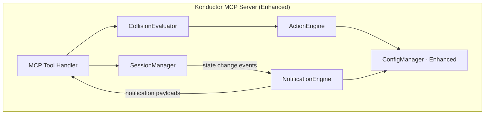

# Design Document: Konductor Actions & Notifications (Phase 3)

## Overview

Phase 3 extends the Konductor's configuration system to support automated actions (warn, block, suggest_rebase) and a notification framework that alerts users when collision state changes. The core server from Phase 1 is enhanced with an ActionEngine that evaluates rules from config and an event-driven notification system.

## Architecture



## Components and Interfaces

### ActionEngine

```typescript
interface IActionEngine {
  evaluate(state: CollisionState, config: KonductorConfig): Action[];
  shouldBlock(state: CollisionState, config: KonductorConfig): boolean;
}
```

Evaluates configured action rules against the current collision state and returns applicable actions.

### NotificationEngine

```typescript
interface INotificationEngine {
  onStateChange(userId: string, previousState: CollisionState, newState: CollisionState): Notification | null;
}

interface Notification {
  targetUserId: string;
  previousState: CollisionState;
  newState: CollisionState;
  message: string;
  timestamp: string;
}
```

Generates notifications when collision state transitions occur, filtered by the configured threshold.

### Enhanced Configuration

```yaml
heartbeat_timeout_seconds: 300
notification_threshold: crossroads  # Default threshold
states:
  collision_course:
    message: "Warning — someone is modifying the same files."
    actions:
      - type: warn
        message: "Consider coordinating with the other engineer."
  merge_hell:
    message: "Critical — divergent changes on the same files."
    actions:
      - type: warn
        message: "Multiple divergent changes detected."
      - type: suggest_rebase
        message: "Consider rebasing your branch."
      - type: block  # Optional
        message: "Submissions blocked until conflict is resolved."
repositories:
  "org/critical-repo":
    notification_threshold: neighbors  # Stricter for critical repos
```

## Data Models

### Action (Enhanced)

```typescript
interface Action {
  type: "warn" | "block" | "suggest_rebase";
  message: string;
  metadata?: Record<string, string>;  // e.g., target branch for rebase
}
```

### Notification

```typescript
interface Notification {
  targetUserId: string;
  repo: string;
  previousState: CollisionState;
  newState: CollisionState;
  message: string;
  timestamp: string;
}
```

## Correctness Properties

*A property is a characteristic or behavior that should hold true across all valid executions of a system — essentially, a formal statement about what the system should do. Properties serve as the bridge between human-readable specifications and machine-verifiable correctness guarantees.*

### Property 1: Action rules are applied for matching states

*For any* collision state and configuration with action rules, the ActionEngine should return exactly the actions configured for that state (and no actions from other states).

**Validates: Requirements 1.1, 1.2, 1.3, 1.4**

### Property 2: Notifications are generated only at or above threshold

*For any* state change and configured notification threshold, a notification should be generated if and only if the new state severity is at or above the threshold.

**Validates: Requirements 2.1, 3.1, 3.2**

### Property 3: Action rule configuration round-trip

*For any* valid action rule configuration, serializing to YAML and deserializing back should produce an equivalent configuration.

**Validates: Requirements 4.1, 4.2**

## Testing Strategy

- **fast-check** for property-based tests on ActionEngine and NotificationEngine
- **Vitest** for unit tests on configuration parsing and edge cases
- Tests co-located with source files
