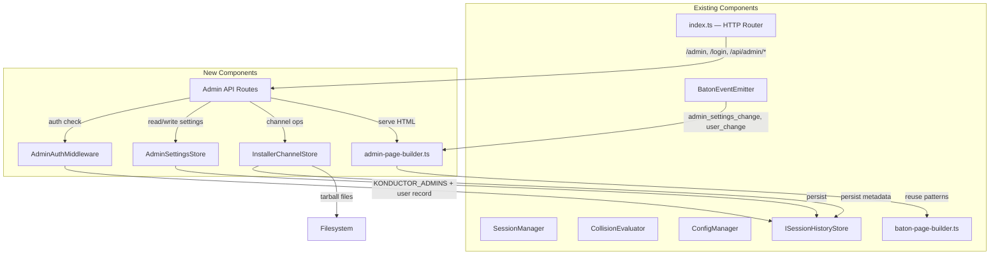

# Design Document: Konductor Admin Dashboard

## Overview

The Konductor Admin Dashboard extends the existing Konductor MCP Server with a web-based administration interface at `/admin`. It provides system configuration, installer channel management, user management, and client install command display. The dashboard reuses the Baton visual design language (collapsible panels, pill badges, freshness color scale) and shares the same storage backend (`ISessionHistoryStore`) established by the long-term-memory feature.

Admin access is controlled by a two-tier model: the `KONDUCTOR_ADMINS` environment variable (highest precedence) and the `admin` flag in user records. Browser access uses cookie-based session authentication via a login form, while programmatic access continues to use `Authorization` + `X-Konductor-User` headers.

The dashboard includes five collapsible panels: System Settings, Global Client Settings, Client Install Commands, User Management, and Freshness Color Scale Configuration. Real-time updates are delivered via SSE, consistent with the Baton dashboard pattern.

## Architecture



### Request Flow

1. Browser navigates to `/admin`
2. `AdminAuthMiddleware` checks for session cookie or Authorization header
3. If no valid auth → redirect to `/login`
4. If authenticated → check admin status (KONDUCTOR_ADMINS env var first, then user record `admin` flag)
5. If admin → serve admin dashboard HTML
6. Dashboard establishes SSE connection to `/api/admin/events` for real-time updates
7. Admin actions (save settings, promote channel, toggle user admin) go through `/api/admin/*` REST endpoints

## Components and Interfaces

### AdminAuthMiddleware

Handles authentication and authorization for admin routes. Supports two auth methods:

- **Cookie-based** (browser): Session cookie set after login at `/login`
- **Header-based** (programmatic): `Authorization: Bearer <apiKey>` + `X-Konductor-User: <userId>`

Admin check priority:
1. Parse `KONDUCTOR_ADMINS` env var → comma-separated list, whitespace-trimmed
2. Match requesting userId or email against the list (case-insensitive)
3. If no match, check user record's `admin` flag in `ISessionHistoryStore`

```typescript
interface AdminAuthResult {
  authenticated: boolean;
  userId: string | null;
  isAdmin: boolean;
  adminSource: "env" | "database" | null;  // where admin status came from
}
```

### AdminSettingsStore

Manages system settings and global client settings. Wraps the `settings` table in `ISessionHistoryStore` with typed accessors.

```typescript
interface AdminSettingsStore {
  get(key: string): Promise<unknown>;
  set(key: string, value: unknown, category: string): Promise<void>;
  getAll(category?: string): Promise<Map<string, unknown>>;
  getSource(key: string): "env" | "database" | "default";
}
```

Settings are serialized to JSON strings for storage and deserialized on retrieval. Environment variables take precedence over database values for overlapping keys.

### InstallerChannelStore

Manages multi-channel installer tarballs and promotion/rollback operations.

```typescript
type ChannelName = "dev" | "uat" | "prod";

interface ChannelMetadata {
  channel: ChannelName;
  version: string;
  uploadTimestamp: string;  // ISO 8601
  tarballHash: string;      // SHA-256
  tarballPath: string;      // filesystem path
  previousVersion?: string; // for rollback
  previousTarballPath?: string;
}

interface InstallerChannelStore {
  getMetadata(channel: ChannelName): Promise<ChannelMetadata | null>;
  getAllMetadata(): Promise<Map<ChannelName, ChannelMetadata>>;
  promote(source: ChannelName, destination: ChannelName): Promise<ChannelMetadata>;
  rollback(channel: ChannelName): Promise<ChannelMetadata>;
  getTarball(channel: ChannelName): Promise<Buffer | null>;
  setTarball(channel: ChannelName, tarball: Buffer, version: string): Promise<ChannelMetadata>;
}
```

Promotion copies the source tarball file to the destination, retaining the previous destination tarball for rollback. Rollback swaps the current tarball with the previous one.

### admin-page-builder.ts

Generates the admin dashboard HTML, following the same pattern as `baton-page-builder.ts`. The page includes:

- Login form (at `/login`)
- Admin dashboard (at `/admin`) with five collapsible panels
- Embedded CSS matching Baton design language
- Embedded JS for SSE connection, form handling, and copy-to-clipboard

### Admin API Routes

New HTTP endpoints added to `index.ts`:

| Method | Path | Auth | Description |
|--------|------|------|-------------|
| GET | `/login` | None | Serve login page |
| POST | `/login` | None | Validate credentials, set session cookie |
| GET | `/admin` | Admin | Serve admin dashboard |
| GET | `/api/admin/settings` | Admin | Get all settings |
| PUT | `/api/admin/settings/:key` | Admin | Update a setting |
| GET | `/api/admin/channels` | Admin | Get all channel metadata |
| POST | `/api/admin/channels/promote` | Admin | Promote channel |
| POST | `/api/admin/channels/rollback` | Admin | Rollback channel |
| GET | `/api/admin/users` | Admin | Get all user records |
| PUT | `/api/admin/users/:userId` | Admin | Update user record |
| GET | `/api/admin/install-commands` | Admin | Get install command data |
| GET | `/api/admin/events` | Admin | SSE stream for admin events |

## Data Models

### Settings Table Extension

Extends the `ISessionHistoryStore` interface with settings operations:

```typescript
interface SettingsRecord {
  key: string;
  value: string;       // JSON-encoded
  category: string;    // "system" | "client" | "freshness"
  updatedAt: string;   // ISO 8601
}

// Added to ISessionHistoryStore:
interface ISessionHistoryStore {
  // ... existing methods ...
  getSetting(key: string): Promise<string | null>;
  setSetting(key: string, value: string, category: string): Promise<void>;
  getAllSettings(category?: string): Promise<SettingsRecord[]>;
}
```

### Installer Channels Table

```typescript
interface InstallerChannelRecord {
  channel: string;           // "dev" | "uat" | "prod"
  version: string;
  uploadTimestamp: string;   // ISO 8601
  tarballHash: string;       // SHA-256
  tarballPath: string;       // relative filesystem path
  previousVersion: string | null;
  previousTarballPath: string | null;
}
```

### UserRecord Extension

The existing `UserRecord` from long-term-memory already includes `admin` and `installerChannel` fields. No schema changes needed.

### Session Cookie

```typescript
interface AdminSession {
  userId: string;
  apiKeyHash: string;   // SHA-256 of the API key used to authenticate
  createdAt: number;    // Unix timestamp ms
  expiresAt: number;    // Unix timestamp ms
}
```

Session cookies are signed with `KONDUCTOR_SESSION_SECRET` (or a random secret generated at startup if not set). Cookie is httpOnly, Secure when TLS is enabled, SameSite=Lax.

### Install Command Data

```typescript
interface InstallCommandData {
  mode: "local" | "cloud";
  channels: {
    channel: ChannelName;
    localCommand?: string;    // only in local mode
    remoteCommand?: string;   // only in local mode
    cloudCommand?: string;    // only in cloud mode
  }[];
  defaultChannel: ChannelName;
}
```

## Cor
rectness Properties

*A property is a characteristic or behavior that should hold true across all valid executions of a system-essentially, a formal statement about what the system should do. Properties serve as the bridge between human-readable specifications and machine-verifiable correctness guarantees.*

### Property Reflection

Before defining properties, redundancy analysis was performed on all testable acceptance criteria:

- Criteria 1.1–1.4 all test aspects of admin resolution. These are consolidated into a single comprehensive property that covers the full priority chain (env var → database → deny).
- Criteria 3.2, 4.3, 11.2, 12.1–12.3 all relate to settings persistence round-trip. Consolidated into one property.
- Criteria 5.2–5.4, 5.6–5.7 all relate to install command generation format. Consolidated into one property.
- Criteria 6.1–6.5 all relate to effective channel resolution. Consolidated into one property.
- Criteria 4.5, 9.4, 9.6 all relate to promotion round-trip. Consolidated into one property.
- Criteria 4.8, 9.7 relate to rollback round-trip. Consolidated into one property.
- Criteria 3.4, 11.4 relate to settings source precedence (env vs database). Consolidated into one property.

### Properties

Property 1: Admin resolution precedence
*For any* userId, email, `KONDUCTOR_ADMINS` env var value, and user record admin flag, the admin check SHALL return `true` if and only if the userId or email appears in `KONDUCTOR_ADMINS` (case-insensitive, whitespace-trimmed) OR the user record has `admin: true`. When both sources disagree, `KONDUCTOR_ADMINS` takes precedence.
**Validates: Requirements 1.1, 1.2, 1.3, 1.4**

Property 2: KONDUCTOR_ADMINS parsing
*For any* comma-separated string of identifiers with arbitrary whitespace, parsing the `KONDUCTOR_ADMINS` value SHALL produce a list of trimmed, non-empty entries matching the original identifiers with leading and trailing whitespace removed.
**Validates: Requirements 1.6**

Property 3: Settings serialization round-trip
*For any* JSON-serializable value (string, number, boolean, null, array, object), serializing the value to a JSON string and then deserializing it back SHALL produce a value equivalent to the original.
**Validates: Requirements 11.2, 12.3**

Property 4: Settings source precedence
*For any* set of database settings and environment variables, merging them SHALL produce a result where environment variable values take precedence for overlapping keys, and database-only keys are preserved unchanged.
**Validates: Requirements 3.4, 11.4**

Property 5: Channel promotion round-trip
*For any* installer tarball (arbitrary byte sequence), promoting it from a source channel to a destination channel and then reading the destination channel's tarball SHALL produce a byte sequence identical to the original.
**Validates: Requirements 4.5, 9.4**

Property 6: Channel rollback restores previous version
*For any* two installer tarballs A and B, if tarball A is set on a channel, then tarball B is promoted to that channel, then a rollback is performed, the channel's tarball SHALL be identical to tarball A.
**Validates: Requirements 4.8, 9.7**

Property 7: Effective channel resolution
*For any* user record with an optional installer channel override and a global default channel setting, the effective channel SHALL equal the per-user override when set, and the global default otherwise.
**Validates: Requirements 6.1**

Property 8: Install command format
*For any* server URL, channel name, and mode (local/cloud), the generated install command SHALL match the format `npx <serverUrl>/bundle/installer-<channel>.tgz --server <serverUrl> --api-key YOUR_API_KEY` and SHALL contain the placeholder `YOUR_API_KEY` (never a real key).
**Validates: Requirements 5.2, 5.3, 5.4, 5.6, 5.7**

Property 9: JIRA ticket extraction from branch names
*For any* branch name matching the pattern `<prefix>/<KEY>-<number>-<description>`, the JIRA extraction function SHALL return the `<KEY>-<number>` portion. *For any* branch name not matching this pattern, the function SHALL return null.
**Validates: Requirements 7.7**

Property 10: Stale repo filtering
*For any* user record with repos accessed timestamps and a stale activity threshold, the filtered repo list SHALL contain only repos whose last-access timestamp is within the threshold, and SHALL exclude all repos whose last-access timestamp exceeds the threshold.
**Validates: Requirements 7.4**

## Error Handling

### Authentication Errors
- Missing or expired session cookie → 302 redirect to `/login`
- Invalid API key or missing Authorization header → 401 JSON response
- Authenticated but not admin → 403 Forbidden with descriptive message
- `KONDUCTOR_SESSION_SECRET` not set → generate random secret at startup, log warning (sessions won't survive restarts)

### Channel Operations
- Promote from empty channel → 400 error: "Source channel has no tarball"
- Rollback with no previous version → 400 error: "No previous version available for rollback"
- Request tarball from empty channel → 404 error: "Channel has no installer available"
- Tarball file missing from disk (SQLite mode) → 500 error, log warning at startup

### Settings Operations
- Write non-JSON-serializable value → 400 error: "Value must be JSON-serializable"
- Modify env-sourced setting → 400 error: "Setting is read-only (set by environment variable)"
- Invalid setting key → 400 error: "Unknown setting key"

### Login Errors
- Invalid userId → generic "Invalid credentials" (don't reveal whether user exists)
- Invalid API key → generic "Invalid credentials"
- Rate limiting: max 5 login attempts per IP per minute

## Testing Strategy

### Testing Framework
- Unit tests: vitest
- Property-based tests: fast-check (already in devDependencies)
- E2E tests: Playwright (for browser-based admin dashboard testing)

### Dual Testing Approach

Unit tests and property-based tests are complementary:
- Unit tests verify specific examples, edge cases, and integration points
- Property-based tests verify universal properties that hold across all inputs
- Together they provide comprehensive coverage

### Property-Based Testing Requirements
- Each property-based test MUST run a minimum of 100 iterations
- Each property-based test MUST be tagged with a comment referencing the correctness property: `**Feature: konductor-admin, Property {number}: {property_text}**`
- Each correctness property MUST be implemented by a single property-based test
- The fast-check library (already installed) MUST be used for all property-based tests

### Unit Testing
- Unit tests cover specific examples, edge cases, and error conditions
- Integration tests verify HTTP routing, auth middleware, and SSE event delivery
- E2E tests verify the full browser flow (login → dashboard → actions)