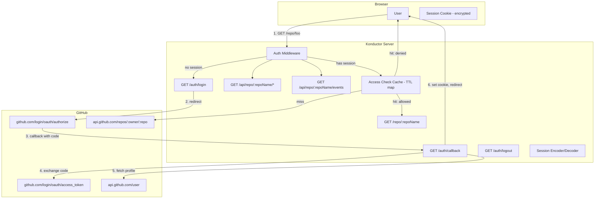

# Design Document: Konductor Baton — GitHub OAuth Access Control

## Overview

This feature adds GitHub OAuth-based authentication and per-repo access control to the Baton dashboard. When configured with a GitHub OAuth App's credentials, the server requires users to authenticate via GitHub before viewing any repo page. After authentication, the server verifies the user has read access to the specific GitHub repository before serving the page. When OAuth is not configured, the Baton falls back to its current open-access behavior for backward compatibility.

## Architecture



## Components

### BatonAuth Module

New file: `konductor/src/baton-auth.ts`

Central module containing all auth logic. No external dependencies beyond Node.js built-ins (`crypto`, `https`/`http`).

```typescript
interface BatonAuthConfig {
  clientId: string;
  clientSecret: string;
  serverUrl: string;              // e.g. "https://hostname:3100"
  sessionSecret: string;          // for cookie encryption
  sessionMaxAgeHours: number;     // default: 8
  accessCacheMinutes: number;     // default: 5
}

interface BatonSession {
  githubUsername: string;
  githubAvatarUrl: string;
  accessToken: string;            // GitHub OAuth access token
  createdAt: number;              // epoch ms
  expiresAt: number;              // epoch ms
}

interface BatonAuthModule {
  /** Check if auth is enabled (OAuth credentials configured). */
  isEnabled(): boolean;

  /** Build the GitHub OAuth authorization URL with state param. */
  buildAuthUrl(redirectPath: string): { url: string; state: string };

  /** Exchange authorization code for access token + user profile. */
  handleCallback(code: string, state: string, expectedState: string): Promise<BatonSession>;

  /** Encrypt a BatonSession into a cookie value. */
  encodeSession(session: BatonSession): string;

  /** Decrypt a cookie value back into a BatonSession, or null if invalid/expired. */
  decodeSession(cookieValue: string): BatonSession | null;

  /** Check if a user has access to a repo. Uses cache, falls back to GitHub API. */
  checkRepoAccess(accessToken: string, owner: string, repo: string): Promise<"allowed" | "denied" | "error">;

  /** Clear cached access for a user (e.g., on logout). */
  clearAccessCache(accessToken: string): void;
}
```

### Session Cookie Encryption

The session cookie contains sensitive data (GitHub access token), so it's encrypted using AES-256-GCM with the `BATON_SESSION_SECRET` as the key material.

```typescript
// Encryption: AES-256-GCM
// Key derivation: PBKDF2(sessionSecret, fixed salt, 100000 iterations, 32 bytes)
// Cookie value: base64(iv + authTag + ciphertext)
```

If `BATON_SESSION_SECRET` is not set, a random 32-byte hex string is generated at startup and logged as a warning. This means sessions won't survive server restarts unless the secret is explicitly configured.

### Access Check Cache

In-memory TTL cache keyed by `${accessToken}:${owner}/${repo}`. Entries expire after `BATON_ACCESS_CACHE_MINUTES` (default: 5).

```typescript
class AccessCache {
  private cache: Map<string, { result: "allowed" | "denied"; expiresAt: number }>;

  get(token: string, repo: string): "allowed" | "denied" | null;
  set(token: string, repo: string, result: "allowed" | "denied"): void;
  clear(token: string): void;
}
```

The cache key uses a hash of the access token (not the raw token) to avoid leaking tokens in memory dumps.

### Auth Middleware Integration

The auth logic integrates into the existing `requestHandler` in `index.ts`. No Express or middleware framework — just conditional checks at the top of the Baton route handlers.

```
Request flow:
1. Is auth enabled? (BATON_GITHUB_CLIENT_ID set?)
   - No → serve page (backward compatible)
   - Yes → continue

2. Is this an auth route? (/auth/login, /auth/callback, /auth/logout)
   - Yes → handle auth route
   - No → continue

3. Does the request have a valid session cookie?
   - No → redirect to /auth/login?redirect=<current_path>
   - Yes → continue

4. Does the user have access to this repo?
   - Check cache first, then GitHub API
   - Allowed → serve page
   - Denied → 403 error page
   - Error → 503 error page
```

For API endpoints (`/api/repo/*`), the flow is the same except:
- Step 3 returns 401 JSON instead of redirecting
- Step 4 returns 403/503 JSON instead of error pages

### Auth Routes

**`GET /auth/login?redirect=<path>`**
1. Generate a random `state` string (CSRF protection)
2. Store `state` + `redirect` in a short-lived cookie (`baton_auth_state`, 10 min TTL, httpOnly)
3. Redirect to GitHub authorization URL

**`GET /auth/callback?code=<code>&state=<state>`**
1. Read `baton_auth_state` cookie, verify `state` matches
2. Exchange `code` for access token via `POST https://github.com/login/oauth/access_token`
3. Fetch user profile via `GET https://api.github.com/user` with the token
4. Create `BatonSession`, encrypt into `baton_session` cookie
5. Clear `baton_auth_state` cookie
6. Redirect to the stored `redirect` path

**`GET /auth/logout`**
1. Clear `baton_session` cookie
2. Clear access cache for the user's token
3. Redirect to `/auth/logged-out` (simple page with "You've been logged out" message)

### Error Pages

All error pages are generated server-side as complete HTML documents using the same dark theme as the Baton dashboard. They are simple static HTML strings built by helper functions in `baton-auth.ts`.

```typescript
function buildErrorPage(title: string, message: string, actions: { label: string; href: string }[]): string;
function build403Page(repo: string, username: string): string;
function build503Page(retryUrl: string): string;
function buildAuthErrorPage(message: string): string;
function buildLoggedOutPage(): string;
```

### Baton Page Header Update

The `buildRepoPage()` function in `baton-page-builder.ts` gains an optional `user` parameter:

```typescript
function buildRepoPage(repo: string, serverUrl: string, user?: { username: string; avatarUrl: string } | null): string;
```

When `user` is provided, the header shows the avatar + username + logout link. When `user` is null (auth disabled), it shows "Authentication disabled". When `user` is undefined (not passed), it behaves as before (no user display).

### GitHub API Calls

All GitHub API calls use Node.js built-in `https` module (no `fetch` polyfill needed on Node 20+, but we use the native `fetch` available in Node 20+).

**Token exchange:**
```
POST https://github.com/login/oauth/access_token
Accept: application/json
Body: { client_id, client_secret, code }
```

**User profile:**
```
GET https://api.github.com/user
Authorization: Bearer <token>
Accept: application/json
```

**Repo access check:**
```
GET https://api.github.com/repos/:owner/:repo
Authorization: Bearer <token>
Accept: application/json
→ 200 = access, 404/403 = no access
```

### Cookie Parsing

The server needs to parse cookies from the `Cookie` header. Since Konductor has no cookie-parsing dependency, a minimal parser is included in `baton-auth.ts`:

```typescript
function parseCookies(cookieHeader: string | undefined): Record<string, string>;
function serializeCookie(name: string, value: string, options: CookieOptions): string;
```

### Environment Variables

| Variable | Default | Description |
|---|---|---|
| `BATON_GITHUB_CLIENT_ID` | (none) | GitHub OAuth App client ID. Auth disabled if not set. |
| `BATON_GITHUB_CLIENT_SECRET` | (none) | GitHub OAuth App client secret. |
| `BATON_SESSION_SECRET` | (random at startup) | Secret key for encrypting session cookies. |
| `BATON_SESSION_HOURS` | `8` | Session cookie max age in hours. |
| `BATON_ACCESS_CACHE_MINUTES` | `5` | How long to cache repo access check results. |

## Data Flow: Full Authentication Sequence

```
User → GET /repo/my-repo
  ↓ (no session cookie)
Server → 302 /auth/login?redirect=/repo/my-repo
  ↓
Server → set baton_auth_state cookie (state + redirect)
       → 302 https://github.com/login/oauth/authorize?client_id=...&state=...&redirect_uri=.../auth/callback&scope=repo
  ↓
GitHub → user authorizes → 302 /auth/callback?code=abc&state=xyz
  ↓
Server → verify state matches baton_auth_state cookie
       → POST github.com/login/oauth/access_token (exchange code)
       → GET api.github.com/user (fetch profile)
       → set baton_session cookie (encrypted session)
       → clear baton_auth_state cookie
       → 302 /repo/my-repo
  ↓
User → GET /repo/my-repo (with baton_session cookie)
  ↓
Server → decode session → check repo access (cache or API)
       → GET api.github.com/repos/owner/my-repo (with user's token)
       → 200 → serve repo page with user info in header
```

## Correctness Properties

### Property 1: Auth bypass when unconfigured

*For any* request to a Baton route, when `BATON_GITHUB_CLIENT_ID` is not set, the server serves the page without any authentication check. Existing behavior is fully preserved.

**Validates: Requirement 5.3**

### Property 2: Session cookie encryption round-trip

*For any* valid `BatonSession`, encoding and then decoding with the same secret produces an equivalent session. Encoding with one secret and decoding with a different secret returns null.

**Validates: Requirements 3.1, 3.5**

### Property 3: CSRF state validation

*For any* OAuth callback, the `state` parameter must match the value stored in the `baton_auth_state` cookie. A mismatched or missing state always results in a 403 error.

**Validates: Requirement 1.7**

### Property 4: Access check caching correctness

*For any* sequence of access checks for the same token+repo, the cache returns the stored result within the TTL window and returns null (cache miss) after the TTL expires.

**Validates: Requirement 2.6**

### Property 5: Expired sessions are rejected

*For any* session cookie where `expiresAt < now`, decoding returns null and the user is redirected to login.

**Validates: Requirement 3.3**

### Property 6: API endpoints return JSON errors, not redirects

*For any* unauthenticated or unauthorized request to `/api/repo/*`, the response is a JSON error (401 or 403), never an HTML redirect.

**Validates: Requirements 4.1, 4.2**

### Property 7: Redirect path is preserved through the OAuth flow

*For any* initial request path that triggers the login redirect, after successful authentication the user is redirected back to that exact path.

**Validates: Requirements 1.1, 1.6**

## Testing Strategy

### Property-Based Tests (fast-check + Vitest)

- **Property 2**: Generate random BatonSession objects, verify encode/decode round-trip with same secret, verify decode fails with wrong secret
- **Property 4**: Generate random access check sequences with timestamps, verify cache hit/miss behavior relative to TTL
- **Property 5**: Generate sessions with various expiry times, verify expired sessions are rejected

### Unit Tests (Vitest)

- `baton-auth.test.ts`:
  - `buildAuthUrl()` generates correct GitHub URL with all params
  - `handleCallback()` exchanges code and fetches profile (mocked HTTP)
  - `handleCallback()` rejects mismatched state
  - `encodeSession()` / `decodeSession()` round-trip
  - `decodeSession()` returns null for tampered cookie
  - `decodeSession()` returns null for expired session
  - `checkRepoAccess()` returns "allowed" for 200, "denied" for 404/403, "error" for network failure
  - `checkRepoAccess()` uses cache on second call within TTL
  - `parseCookies()` handles edge cases (empty, malformed, special chars)
  - `serializeCookie()` generates correct Set-Cookie header
  - Error page builders produce valid HTML with correct content

- `index.test.ts` (additions):
  - Auth routes return correct redirects
  - Baton routes redirect to login when auth enabled and no session
  - Baton routes serve page when auth enabled and valid session with repo access
  - Baton API routes return 401/403 JSON when appropriate
  - Auth disabled: all routes serve without auth check

### Integration Tests

- Full OAuth flow with mocked GitHub endpoints
- Session persistence across multiple requests
- Access cache expiry and refresh
- Token revocation handling (GitHub returns 401 on user API call)

## Error Handling

### GitHub API Failures

- Token exchange failure → auth error page with "Try again" link
- User profile fetch failure → auth error page with "Try again" link
- Repo access check failure → 503 page with retry link (don't cache errors)

### Cookie Corruption

- Tampered cookie → treated as no session → redirect to login
- Decryption failure → treated as no session → redirect to login

### Missing Configuration

- `BATON_GITHUB_CLIENT_ID` set but `BATON_GITHUB_CLIENT_SECRET` missing → log warning at startup, disable auth
- `BATON_SESSION_SECRET` not set → generate random secret, log warning that sessions won't survive restarts
