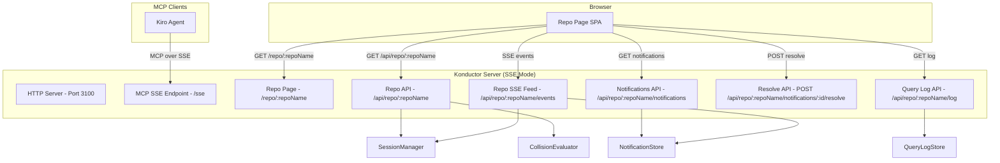

# Design Document: Konductor Baton — Per-Repo Dashboard

## Overview

The Konductor Baton is a lightweight web dashboard served directly by the Konductor MCP Server. Instead of a single page showing all repos, each repository gets its own dedicated page at a predictable URL (`/repo/:repoName`). The repo page provides five panels: Repository Summary (health status, active users with freshness, branches, GitHub links), Notifications & Alerts (real-time collision events with resolve/history), Query Log (user queries directed at the repo), Open PRs (stubbed for future GitHub integration), and Repo History (stubbed for future GitHub integration). All panels except the summary are collapsible. The dashboard uses SSE for live updates and vanilla HTML/CSS/JS with no build tooling.

## Architecture



The Konductor's existing HTTP server serves double duty — MCP SSE transport on `/sse` and `/messages`, plus the Baton dashboard on `/repo/*` and `/api/repo/*`.

## Components and Interfaces

### Server-Side Components

#### NotificationStore

In-memory store for collision notifications, with JSON persistence. Each notification is created when a collision state change is detected during session registration or update.

```typescript
interface INotificationStore {
  add(notification: BatonNotification): void;
  getActive(repo: string): BatonNotification[];
  getResolved(repo: string): BatonNotification[];
  resolve(notificationId: string): boolean;
  serialize(): string;
  deserialize(json: string): void;
}
```

#### QueryLogStore

In-memory ring buffer for query log entries. Captures user-initiated query tool invocations (who_is_active, who_overlaps, etc.) scoped to a repo. No persistence needed — logs are ephemeral.

```typescript
interface IQueryLogStore {
  add(entry: QueryLogEntry): void;
  getEntries(repo: string): QueryLogEntry[];
}
```

#### BatonEventEmitter

Lightweight event bus that the SessionManager and NotificationStore push events into. The SSE endpoint for each repo page subscribes to events filtered by repo.

```typescript
interface IBatonEventEmitter {
  emit(event: BatonEvent): void;
  subscribe(repo: string, callback: (event: BatonEvent) => void): () => void;
}
```

#### RepoPageBuilder

Generates the HTML for a repo page. Single function that returns a complete HTML string with embedded CSS and JS. The JS connects to the repo-specific SSE endpoint and renders all four panels.

```typescript
function buildRepoPage(repo: string, serverUrl: string): string;
```

### API Endpoints

**`GET /repo/:repoName`**
- Serves the repo page HTML (generated by RepoPageBuilder)
- No authentication required (dashboard is informational)

**`GET /api/repo/:repoName`**
- Returns repo summary JSON: health status, active users with freshness, branches, session count
- Response: `{ repo, healthStatus, users: [...], branches: [...], sessionCount, userCount }`

**`GET /api/repo/:repoName/notifications`**
- Returns active and resolved notifications for the repo
- Query param: `?status=active|resolved` (default: active)
- Response: `{ notifications: [...] }`

**`GET /api/repo/:repoName/log`**
- Returns query log entries for the repo
- Response: `{ entries: [...] }`

**`POST /api/repo/:repoName/notifications/:id/resolve`**
- Marks a notification as resolved
- Response: `{ success: boolean }`

**`GET /api/repo/:repoName/events`**
- SSE stream pushing events: `session_change`, `notification_added`, `notification_resolved`, `query_logged`
- Each event includes the affected data and is scoped to the repo

### Client-Side (Embedded in HTML)

The repo page is a single HTML document with embedded CSS and JS. No framework, no build step.

**Layout:**
```
┌─────────────────────────────────────────────────────────────────┐
│  🎵 Konductor Baton — owner/repo                               │
├─────────────────────────────────────────────────────────────────┤
│  ┌─────────────────────────────────────────────────────────┐    │
│  │  REPO SUMMARY                                           │    │
│  │  Status: [🟢 Healthy / 🟡 Warning / 🔴 Alerting]       │    │
│  │  GitHub: https://github.com/owner/repo                  │    │
│  │  Users: [🟢 bob 2m] [🟢 alice 12m] [🔵 ian 45m]       │    │
│  │  Branches: main, feature/auth, fix/login                │    │
│  └─────────────────────────────────────────────────────────┘    │
├─────────────────────────────────────────────────────────────────┤
│  NOTIFICATIONS & ALERTS              [▼ collapse] [Active | History]   │
│  ┌──────┬──────┬───────┬────────┬───────┬─────────┬───────┬────────┐  │
│  │ Time │ Type │ State │ Branch │ JIRAs │ Summary │ Users │Resolve │  │
│  ├──────┼──────┼───────┼────────┼───────┼─────────┼───────┼────────┤  │
│  │ ...  │ ...  │ ...   │ ...    │ ...   │ ...     │ ...   │ [✓]    │  │
│  └──────┴──────┴───────┴────────┴───────┴─────────┴───────┴────────┘  │
├─────────────────────────────────────────────────────────────────┤
│  QUERY LOG                                         [▼ collapse] │
│  ┌──────────┬────────┬────────┬────────────┬────────────┐       │
│  │ Time     │ User   │ Branch │ Query Type │ Parameters │       │
│  ├──────────┼────────┼────────┼────────────┼────────────┤       │
│  │ ...      │ ...    │ ...    │ ...        │ ...        │       │
│  └──────────┴────────┴────────┴────────────┴────────────┘       │
├─────────────────────────────────────────────────────────────────┤
│  OPEN PRs                                          [▼ collapse] │
│  🚧 GitHub Integration Coming Soon!                             │
├─────────────────────────────────────────────────────────────────┤
│  REPO HISTORY                                      [▼ collapse] │
│  🚧 GitHub Integration Coming Soon!                             │
└─────────────────────────────────────────────────────────────────┘
```

**Responsive Layout:**
- The page uses a fluid layout that scales with the browser window width and height
- All panels use percentage-based or flex/grid sizing — no fixed pixel widths
- Tables use `width: 100%` and overflow-x scrolling on narrow viewports
- The summary panel, notifications table, query log table, and open PRs section each fill the available width
- On narrow screens (< 768px), the layout stacks vertically with full-width panels

**Health Status Color Coding:**
- 🟢 Healthy: Green background (`#16a34a`), white text — no users or all Solo
- 🟡 Warning: Yellow background (`#eab308`), dark text (`#1a1a1a`) — any Neighbors or Crossroads
- 🔴 Alerting: Red background (`#dc2626`), white text — any Collision Course or Merge Hell

**User Freshness Color Scale (10 levels):**

Each active user is displayed as a pill-shaped badge color-coded by how recently their last heartbeat was received. The interval per level is configurable (default: 10 minutes per level).

| Level | Minutes Since Heartbeat | Color | Hex |
|-------|------------------------|-------|-----|
| 1 | 0–10 | Bright Green | `#22c55e` |
| 2 | 10–20 | Green | `#16a34a` |
| 3 | 20–30 | Teal | `#14b8a6` |
| 4 | 30–40 | Cyan | `#06b6d4` |
| 5 | 40–50 | Blue | `#3b82f6` |
| 6 | 50–60 | Indigo | `#6366f1` |
| 7 | 60–70 | Purple | `#8b5cf6` |
| 8 | 70–80 | Dim Purple | `#6b21a8` |
| 9 | 80–90 | Dark Gray | `#4b5563` |
| 10 | 90+ | Black | `#1f2937` |

Text color is white for all levels. The freshness interval is configurable via the `BATON_FRESHNESS_INTERVAL_MINUTES` environment variable in `.env.local` (default: 10). The color scale itself can be overridden via `BATON_FRESHNESS_COLORS` as a comma-separated list of hex values (10 values expected). These configuration values are read at server startup and served to the client via the `/api/repo/:owner/:repo` response. In a future phase, this configuration will migrate to a database and be editable via the admin page.

**Notification Type Color Coding (table row accent):**
- Healthy: Green left border
- Warning: Yellow left border
- Alerting: Red left border

**Table Interactions (all tables):**
- Every table column header is clickable to sort ascending/descending (toggle on click)
- A sort indicator arrow shows the current sort column and direction
- Filter controls appear above each table: dropdowns for enum columns (Type, State, Query Type, Action), text input for free-text columns (User, Summary)
- Filters are applied client-side with immediate results (no server round-trip)
- Active filters show a clear/reset button

**Collapsible Sections:**
- All sections except Repository Summary are collapsible
- Clicking a section header toggles between expanded and collapsed states
- When collapsed, only the header bar is visible with the section name and a summary count badge (e.g., "3 active", "5 entries", "coming soon")
- A chevron icon (▼ expanded, ▶ collapsed) indicates the current state
- Collapse state is managed client-side with CSS transitions

## Data Models

### HealthStatus

```typescript
enum HealthStatus {
  Healthy = "healthy",
  Warning = "warning",
  Alerting = "alerting",
}
```

Derived from CollisionState using this rubric:
- `Alerting` = any session at `CollisionCourse` or `MergeHell`
- `Warning` = any session at `Crossroads` or `Neighbors`
- `Healthy` = no sessions, or all sessions at `Solo`

### BatonNotification

```typescript
interface BatonNotification {
  id: string;                    // UUID
  repo: string;                  // "owner/repo"
  timestamp: string;             // ISO 8601
  notificationType: HealthStatus; // Healthy, Warning, Alerting
  collisionState: CollisionState; // Solo, Neighbors, Crossroads, CollisionCourse, MergeHell
  jiras: string[];               // JIRA ticket IDs if known, empty array if unknown
  summary: string;               // Human-readable description of the event
  users: BatonNotificationUser[];
  resolved: boolean;
  resolvedAt?: string;           // ISO 8601, set when resolved
}

interface BatonNotificationUser {
  userId: string;
  branch: string;
}
```

### QueryLogEntry

```typescript
interface QueryLogEntry {
  id: string;           // UUID
  repo: string;         // "owner/repo"
  timestamp: string;    // ISO 8601
  userId: string;       // Who made the query (from actor context)
  branch: string;       // Branch the user is on when making the query
  queryType: string;    // Tool name: who_is_active, who_overlaps, etc.
  parameters: Record<string, unknown>;
}
```

### RepoSummary

```typescript
interface RepoSummary {
  repo: string;
  githubUrl: string;
  healthStatus: HealthStatus;
  branches: RepoBranch[];
  users: RepoActiveUser[];
  sessionCount: number;
  userCount: number;
}

interface RepoBranch {
  name: string;
  githubUrl: string;
  users: string[];
}

interface RepoActiveUser {
  userId: string;
  githubUrl: string;
  lastHeartbeat: string;  // ISO 8601 — used to compute freshness level client-side
}
```

### BatonEvent

```typescript
type BatonEvent =
  | { type: "session_change"; repo: string; data: RepoSummary }
  | { type: "notification_added"; repo: string; data: BatonNotification }
  | { type: "notification_resolved"; repo: string; data: { id: string } }
  | { type: "query_logged"; repo: string; data: QueryLogEntry };
```

### RepoHistoryEntry (future — GitHub integration)

```typescript
interface RepoHistoryEntry {
  id: string;           // UUID
  repo: string;         // "owner/repo"
  timestamp: string;    // ISO 8601
  action: "commit" | "pr" | "merge";
  userId: string;       // GitHub username
  summary: string;      // Commit message, PR title, or merge description
  githubUrl: string;    // Link to the commit, PR, or merge on GitHub
}
```

This data model is defined now for design completeness but will only be populated when the GitHub integration (konductor-github) is implemented. Until then, the Repo History section displays a "Coming Soon" placeholder.

### NotificationFormat (for serialization/pretty-printing)

The notification serialization format uses JSON for persistence and a human-readable text format for pretty-printing:

**JSON format** (for persistence):
```json
{
  "id": "uuid",
  "repo": "owner/repo",
  "timestamp": "2026-04-15T10:30:00Z",
  "notificationType": "alerting",
  "collisionState": "collision_course",
  "jiras": ["PROJ-123"],
  "summary": "bob and alice are on a collision course...",
  "users": [{"userId": "bob", "branch": "feature/auth"}],
  "resolved": false
}
```

**Pretty-print format** (for human-readable display/logging):
```
[2026-04-15 10:30:00] [ALERTING] [collision_course] owner/repo
  Users: bob (feature/auth), alice (main)
  JIRAs: PROJ-123
  Summary: bob and alice are on a collision course...
  Status: active
```

The pretty-printer and parser form a round-trip pair: `parse(prettyPrint(notification))` produces an equivalent notification object.


## Correctness Properties

*A property is a characteristic or behavior that should hold true across all valid executions of a system — essentially, a formal statement about what the system should do. Properties serve as the bridge between human-readable specifications and machine-verifiable correctness guarantees.*

### Property 1: Repo page contains all five sections

*For any* valid repository name in `owner/repo` format, the generated repo page HTML should contain identifiable sections for Repository Summary, Notifications & Alerts, Query Log, Open PRs, and Repo History.

**Validates: Requirements 1.1**

### Property 2: Repo summary contains repo name, GitHub link, and all active branches

*For any* repository with a set of active sessions, the repo summary should include the repository name, a link to `https://github.com/<owner>/<repo>`, and every unique branch from the active sessions should appear with a link to `https://github.com/<owner>/<repo>/tree/<branch>`.

**Validates: Requirements 2.1, 2.2**

### Property 3: Health status rubric correctness

*For any* set of collision states, the computed HealthStatus should be: Alerting if any state is CollisionCourse or MergeHell, Warning if any state is Crossroads or Neighbors (and none are CollisionCourse or MergeHell), and Healthy if the set is empty or all states are Solo.

**Validates: Requirements 2.3**

### Property 4: Notification rendering contains all required fields and correct links

*For any* BatonNotification, the rendered notification row should contain the timestamp, notification type, collision state, branch names (each linked to GitHub), JIRAs (or "unknown"), summary text, and each user name as a link to `https://github.com/<userId>`.

**Validates: Requirements 3.2, 3.3**

### Property 5: Resolving a notification moves it from active to resolved

*For any* NotificationStore containing active notifications, resolving a notification by ID should remove it from the active list and add it to the resolved list, and the total count (active + resolved) should remain unchanged.

**Validates: Requirements 3.5**

### Property 6: Query log entry addition and retrieval

*For any* QueryLogEntry added to the QueryLogStore for a given repo, the entry should be retrievable from `getEntries(repo)` and should contain the original timestamp, userId, queryType, and parameters.

**Validates: Requirements 4.1, 4.2**

### Property 7: Repo page URL in registration response follows correct pattern

*For any* server host, port, and registered session with repo in `owner/repo` format, the repo page URL included in the registration response should match the pattern `http://<host>:<port>/repo/<repoName>`.

**Validates: Requirements 6.1, 6.3**

### Property 8: Notification JSON serialization round-trip

*For any* valid BatonNotification, serializing to JSON and then deserializing should produce a notification object equivalent to the original.

**Validates: Requirements 9.3**

### Property 9: Notification pretty-print round-trip

*For any* valid BatonNotification, pretty-printing to human-readable text and then parsing should produce a notification object equivalent to the original.

**Validates: Requirements 9.5**

## Error Handling

### Invalid Repo URLs
- `GET /repo/` (missing repo name) returns 404 with a helpful message
- `GET /repo/owner/repo/extra` (extra path segments) returns 404

### Notification Resolution
- Resolving a non-existent notification ID returns `{ success: false }` with a 404 status
- Resolving an already-resolved notification is idempotent — returns success

### SSE Connection
- If the SSE connection drops, the client-side JS retries with exponential backoff (1s, 2s, 4s, max 30s)
- A visible "Disconnected — reconnecting..." banner appears when the connection is lost
- The banner disappears when the connection is re-established

### Empty States
- Repo with no sessions: summary shows Healthy status, empty branch list, "No active sessions" message
- Repo with no notifications: table shows "No notifications yet" placeholder
- Repo with no query log entries: table shows "No queries logged" placeholder

## Testing Strategy

### Property-Based Testing

Use **Vitest + fast-check** (already in the project) for property-based tests. Each correctness property maps to a single property-based test annotated with the property number and requirements reference.

- Configure each property test to run a minimum of 100 iterations
- Tag each test with: `**Feature: konductor-baton, Property {N}: {description}**`
- Write smart generators that produce valid BatonNotification, QueryLogEntry, and session data

### Unit Testing

Unit tests complement property tests by covering:
- Specific edge cases (empty repos, single user, max notification length)
- Health status color mapping (specific CSS values for each status)
- API endpoint response shapes
- SSE event serialization format
- URL routing (valid and invalid repo paths)

### Test Organization

- `konductor/src/baton-health.test.ts` — Health status computation (Property 3)
- `konductor/src/baton-notification-store.test.ts` — NotificationStore CRUD and resolve (Properties 5, 8, 9)
- `konductor/src/baton-query-log.test.ts` — QueryLogStore add/retrieve (Property 6)
- `konductor/src/baton-repo-summary.test.ts` — Repo summary builder (Properties 1, 2, 4)
- `konductor/src/baton-url.test.ts` — URL builder and registration response (Property 7)
