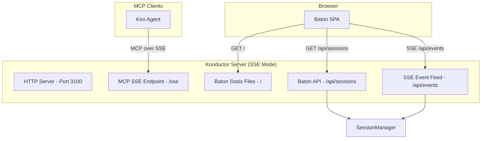

# Design Document: Konductor Baton Dashboard (Phase 4)

## Overview

The Konductor Baton is a lightweight single-page web application served directly by the Konductor server. It provides real-time visualization of active work sessions, collision states, and file-level conflict indicators. The dashboard uses SSE for live updates and vanilla HTML/CSS/JS to avoid build tooling dependencies.

## Architecture



The Konductor's HTTP server (already running for SSE transport) serves double duty:
- `/sse` — MCP SSE endpoint for agent clients
- `/` — Baton SPA static files
- `/api/sessions` — REST endpoint returning current session data as JSON
- `/api/events` — SSE feed pushing session change events to the dashboard

## Components and Interfaces

### Baton API Endpoints

**`GET /api/sessions`**
- Returns all active sessions grouped by repository, with collision state computed for each
- Response: `{ repos: [{ repo, highestState, sessionCount, userCount, sessions: [...] }] }`

**`GET /api/events`**
- SSE stream pushing events: `session_registered`, `session_updated`, `session_deregistered`, `state_changed`
- Each event includes the affected session and updated collision state

### Baton SPA

Single HTML file with embedded CSS and JS. No framework, no build step.

**Layout:**
```
┌─────────────────────────────────────────────┐
│  🎵 Konductor Baton                         │
├─────────────────────────────────────────────┤
│  Repository: org/repo-a        [🔴 Merge Hell] │
│  ├─ alice (feature/auth) - 3 files          │
│  │   ├─ src/auth.ts          [🔴 bob]       │
│  │   ├─ src/middleware.ts    [🟢]            │
│  │   └─ src/types.ts         [🟠 bob]       │
│  └─ bob (fix/login) - 2 files               │
│      ├─ src/auth.ts          [🔴 alice]      │
│      └─ src/types.ts         [🟠 alice]      │
├─────────────────────────────────────────────┤
│  Repository: org/repo-b        [🟢 Solo]    │
│  └─ carol (main) - 1 file                   │
│      └─ README.md             [🟢]           │
└─────────────────────────────────────────────┘
```

**Color coding:**
- 🟢 Green: Solo / Neighbors (no file-level conflict)
- 🟡 Yellow: Crossroads (same directory)
- 🟠 Orange: Collision Course (same file)
- 🔴 Red: Merge Hell (same file, different branches)

## Data Models

### BatonRepoSummary

```typescript
interface BatonRepoSummary {
  repo: string;
  highestState: CollisionState;
  sessionCount: number;
  userCount: number;
  sessions: BatonSessionView[];
}

interface BatonSessionView {
  sessionId: string;
  userId: string;
  branch: string;
  files: BatonFileView[];
  duration: string;  // Human-readable, e.g. "2h 15m"
  collisionState: CollisionState;
}

interface BatonFileView {
  path: string;
  state: CollisionState;
  conflictingUsers: string[];
}
```

## Correctness Properties

*A property is a characteristic or behavior that should hold true across all valid executions of a system — essentially, a formal statement about what the system should do. Properties serve as the bridge between human-readable specifications and machine-verifiable correctness guarantees.*

### Property 1: Baton API session data consistency

*For any* set of active sessions in the SessionManager, the `/api/sessions` endpoint should return a response where every non-stale session appears exactly once, grouped under the correct repository, and the `highestState` for each repository matches the maximum severity across all sessions in that repository.

**Validates: Requirements 1.1, 3.1, 3.2**

### Property 2: File conflict indicator accuracy

*For any* session and set of overlapping sessions, each file in the BatonFileView should have a collision state that matches the state computed by the CollisionEvaluator for that specific file, and `conflictingUsers` should list exactly the users whose sessions include that file.

**Validates: Requirements 2.1, 2.2**

## Testing Strategy

- **Vitest + fast-check** for property-based tests on the Baton API response builder (transforming SessionManager data into BatonRepoSummary)
- **Playwright** for UI tests verifying the dashboard renders correctly, updates in real-time, and displays correct color coding
- Unit tests for the SSE event feed logic
