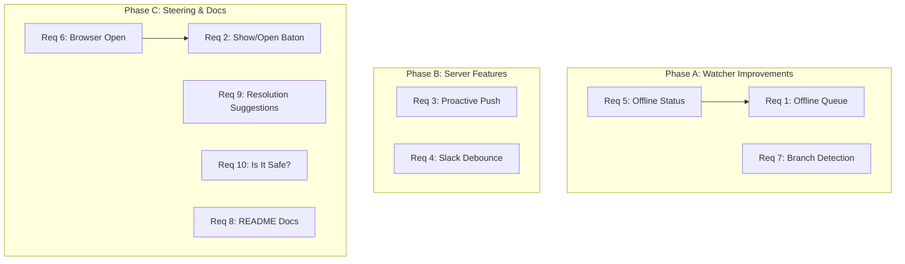

# Design Document: Konductor Bugs & Missing Features

## Overview

This design addresses the 10 remaining open requirements from the bugs-and-missing-features spec (Requirement 11 — Proximity state — is already implemented and verified). The features span three layers: the file watcher client (`konductor-watcher.mjs`), the server (`src/index.ts` and related modules), and the steering rule (`konductor-collision-awareness.md`). The design also incorporates findings from the regression test run documented in `regression-findings.md`.

### Regression Context

The regression run (documented in `regression-findings.md`) found and fixed 3 bugs:
- BUG-001: Admin auth bypass when `KONDUCTOR_ADMIN_AUTH=false` — FIXED
- BUG-002: No REST `/api/deregister` endpoint — FIXED  
- BUG-003: `sharedFiles` missing from `register_session` response — FIXED

All 721 unit tests, 92 Playwright E2E tests, and 56/57 client verification tests now pass. The remaining work is the 10 feature requirements below.

### Requirement Status

| Req | Feature | Layer | Complexity | Status |
|-----|---------|-------|------------|--------|
| 1 | Offline change queuing | Watcher | Medium | Open |
| 2 | "Show/Open Baton" command | Steering | Low | Open |
| 3 | Proactive collision push | Server | Medium | Open |
| 4 | Slack notification debouncing | Server | Medium | Open |
| 5 | Watcher offline status indicator | Watcher + Steering | Low | Open (depends on Req 1) |
| 6 | Browser open capability | Steering | Low | Open (overlaps Req 2) |
| 7 | Watcher branch change detection | Watcher | Low | Open |
| 8 | README dual install docs | Documentation | Low | Open |
| 9 | Actionable resolution suggestions | Steering | Medium | Open |
| 10 | "Is it safe?" query | Steering | Low | Open |
| 11 | Proximity state | Server | — | **DONE** (verified T-062) |

## Architecture

The features group into three implementation phases by layer:



## Components and Interfaces

### Phase A: Watcher Improvements

#### Req 1: Offline Queue (`konductor-watcher.mjs`)

Add an in-memory queue that accumulates file changes when the server is unreachable. On reconnection, replay the cumulative file set in a single registration.

**Changes to `konductor-watcher.mjs`:**

```javascript
// New state
const offlineQueue = new Set();  // cumulative file paths
let offlineQueueMax = 100;       // from KONDUCTOR_OFFLINE_QUEUE_MAX

// In loadConfig():
offlineQueueMax: parseInt(env.KONDUCTOR_OFFLINE_QUEUE_MAX || "100", 10),

// In registerFiles() — when server is unreachable:
for (const f of files) {
  if (offlineQueue.size >= CFG.offlineQueueMax) {
    // FIFO eviction: remove oldest (first inserted)
    const oldest = offlineQueue.values().next().value;
    offlineQueue.delete(oldest);
    log("Offline queue full (max: " + CFG.offlineQueueMax + "). Oldest events discarded.");
  }
  offlineQueue.add(f);
}
log(offlineQueue.size + " file changes queued while offline. Will report on reconnection.");

// On reconnection (server becomes reachable):
if (offlineQueue.size > 0) {
  const queuedFiles = [...offlineQueue];
  offlineQueue.clear();
  await registerFiles(queuedFiles);  // single cumulative registration
  log("Reconnected. Synced " + queuedFiles.length + " offline changes.");
}
```

**Design decision:** Use a `Set` (not array) for the queue since we only need unique file paths. The "FIFO eviction" removes the oldest entry when the set exceeds max size. Since `Set` preserves insertion order, `values().next().value` gives the oldest.

#### Req 7: Branch Detection (`konductor-watcher.mjs`)

Currently `BRANCH` is a constant resolved at startup. Change it to a `let` that's re-evaluated on every poll cycle.

**Changes:**

```javascript
// Change from:
const BRANCH = envVars.KONDUCTOR_BRANCH || git("git branch --show-current") || "unknown";

// To:
let currentBranch = envVars.KONDUCTOR_BRANCH || git("git branch --show-current") || "unknown";

function refreshBranch() {
  if (envVars.KONDUCTOR_BRANCH) return; // env override is static
  const newBranch = git("git branch --show-current") || "unknown";
  if (newBranch !== currentBranch) {
    log(`Branch changed: ${currentBranch} → ${newBranch}`);
    currentBranch = newBranch;
    // Clear pending files — new branch may have different file state
    pendingFiles.clear();
  }
}

// In the poll interval:
setInterval(async () => {
  refreshBranch();  // Check branch on every cycle
  // ... existing poll logic, using currentBranch instead of BRANCH
}, CFG.pollInterval);
```

All references to `BRANCH` in `registerFiles()`, `checkAndNotify()`, and startup logging change to `currentBranch`.

#### Req 5: Offline Status Indicator

This is a watcher-side enhancement that depends on Req 1. The watcher already logs disconnect/reconnect messages. The additional requirement is to include the queue count in those messages.

**Changes:** Modify the disconnect and reconnect log messages in `registerFiles()` to include `offlineQueue.size`. The steering rule already handles displaying watcher status on session start — no steering changes needed beyond what Req 1 provides.

### Phase B: Server Features

#### Req 3: Proactive Collision Push (`src/index.ts`)

When a `register_session` call creates a collision, emit an SSE event to all other affected users' MCP transports.

**Changes to `startSseServer()` in `src/index.ts`:**

The server already tracks SSE transports in a `Map<string, SSEServerTransport>`. We need to also track which userId is associated with each transport (from the `X-Konductor-User` header on `/sse` connection).

```typescript
// New: track userId → transport mapping
const userTransports = new Map<string, Set<SSEServerTransport>>();

// On SSE connection (/sse endpoint):
const userId = req.headers["x-konductor-user"] as string;
if (userId) {
  if (!userTransports.has(userId)) userTransports.set(userId, new Set());
  userTransports.get(userId)!.add(transport);
}

// On SSE disconnect:
if (userId && userTransports.has(userId)) {
  userTransports.get(userId)!.delete(transport);
  if (userTransports.get(userId)!.size === 0) userTransports.delete(userId);
}
```

**In the register_session handler (both MCP and REST):**

After collision evaluation, if the state is not `solo`, push an SSE notification to each overlapping user's transport:

```typescript
if (result.state !== "solo" && result.overlappingSessions.length > 0) {
  for (const overlapping of result.overlappingSessions) {
    const transports = userTransports.get(overlapping.userId);
    if (!transports) continue;
    const event = {
      type: "collision_alert",
      repo,
      collisionState: result.state,
      triggeringUser: userId,
      sharedFiles: result.sharedFiles,
      summary: summaryFormatter.format(result),
    };
    for (const t of transports) {
      // Best-effort push — don't block registration
      try { t.send(JSON.stringify(event)); } catch {}
    }
  }
}
```

**Note:** The MCP SDK's `SSEServerTransport` doesn't expose a raw `send()` method for arbitrary events. We'll need to use the underlying `res` (ServerResponse) object to write SSE data directly. This requires storing the response object alongside the transport.

**Alternative approach:** Use the existing `BatonEventEmitter` to emit a `collision_alert` event scoped to the repo. The watcher already polls `/api/status` on each cycle, so it will pick up the collision on the next poll. The proactive push is an optimization for MCP-connected clients (IDE agents). For the watcher, the poll cycle (default 10s) is the notification path.

#### Req 4: Slack Debounce (`src/slack-notifier.ts`)

Add a per-repo debounce timer to `SlackNotifier.onCollisionEvaluated()`.

**New class: `SlackDebouncer`** (or inline in `SlackNotifier`):

```typescript
interface PendingNotification {
  timer: NodeJS.Timeout;
  repo: string;
  result: CollisionResult;
  triggeringUserId: string;
}

class SlackDebouncer {
  private pending = new Map<string, PendingNotification>();
  private debounceMs: number;

  constructor(debounceMs: number = 30_000) {
    this.debounceMs = debounceMs;
  }

  schedule(repo: string, result: CollisionResult, userId: string, callback: () => Promise<void>): void {
    const existing = this.pending.get(repo);
    if (existing) {
      clearTimeout(existing.timer);
    }
    const timer = setTimeout(async () => {
      this.pending.delete(repo);
      await callback();
    }, this.debounceMs);
    this.pending.set(repo, { timer, repo, result, triggeringUserId: userId });
  }

  setDebounceMs(ms: number): void {
    this.debounceMs = Math.max(5000, Math.min(300_000, ms));
  }
}
```

**Integration in `SlackNotifier.onCollisionEvaluated()`:**

Instead of posting immediately, schedule through the debouncer. The debouncer resets the timer on each call, so rapid state changes coalesce into a single notification.

### Phase C: Steering Rule & Documentation

#### Req 2 + 6: "Show/Open Baton" and Browser Open

Add entries to the Query Routing Table in `konductor-collision-awareness.md`:

```markdown
| "show baton", "where is the repo website?", "show dashboard" | Display the `repoPageUrl` from the most recent registration response. If not available, suggest registering first. |
| "open baton", "open dashboard" | Open the Baton repo page URL in the default browser using `open` (macOS), `xdg-open` (Linux), or `start` (Windows). |
| "open slack" | Open the configured Slack channel URL (`https://slack.com/app_redirect?channel=<channel>`) in the default browser. |
```

#### Req 9: Actionable Resolution Suggestions

Add a new section to the steering rule after the Automatic Collision Check section:

```markdown
## Resolution Suggestions

When displaying a Collision Course or Merge Hell warning, the agent SHALL append a numbered list of suggested actions:

### Same Branch Collision (collision_course)
1. `git pull --rebase` — Rebase your changes on top of the other user's
2. Coordinate with <user> — Agree on who edits which sections
3. `git stash` — Shelve your changes and wait for the other user to finish
4. Continue working — Accept the risk of merge conflicts

### Cross-Branch Collision (merge_hell)
1. Stop and coordinate — Talk to <user> before making more changes
2. `git pull --rebase origin/<their-branch>` — Rebase onto their branch
3. `git stash` — Shelve and wait for their branch to merge first
4. Create a shared branch — Both work on a common feature branch
5. Continue working — Accept the risk of complex merge conflicts

### Approved PR Imminent
1. `git add . && git commit` — Commit your changes immediately before the merge
2. Ask <user> to hold the merge — Request a delay via Slack/chat
3. `git stash` — Shelve and rebase after the PR merges

When the user says "do option N" or "option N", execute the corresponding command after confirmation. Never execute destructive commands (rebase, stash) without explicit "yes" from the user.
```

#### Req 10: "Is It Safe?" Query

Add to the Query Routing Table:

```markdown
| "is it safe to unstash?", "is it safe to resume?", "can I continue?", "is it safe?" | Call `check_status` or `who_overlaps` for the files that were previously stashed. If no overlap: "🟢 Safe to resume." If overlap persists: "⚠️ <user> is still editing <files>. Wait or coordinate." |
```

#### Req 8: README Documentation

Add a "Method 2: Manual MCP Config" subsection to the "Installing Konductor (Client)" section of `konductor/README.md`:

```markdown
### Method 2: Manual MCP Config (auto-install)

If you prefer to configure the MCP connection manually, create `.kiro/settings/mcp.json` in your workspace:

\`\`\`json
{
  "mcpServers": {
    "konductor": {
      "url": "http://localhost:3011/sse",
      "headers": { "Authorization": "Bearer YOUR_API_KEY" }
    }
  }
}
\`\`\`

On the agent's first interaction, the steering rule detects that the workspace files are missing and automatically runs the npx installer to deploy the watcher, hooks, and other artifacts. This is the same installer that runs with Method 1 — the only difference is the trigger.
```

## Data Models

### Offline Queue (Watcher)

```typescript
// In-memory, no persistence needed
interface OfflineQueue {
  files: Set<string>;     // cumulative unique file paths
  maxSize: number;        // from KONDUCTOR_OFFLINE_QUEUE_MAX
  queuedCount: number;    // total events queued (including evicted)
}
```

### Slack Debounce State (Server)

```typescript
interface DebouncePending {
  timer: NodeJS.Timeout;
  repo: string;
  latestResult: CollisionResult;
  latestUserId: string;
  scheduledAt: number;    // Date.now() when timer was last reset
}
```

### User Transport Map (Server — for proactive push)

```typescript
// Maps userId → set of active SSE response objects
type UserTransportMap = Map<string, Set<ServerResponse>>;
```

## Correctness Properties

*A property is a characteristic or behavior that should hold true across all valid executions of a system — essentially, a formal statement about what the system should do. Properties serve as the bridge between human-readable specifications and machine-verifiable correctness guarantees.*

### Property 1: Offline queue preserves all files (union)

*For any* sequence of file change events received while the server is unreachable, and the queue has not exceeded its maximum size, the queue SHALL contain exactly the union of all file paths from those events.

**Validates: Requirements 1.1, 1.2, 1.3**

### Property 2: Offline queue FIFO eviction

*For any* sequence of N file change events where N exceeds the configured maximum queue size M, the queue SHALL contain exactly M entries, and the evicted entries SHALL be the oldest (earliest inserted) ones.

**Validates: Requirements 1.4**

### Property 3: Offline replay is a single registration

*For any* non-empty offline queue, when the server becomes reachable, the watcher SHALL make exactly one registration API call containing all files from the queue, and the queue SHALL be empty after replay.

**Validates: Requirements 1.2, 1.3**

### Property 4: Branch detection on every poll cycle

*For any* branch switch (changing the output of `git branch --show-current`), the watcher SHALL use the new branch name in the next registration call that occurs after the switch.

**Validates: Requirements 7.1, 7.3**

### Property 5: Proactive collision push reaches affected users

*For any* registration that creates a collision (state ≠ solo), all overlapping users with active SSE connections SHALL receive a `collision_alert` event containing the collision state, shared files, and triggering user.

**Validates: Requirements 3.1, 3.4**

### Property 6: Slack debounce coalesces rapid changes

*For any* sequence of collision state changes for a repo within the debounce window, exactly one Slack message SHALL be posted after the debounce period expires, reflecting the final (settled) state.

**Validates: Requirements 4.1, 4.2, 4.3**

### Property 7: Debounce timer resets on new state change

*For any* collision state change that occurs while a debounce timer is active for the same repo, the timer SHALL be reset, and the pending notification SHALL be updated to reflect the new state.

**Validates: Requirements 4.2**

## Error Handling

| Scenario | Handling |
|----------|----------|
| Offline queue full | FIFO eviction with log warning (Req 1.4, 1.6) |
| Server unreachable during replay | Re-queue the files, retry on next poll cycle |
| SSE transport closed during proactive push | Silently skip — transport cleanup handles removal |
| Debounce timer fires after server restart | Timer is in-memory, lost on restart — acceptable |
| Branch detection fails (`git` not available) | Keep current branch, log warning |
| `open` command fails (no browser) | Log error, display URL as text fallback |

## Testing Strategy

### Property-Based Testing

Use `fast-check` (already in the project) for property tests. Each correctness property maps to a single property-based test with a minimum of 100 iterations.

- Property 1–3: Test the `OfflineQueue` class in isolation with generated file path sequences
- Property 4: Test branch refresh logic with generated branch name sequences
- Property 5: Test proactive push with generated user/file/collision scenarios
- Property 6–7: Test `SlackDebouncer` with generated state change sequences and timing

Each property test MUST be tagged with: `**Feature: konductor-bugs-and-missing-features, Property N: <name>**`

### Unit Testing

- Offline queue: edge cases (empty queue, single file, max size boundary)
- Branch detection: no git, detached HEAD, env override
- Proactive push: no connected transports, transport error during send
- Slack debounce: immediate fire (debounce = 0), config change mid-timer
- Steering rule: verify routing table entries exist (text search)
- README: verify both install methods documented (text search)

### Integration Testing

- Watcher offline → reconnect → verify single registration (requires mock server)
- Proactive push end-to-end: register user A, connect SSE, register user B on same files, verify A receives event
- Slack debounce end-to-end: rapid registrations, verify single Slack call after debounce window
