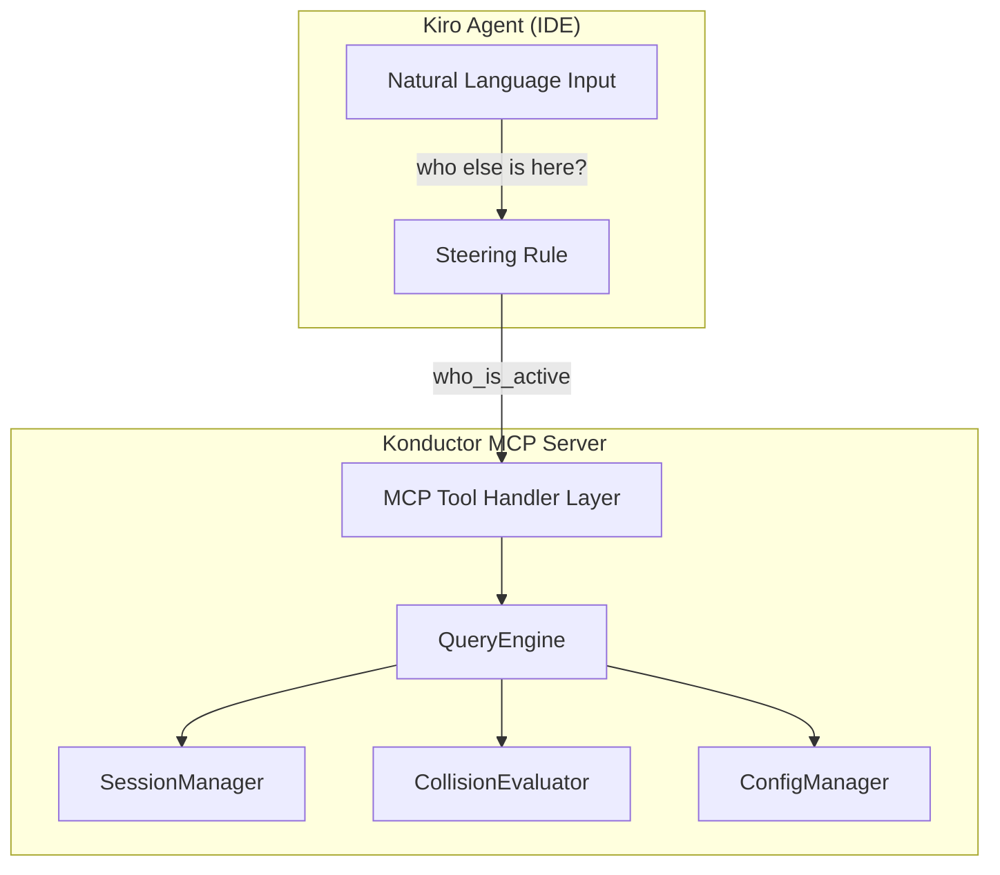

# Design Document: Konductor Enhanced Chat Support

## Overview

The Enhanced Chat feature extends the Konductor MCP server with a set of query-oriented tools that let developers ask natural language questions about repo activity, collision risk, and coordination — and get actionable answers directly in their IDE chat. Rather than only reacting to file registrations, the system becomes conversational.

Phase 1 (this design) adds seven new MCP query tools built on existing session data, plus a comprehensive set of management commands. All interactions are activated by the user prefixing their message with "konductor," (e.g. "konductor, who else is here?"). A companion steering rule update teaches the agent to recognize this prefix, route to the right tool or action, and format responses with emoji-prefixed, human-readable output.

The feature has two categories:
1. **Query tools** — New MCP tools for awareness questions (`who_is_active`, `who_overlaps`, `user_activity`, `risk_assessment`, `repo_hotspots`, `active_branches`, `coordination_advice`)
2. **Management commands** — Steering-rule-driven commands for status checks, configuration changes, reinstallation, and help (no new MCP tools needed — these use existing tools, shell commands, and file edits)

Phases 2 and 3 (history queries and GitHub integration) are deferred to their respective specs.

**Runtime:** Node.js 20+
**Language:** TypeScript 5+
**MCP SDK:** `@modelcontextprotocol/sdk`
**Testing:** Vitest + fast-check (property-based testing)

## Architecture



The new tools are implemented in a single `QueryEngine` class that composes the existing `SessionManager` and `CollisionEvaluator`. The QueryEngine contains no state of its own — it reads from the SessionManager and delegates collision math to the CollisionEvaluator. This keeps the new code thin and testable.

The steering rule update adds a natural language routing table so the agent knows which tool to call for common questions, plus formatting instructions for human-readable output.

### Key Design Decisions

1. **"konductor," activation prefix** — All user-initiated interactions require the prefix "konductor," to avoid false positives. Automatic background operations (session registration, collision checks on file save) continue without the prefix. The prefix is case-insensitive.

2. **Single QueryEngine class** — All seven query tools share common patterns (fetch sessions, filter, compute overlaps, format). A single class avoids duplication and makes testing straightforward.

3. **No new persistence** — Phase 1 queries only need active session data, which already lives in SessionManager. No new storage layer needed.

4. **Pure computation** — The QueryEngine methods are pure functions over session data. They read from SessionManager but never write. This makes them safe to call at any time without side effects.

5. **Structured return types** — Each tool returns a typed result object. The MCP tool handler serializes it to JSON. The steering rule instructs the agent to format the JSON into human-readable chat output.

6. **Management commands via steering rule** — Commands like "restart", "change API key", "show config" don't need new MCP tools. They're implemented as steering rule instructions that tell the agent to run shell commands or edit config files. This keeps the MCP server focused on session/collision data.

7. **Installer post-install message** — The install script is updated to inform users they can talk to Konductor with the "konductor," prefix and list example commands.

## Components and Interfaces

### QueryEngine

```typescript
interface IQueryEngine {
  whoIsActive(repo: string): Promise<ActiveUsersResult>;
  whoOverlaps(userId: string, repo: string): Promise<OverlapResult>;
  userActivity(userId: string): Promise<UserActivityResult>;
  riskAssessment(userId: string, repo: string): Promise<RiskResult>;
  repoHotspots(repo: string): Promise<HotspotsResult>;
  activeBranches(repo: string): Promise<BranchesResult>;
  coordinationAdvice(userId: string, repo: string): Promise<CoordinationResult>;
}
```

The QueryEngine is constructed with references to `SessionManager`, `CollisionEvaluator`, and `ConfigManager`. Each method:
1. Fetches active sessions from SessionManager
2. Filters/groups as needed
3. Delegates collision math to CollisionEvaluator where applicable
4. Returns a structured result

### New MCP Tools

Seven new tools are registered on the MCP server alongside the existing four:

| Tool | Input | Description |
|------|-------|-------------|
| `who_is_active` | `{ repo }` | List all active users in a repo |
| `who_overlaps` | `{ userId, repo }` | Find users overlapping with a specific user |
| `user_activity` | `{ userId }` | Show all active sessions for a user across repos |
| `risk_assessment` | `{ userId, repo }` | Compute collision risk score |
| `repo_hotspots` | `{ repo }` | Rank files by collision risk |
| `active_branches` | `{ repo }` | List branches with active sessions |
| `coordination_advice` | `{ userId, repo }` | Suggest who to coordinate with |

### Steering Rule Update

The existing `konductor-collision-awareness.md` steering rule is extended with three new sections:

1. **Activation prefix** — All user-initiated Konductor interactions require the "konductor," prefix. The agent only routes to Konductor tools/actions when the message starts with "konductor," (case-insensitive). Automatic background operations (session registration, collision checks) continue without the prefix.

2. **Query routing table** — Maps natural language questions to the appropriate MCP query tool.

3. **Management command routing** — Maps management requests to the appropriate action (shell command, file edit, or tool call). These commands do not require new MCP tools — they use existing tools, shell commands, and file operations.

#### Management Commands

The steering rule defines the following management commands, all triggered by the "konductor," prefix:

| User says (examples) | Action | Implementation |
|---|---|---|
| "konductor, are you running?" / "konductor, status" | Check connection status | Call `check_status` or `list_sessions` as a health probe; check watcher PID via `pgrep` |
| "konductor, please reinstall" / "konductor, setup" | Run installer | Execute `bash konductor/konductor_bundle/install.sh` |
| "konductor, please restart" | Restart watcher + reconnect | Kill watcher via `pkill`, relaunch `node konductor-watcher.mjs &`, verify MCP connection |
| "konductor, turn off" / "konductor, stop" | Disable Konductor | Kill watcher, call `deregister_session`, print offline status |
| "konductor, turn on" / "konductor, start" | Enable Konductor | Launch watcher, verify MCP connection, register session |
| "konductor, change my API key to X" | Update API key | Edit `~/.kiro/settings/mcp.json` to set the new Bearer token |
| "konductor, change my logging level to X" | Update log level | Edit `.konductor-watcher.env` to set `KONDUCTOR_LOG_LEVEL=X`, restart watcher |
| "konductor, please enable file logging" | Enable file logging | Edit `.konductor-watcher.env` to uncomment/set `KONDUCTOR_LOG_FILE`, restart watcher |
| "konductor, please disable file logging" | Disable file logging | Edit `.konductor-watcher.env` to comment out `KONDUCTOR_LOG_FILE`, restart watcher |
| "konductor, what config options are there?" | Show config reference | Print a formatted list of all `.konductor-watcher.env` options with descriptions and current values |
| "konductor, show my config" | Show current config | Read `.konductor-watcher.env` and `~/.kiro/settings/mcp.json`, display current values |
| "konductor, what can I ask you to do?" / "konductor, help" | Show help | Print the full list of supported queries and management commands |
| "konductor, change poll interval to X" | Update poll interval | Edit `.konductor-watcher.env` to set `KONDUCTOR_POLL_INTERVAL=X`, restart watcher |
| "konductor, watch only X extensions" | Set file filter | Edit `.konductor-watcher.env` to set `KONDUCTOR_WATCH_EXTENSIONS=X`, restart watcher |
| "konductor, watch all files" | Clear file filter | Edit `.konductor-watcher.env` to comment out `KONDUCTOR_WATCH_EXTENSIONS`, restart watcher |
| "konductor, who am I?" | Show identity | Display resolved userId, repo, branch from cached identity |
| "konductor, change my username to X" | Update identity | Edit `.konductor-watcher.env` to set `KONDUCTOR_USER=X`, restart watcher |

#### Query Routing Table

| User says (examples) | Tool to call |
|---|---|
| "konductor, who else is working here?" / "konductor, who's active?" / "konductor, who else is using konductor right now?" / "konductor, what other users are active in my repo?" | `who_is_active` |
| "konductor, who's on my files?" / "konductor, any conflicts?" | `who_overlaps` |
| "konductor, what is bob working on?" | `user_activity` |
| "konductor, how risky is my situation?" / "konductor, am I safe?" | `risk_assessment` |
| "konductor, what's the hottest file?" / "konductor, where are the conflicts?" | `repo_hotspots` |
| "konductor, what branches are active?" | `active_branches` |
| "konductor, who should I talk to?" / "konductor, who do I coordinate with?" | `coordination_advice` |

#### Formatting Rules

- All Konductor responses use emoji prefixes for severity/category
- Query results are formatted as readable lists, never raw JSON
- Management command confirmations are short and actionable
- Unknown "konductor," commands get a helpful suggestion pointing to "konductor, help"

## Data Models

### ActiveUsersResult

```typescript
interface ActiveUserInfo {
  userId: string;
  branch: string;
  files: string[];
  sessionDurationMinutes: number;
}

interface ActiveUsersResult {
  repo: string;
  users: ActiveUserInfo[];
  totalUsers: number;
}
```

### OverlapResult

```typescript
interface OverlapInfo {
  userId: string;
  branch: string;
  sharedFiles: string[];
  collisionState: CollisionState;
}

interface OverlapResult {
  userId: string;
  repo: string;
  overlaps: OverlapInfo[];
  isAlone: boolean;
}
```

### UserActivityResult

```typescript
interface UserSessionInfo {
  repo: string;
  branch: string;
  files: string[];
  sessionStartedAt: string;
  lastHeartbeat: string;
}

interface UserActivityResult {
  userId: string;
  sessions: UserSessionInfo[];
  isActive: boolean;
}
```

### RiskResult

```typescript
interface RiskResult {
  userId: string;
  repo: string;
  collisionState: CollisionState;
  severity: number;              // 0-4
  overlappingUserCount: number;
  sharedFileCount: number;
  hasCrossBranchOverlap: boolean;
  riskSummary: string;           // Human-readable one-liner
}
```

### HotspotsResult

```typescript
interface HotspotInfo {
  file: string;
  editors: Array<{ userId: string; branch: string }>;
  collisionState: CollisionState;
}

interface HotspotsResult {
  repo: string;
  hotspots: HotspotInfo[];
  isClear: boolean;
}
```

### BranchesResult

```typescript
interface BranchInfo {
  branch: string;
  users: string[];
  files: string[];
  hasOverlapWithOtherBranches: boolean;
}

interface BranchesResult {
  repo: string;
  branches: BranchInfo[];
}
```

### CoordinationResult

```typescript
interface CoordinationTarget {
  userId: string;
  branch: string;
  sharedFiles: string[];
  urgency: "high" | "medium" | "low";
  suggestedAction: string;
}

interface CoordinationResult {
  userId: string;
  repo: string;
  targets: CoordinationTarget[];
  hasUrgentTargets: boolean;
}
```


## Correctness Properties

*A property is a characteristic or behavior that should hold true across all valid executions of a system — essentially, a formal statement about what the system should do. Properties serve as the bridge between human-readable specifications and machine-verifiable correctness guarantees.*

### Property 1: who_is_active returns all active users with complete data

*For any* set of registered sessions in a repository, calling `whoIsActive` should return exactly the set of active (non-stale) users, and each entry should contain the correct `userId`, `branch`, `files`, and a non-negative `sessionDurationMinutes`.

**Validates: Requirements 1.1, 1.2**

### Property 2: who_overlaps returns exactly the overlapping users with complete data

*For any* user with an active session and any set of other sessions in the same repo, calling `whoOverlaps` should return exactly the users whose files overlap with the querying user. Each overlap entry should include the correct `userId`, `branch`, `sharedFiles`, and `collisionState`. When no overlaps exist, `isAlone` should be true and the overlaps list should be empty.

**Validates: Requirements 2.1, 2.2, 2.4**

### Property 3: user_activity returns all sessions across repos with complete data

*For any* user with active sessions across one or more repositories, calling `userActivity` should return all of those sessions. Each entry should include `repo`, `branch`, `files`, `sessionStartedAt`, and `lastHeartbeat`. When the user has no sessions, `isActive` should be false and the sessions list should be empty.

**Validates: Requirements 3.1, 3.2, 3.3**

### Property 4: risk_assessment returns internally consistent risk data

*For any* user with an active session and any set of other sessions in the same repo, calling `riskAssessment` should return a result where: `severity` matches the numeric value of `collisionState`, `overlappingUserCount` equals the number of users with overlapping files, `sharedFileCount` equals the number of shared files, and `hasCrossBranchOverlap` is true if and only if at least one overlapping user is on a different branch.

**Validates: Requirements 4.1, 4.2**

### Property 5: repo_hotspots are ranked by editor count with complete data

*For any* set of sessions in a repository, calling `repoHotspots` should return hotspot entries sorted in descending order by number of editors. Each entry should include the `file`, the list of `editors` (with userId and branch), and the correct `collisionState`. When no files have multiple editors, `isClear` should be true.

**Validates: Requirements 5.1, 5.2, 5.3, 5.4**

### Property 6: active_branches returns all distinct branches with correct overlap flags

*For any* set of sessions in a repository, calling `activeBranches` should return exactly the set of distinct branches. Each entry should include the `branch` name, the `users` on it, and the `files` being edited. The `hasOverlapWithOtherBranches` flag should be true if and only if at least one file on that branch is also being edited on a different branch.

**Validates: Requirements 6.1, 6.2, 6.3**

### Property 7: coordination_advice targets are ranked by urgency with complete data

*For any* user with an active session and any set of other sessions in the same repo, calling `coordinationAdvice` should return targets sorted by urgency: "high" (merge hell — different branch, same files) before "medium" (collision course — same branch, same files) before "low" (crossroads — same directories). Each target should include `userId`, `branch`, `sharedFiles`, and a non-empty `suggestedAction`.

**Validates: Requirements 7.1, 7.2, 7.3**

## Error Handling

### Input Validation
- Invalid repo format (not "owner/repo") → return MCP error with descriptive message (reuses existing `validateRepo` helper)
- Empty or missing userId → return MCP error with validation message
- User not found in active sessions (for overlap/risk/coordination queries) → return a result indicating no active session rather than an error, since the user may simply not have registered yet

### Edge Cases
- No active sessions in repo → `who_is_active` returns empty list, `repo_hotspots` returns `isClear: true`, `active_branches` returns empty list
- User has no session in the queried repo → `who_overlaps` returns `isAlone: true`, `risk_assessment` returns severity 0 (solo), `coordination_advice` returns empty targets
- User has sessions in multiple repos → `user_activity` returns all of them
- Multiple users editing the same file on the same branch → `repo_hotspots` reports it as collision_course, not merge_hell

### Consistency
- All query tools read from the same SessionManager snapshot. Since Node.js is single-threaded, there's no risk of reading inconsistent state within a single tool invocation.

## Testing Strategy

### Property-Based Testing

The project uses **fast-check** as the property-based testing library, integrated with **Vitest** as the test runner.

Each property-based test:
- Runs a minimum of 100 iterations
- Is tagged with a comment in the format: `**Feature: konductor-enhanced-chat, Property {number}: {property_text}**`
- Implements exactly one correctness property from this design document
- Uses smart generators that constrain inputs to the valid domain

#### Generators

A shared set of fast-check arbitraries will generate valid test data:
- `arbUserId()` — alphanumeric strings 1-20 chars
- `arbRepo()` — strings matching "owner/repo" format
- `arbBranch()` — alphanumeric branch names
- `arbFilePath()` — valid relative file paths with forward slashes (e.g. "src/index.ts")
- `arbWorkSession()` — complete WorkSession objects with valid fields
- `arbSessionSet(repo)` — arrays of 0-10 WorkSessions for a given repo, with varied users/branches/files to exercise all collision states

These generators are shared across all property tests to ensure consistency.

### Unit Testing

Unit tests complement property tests by covering:
- Specific edge cases (empty repos, users with no sessions, single-user repos)
- Error conditions (invalid repo format, missing userId)
- Integration between QueryEngine and the MCP tool handler layer
- Steering rule content validation (correct tool names referenced)

### Test Organization

```
src/
  query-engine.ts
  query-engine.test.ts       # Property + unit tests for QueryEngine
  query-engine.types.ts      # Result type definitions
  index.ts                   # Updated with new tool registrations
  index.test.ts              # Updated with new tool integration tests
```

Tests are co-located with source files using `.test.ts` suffix. Property-based tests and unit tests live in the same test files, separated by describe blocks.
