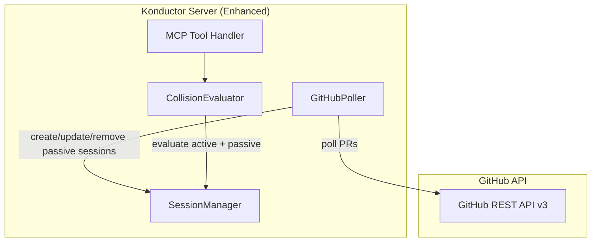

# Design Document: Konductor GitHub Integration (Phase 5)

## Overview

Phase 5 adds a GitHubPoller component to the Konductor that periodically queries the GitHub API for open pull requests across configured repositories. PR data is converted into passive work sessions that participate in collision evaluation alongside active sessions. This provides asymmetric collision awareness — detecting conflicts between active development and pending PRs.

## Architecture



## Components and Interfaces

### GitHubPoller

```typescript
interface IGitHubPoller {
  start(): void;
  stop(): void;
  pollNow(): Promise<void>;
}
```

Runs on a configurable interval (default: 60 seconds). For each configured repository:
1. Fetches open PRs via `GET /repos/{owner}/{repo}/pulls?state=open`
2. For each PR, fetches changed files via `GET /repos/{owner}/{repo}/pulls/{number}/files`
3. Creates or updates passive sessions in the SessionManager
4. Removes passive sessions for PRs that are no longer open

### Passive Session Extension

WorkSession gains an optional `source` field:

```typescript
interface WorkSession {
  // ... existing fields
  source: "active" | "github_pr";
  prNumber?: number;
  prUrl?: string;
}
```

### Enhanced Configuration

```yaml
github:
  token_env: GITHUB_TOKEN  # Environment variable containing the PAT
  poll_interval_seconds: 60
  repositories:
    - "org/repo-a"
    - "org/repo-b"
    - "org/repo-c"
```

## Data Models

### PassiveSessionInfo (extends CollisionResult response)

```typescript
interface OverlappingSessionInfo {
  // ... existing fields
  source: "active" | "github_pr";
  prNumber?: number;
  prUrl?: string;
}
```

## Correctness Properties

*A property is a characteristic or behavior that should hold true across all valid executions of a system — essentially, a formal statement about what the system should do. Properties serve as the bridge between human-readable specifications and machine-verifiable correctness guarantees.*

### Property 1: Passive sessions participate in collision evaluation

*For any* set of active sessions and passive sessions in the same repository, the CollisionEvaluator should compute collision state considering both session types, and the result should be identical to evaluating all sessions as if they were active.

**Validates: Requirements 2.1**

### Property 2: PR lifecycle maps to session lifecycle

*For any* sequence of GitHub PR events (open, update, close/merge), the resulting passive sessions should match: open → create session, update → update session files, close/merge → remove session. After processing, the set of passive sessions should exactly match the set of currently open PRs.

**Validates: Requirements 1.2, 1.3, 1.4**

## Testing Strategy

- **fast-check** for property-based tests on collision evaluation with mixed active/passive sessions
- **Vitest** for unit tests on GitHubPoller with mocked GitHub API responses
- Integration tests verifying the full poll → session creation → collision evaluation pipeline
