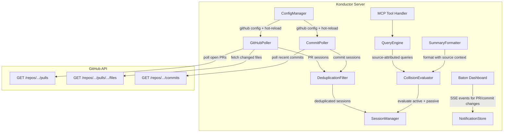

# Design Document: Konductor GitHub Integration

## Overview

This feature adds GitHub-aware collision detection to the Konductor. Two new components — GitHubPoller and CommitPoller — periodically query the GitHub API for open pull requests and recent commits. This data is converted into passive work sessions that participate in collision evaluation alongside active sessions.

The design extends the WorkSession type, CollisionResult model, query tools, client messages, and the Baton dashboard to provide source-attributed collision awareness.

## Architecture



## Components

### WorkSession Extension

The existing `WorkSession` interface in `types.ts` gains optional fields:

```typescript
interface WorkSession {
  // ... existing fields
  source?: "active" | "github_pr" | "github_commit";
  prNumber?: number;
  prUrl?: string;
  prTargetBranch?: string;
  prDraft?: boolean;
  prApproved?: boolean;
  commitDateRange?: { earliest: string; latest: string };
}
```

All existing code treats `source` as `"active"` when undefined (backward compatible).

Passive sessions are NOT persisted to `sessions.json` — they are ephemeral and re-created on each poll cycle. This avoids stale GitHub data surviving server restarts.

### GitHubPoller

```typescript
class GitHubPoller {
  constructor(config: GitHubConfig, sessionManager: SessionManager, logger?: KonductorLogger);
  start(): void;
  stop(): void;
  pollNow(): Promise<void>;
}
```

- Runs on configurable interval (default: 60s)
- Uses the existing `ConfigManager` hot-reload mechanism to pick up config changes
- For each configured repo: fetches open PRs, their changed files, and review status
- Creates/updates/removes PR sessions via `SessionManager`
- Tracks known PR numbers to detect closed/merged PRs
- Respects `include_drafts` config
- Logs via `KonductorLogger` using a new `GITHUB` log category

### CommitPoller

```typescript
class CommitPoller {
  constructor(config: GitHubConfig, sessionManager: SessionManager, logger?: KonductorLogger);
  start(): void;
  stop(): void;
  pollNow(): Promise<void>;
}
```

- Runs on same interval as GitHubPoller
- Fetches recent commits within lookback window per configured branch
- Groups by author, aggregates changed files
- Creates/removes commit sessions
- Deduplicates against existing PR sessions

### DeduplicationFilter

Prevents redundant and self-collision sessions:

1. **Self-collision suppression**: If candidate userId matches an active session's userId in the same repo, skip
2. **PR supersedes commits**: If a user has a PR session covering the same files, skip the commit session
3. **Active supersedes passive**: If a user has an active session, their own PR/commit sessions are suppressed

### Enhanced CollisionEvaluator

Extends `evaluate()`:

1. All session types participate in overlap detection identically
2. Severity weighting:
   - Approved PR + overlap → escalate one level
   - Draft PR + overlap → de-escalate one level
   - PR targeting user's current branch → escalate one level
3. Result includes `OverlappingSessionDetail` with source attribution

### Enhanced SummaryFormatter

Generates source-aware messages:

```
[COLLISION_COURSE] repo:org/app | user:alice
  🟠 bob is actively editing src/index.ts on feature-y (live session)
  🟠 carol's PR #42 (github.com/org/app/pull/42) modifies src/index.ts, targeting main
```

### Enhanced Query Tools

All seven query tools gain source attribution:

- `who_is_active`: includes passive session users with `source` field
- `who_overlaps`: includes source type and metadata per overlap
- `repo_hotspots`: includes passive session files with source
- `coordination_advice`: "review their PR" vs "talk to them now" vs "check their commits"
- `risk_assessment`: factors in PR review status and source diversity
- `active_branches`: includes branches with PR/commit activity
- `user_activity`: includes passive sessions across repos

### Baton Dashboard Integration

Fills the existing "Coming Soon" placeholders:

**Open PRs section** (Baton Requirement 5):
- Table: Hours Open, Branch (linked), PR # (linked), User (linked), Status (draft/approved/open), Files count
- Real-time updates via SSE when PRs are opened/updated/closed

**Repo History section** (Baton Requirement 10):
- Table: Timestamp, Action (Commit/PR/Merge), User (linked), Branch, Summary
- Populated from commit and PR data

**Notifications**:
- PR/commit collision events generate Baton notifications with source context
- Health status computation includes passive session overlaps

### Logger Extension

New `GITHUB` log category:

```
[GITHUB] [SYSTEM] Polled org/repo: 5 open PRs, 12 recent commits
[GITHUB] [SYSTEM] Created PR session for bob: PR #42 (feature-x → main, 3 files)
[GITHUB] [SYSTEM] Removed PR session: PR #42 merged
[GITHUB] [SYSTEM] Created commit session for carol: 4 commits on main (Apr 15–16)
```

### Configuration

Added to `konductor.yaml` (hot-reloadable via existing `ConfigManager`):

```yaml
github:
  token_env: GITHUB_TOKEN
  poll_interval_seconds: 60
  include_drafts: true
  commit_lookback_hours: 24
  repositories:
    - repo: "org/repo-a"
      commit_branches:
        - main
        - develop
    - repo: "org/repo-b"
```

The PAT is stored in `.env.local` as `GITHUB_TOKEN=ghp_...` and referenced by `token_env`.

## Correctness Properties

### Property 1: Source-agnostic overlap detection
For any set of active and passive sessions, file overlap detection is identical regardless of source. Source only affects severity weighting and message formatting.
**Validates: Requirement 3.1**

### Property 2: PR lifecycle maps to session lifecycle
Open → create, update → update files, close/merge → remove. After processing, PR sessions match currently open PRs minus self-collision suppressions.
**Validates: Requirements 1.2, 1.3, 1.4**

### Property 3: Self-collision never reported
A user never sees a warning about colliding with their own PR or commits.
**Validates: Requirements 1.7, 2.4, 3.6**

### Property 4: Severity weighting is monotonic
Approved PR > open PR > draft PR. PR targeting user's branch > PR targeting other branch. Adjustments never skip more than one level.
**Validates: Requirements 3.4, 3.5**

### Property 5: Source attribution in all messages
Every passive session in formatted output includes source type and metadata.
**Validates: Requirements 4.1–4.7**

### Property 6: Deduplication prevents redundant sessions
PR supersedes commits for same files. Active supersedes passive for same user.
**Validates: Requirements 1.7, 2.4**

### Property 7: Graceful degradation on API failure
GitHub API errors don't disrupt active session tracking. Errors are logged and retried next interval.
**Validates: Requirement 5.3**

### Property 8: Baton receives real-time GitHub events
PR and commit session changes trigger SSE events to the Baton dashboard within 5 seconds.
**Validates: Requirement 7.3**

## Testing Strategy

- **fast-check** property tests for collision evaluation with mixed active/passive sessions
- **Vitest** unit tests for GitHubPoller and CommitPoller with mocked API responses
- **Vitest** unit tests for DeduplicationFilter (self-collision, PR-supersedes-commits, active-supersedes-passive)
- **Vitest** unit tests for enhanced SummaryFormatter with source-attributed messages
- **Vitest** unit tests for enhanced query tools with passive session data
- **Vitest** unit tests for Baton SSE events from GitHub session changes
- Integration tests for the full poll → dedup → session → collision → message pipeline
- Edge cases: API rate limiting, empty PR file lists, paginated PRs (300+ files), commit authors not matching Konductor userIds, config hot-reload during polling
