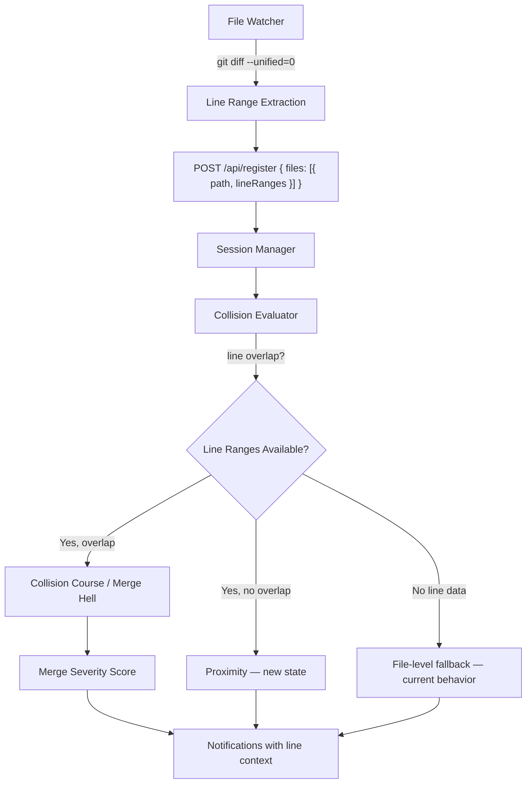

# Design Document: Line-Level Collision Detection

## Overview

The current collision evaluator operates at file granularity — if two users edit the same file, it's a Collision Course regardless of whether they're touching the same function or completely different sections. This feature adds line-level collision detection by:

1. Having the file watcher report modified line ranges (via `git diff` hunks) alongside file paths
2. Extending the server to accept, store, and evaluate line range data
3. Introducing a new "Proximity" state (severity 2.5) for same-file-different-section scenarios
4. Enhancing collision messages, Slack notifications, and dashboard output with line-level context
5. Computing merge severity scores (minimal/moderate/severe) based on overlap extent

All changes are fully backward compatible — clients without line range support continue working unchanged.

## Architecture



The feature touches four layers:

1. **Client (watcher)** — `konductor-watcher.mjs` runs `git diff` to extract line ranges per changed file
2. **Transport (API)** — `/api/register` and `register_session` MCP tool accept extended file format
3. **Core (evaluator)** — `collision-evaluator.ts` computes line overlap and merge severity
4. **Output (formatter/notifier)** — `summary-formatter.ts`, `slack-notifier.ts`, and Baton dashboard include line context

## Components and Interfaces

### New Types in `types.ts`

```typescript
/** A contiguous range of lines (1-indexed, inclusive). */
export interface LineRange {
  startLine: number;
  endLine: number;
}

/** A file change with optional line-level detail. */
export interface FileChange {
  path: string;
  lineRanges?: LineRange[];
}

/** Merge severity based on overlap extent. */
export type OverlapSeverity = "minimal" | "moderate" | "severe";

/** Line-level overlap detail between two users on a shared file. */
export interface LineOverlapDetail {
  file: string;
  /** True if line ranges overlap, false if same file but different sections, null if no line data. */
  lineOverlap: boolean | null;
  userRanges: LineRange[];
  otherRanges: LineRange[];
  overlappingLines: number;
  overlapSeverity: OverlapSeverity | null;
}
```

### Extended `WorkSession`

```typescript
export interface WorkSession {
  // ... existing fields ...
  /** Line-level change data per file. When present, enables line-level collision detection. */
  fileChanges?: FileChange[];
}
```

### Extended `OverlappingSessionDetail`

```typescript
export interface OverlappingSessionDetail {
  // ... existing fields ...
  /** Line-level overlap details for shared files. */
  lineOverlapDetails?: LineOverlapDetail[];
  /** Aggregate merge severity across all shared files. */
  overlapSeverity?: OverlapSeverity;
}
```

### Extended `CollisionResult`

```typescript
export interface CollisionResult {
  // ... existing fields ...
  /** Aggregate merge severity across all overlapping sessions. */
  overlapSeverity?: OverlapSeverity;
}
```

### New Proximity State

The `CollisionState` enum gains no new member. Instead, the Proximity concept is expressed as a `CollisionCourse` state with a `lineOverlap: false` annotation on the overlapping detail. This avoids breaking the existing state model (Requirement 7.3) while still providing the lower-risk context.

However, per Requirement 3.2, Proximity is a distinct state between Crossroads and Collision Course. We add it to the enum:

```typescript
export enum CollisionState {
  Solo = "solo",
  Neighbors = "neighbors",
  Crossroads = "crossroads",
  Proximity = "proximity",        // NEW — same file, different sections
  CollisionCourse = "collision_course",
  MergeHell = "merge_hell",
}

export const SEVERITY: Record<CollisionState, number> = {
  [CollisionState.Solo]: 0,
  [CollisionState.Neighbors]: 1,
  [CollisionState.Crossroads]: 2,
  [CollisionState.Proximity]: 2.5,  // NEW
  [CollisionState.CollisionCourse]: 3,
  [CollisionState.MergeHell]: 4,
};
```

Per Requirements 3.4 and 3.5, Proximity does not pause the agent and does not trigger Slack at default verbosity (level 2). The `shouldNotify` function in `slack-settings.ts` will treat Proximity like Crossroads.

### Collision Evaluator Changes

The `evaluate()` method gains line-level logic in the file overlap section:

```typescript
// Current: commonFiles.length > 0 → CollisionCourse or MergeHell
// New: commonFiles.length > 0 → check line ranges
//   - Both have lineRanges for the file AND ranges overlap → CollisionCourse/MergeHell (unchanged)
//   - Both have lineRanges for the file AND ranges do NOT overlap → Proximity
//   - One or both missing lineRanges → CollisionCourse/MergeHell (fallback, Req 3.3)
```

New helper functions:

```typescript
/** Check if two line ranges overlap (non-empty intersection). */
function rangesOverlap(a: LineRange, b: LineRange): boolean {
  return a.startLine <= b.endLine && b.startLine <= a.endLine;
}

/** Check if any range in set A overlaps with any range in set B. */
function anyRangeOverlap(rangesA: LineRange[], rangesB: LineRange[]): boolean;

/** Count the number of overlapping lines between two range sets. */
function countOverlappingLines(rangesA: LineRange[], rangesB: LineRange[]): number;

/** Compute overlap severity from line counts and percentages. */
function computeOverlapSeverity(
  overlappingLines: number,
  userTotalLines: number,
  otherTotalLines: number,
): OverlapSeverity;
```

Severity thresholds (Requirement 5.2):
- `minimal`: 1–5 overlapping lines
- `moderate`: 6–20 overlapping lines
- `severe`: 21+ overlapping lines OR >50% of either user's changes

### Session Manager Changes

The `register()` method signature is extended to accept the new format:

```typescript
async register(
  userId: string,
  repo: string,
  branch: string,
  files: string[],
  fileChanges?: FileChange[],
): Promise<WorkSession>;
```

When `fileChanges` is provided, the session stores both `files` (for backward-compatible lookups) and `fileChanges` (for line-level evaluation). The `files` array is derived from `fileChanges[].path` to maintain consistency.

### API / MCP Tool Changes

The `register_session` tool and `/api/register` endpoint accept an extended `files` parameter:

```typescript
// Backward compatible: files can be string[] or FileChange[]
files: z.union([
  z.array(z.string().min(1)),
  z.array(z.object({
    path: z.string().min(1),
    lineRanges: z.array(z.object({
      startLine: z.number().int().min(1),
      endLine: z.number().int().min(1),
    })).optional(),
  })),
]).describe("File paths or file changes with optional line ranges");
```

Mixed arrays (Requirement 2.4) are handled by normalizing: strings become `{ path: string }` objects.

### Watcher Changes (`konductor-watcher.mjs`)

New function to extract line ranges from `git diff`:

```javascript
function getLineRanges(filepath) {
  try {
    const diff = execSync(
      `git diff --unified=0 -- "${filepath}"`,
      { encoding: "utf-8", stdio: ["pipe", "pipe", "pipe"] }
    );
    const ranges = [];
    for (const line of diff.split("\n")) {
      // Parse @@ -a,b +c,d @@ hunk headers
      const match = line.match(/^@@\s+-\d+(?:,\d+)?\s+\+(\d+)(?:,(\d+))?\s+@@/);
      if (match) {
        const start = parseInt(match[1], 10);
        const count = match[2] !== undefined ? parseInt(match[2], 10) : 1;
        if (count > 0) {
          ranges.push({ startLine: start, endLine: start + count - 1 });
        }
      }
    }
    return ranges.length > 0 ? ranges : undefined;
  } catch {
    return undefined; // Fallback: no line data (Req 1.3)
  }
}
```

The `registerFiles()` function changes from sending `files: string[]` to sending `files: FileChange[]`:

```javascript
async function registerFiles(files) {
  const fileChanges = files.map(f => {
    const ranges = getLineRanges(f);
    return ranges ? { path: f, lineRanges: ranges } : { path: f };
  });
  const res = await api("/api/register", {
    userId: USER_ID, repo: REPO, branch: BRANCH,
    files: fileChanges,
  });
  // ...
}
```

### Summary Formatter Changes

The `formatDetailLine()` method gains line-level context:

- When `lineOverlapDetails` exist with `lineOverlap: true`: include "same lines" context with specific ranges
- When `lineOverlapDetails` exist with `lineOverlap: false`: include "different sections" context
- When no line data: use existing file-level message (no change)

### Slack Notifier Changes

The `buildEscalationMessage()` method includes line range info in the Slack Block Kit message when available (Requirement 4.4). Shared files list gains line annotations:

```
• `src/index.ts` lines 10-25 ↔ lines 15-30 (overlap: 11 lines — moderate)
```

### Pretty-Printer (`line-range-formatter.ts`)

New utility module for consistent line range display:

```typescript
/** Format a single line range: "line 10" or "lines 10-25" */
export function formatLineRange(range: LineRange): string;

/** Format multiple ranges: "lines 10-25, 40-50" */
export function formatLineRanges(ranges: LineRange[]): string;

/** Serialize FileChange[] to JSON (round-trip safe). */
export function serializeFileChanges(changes: FileChange[]): string;

/** Deserialize FileChange[] from JSON. */
export function deserializeFileChanges(json: string): FileChange[];
```

## Data Models

### Extended Session JSON (persistence)

```json
{
  "sessionId": "abc-123",
  "userId": "alice",
  "repo": "org/app",
  "branch": "feature-x",
  "files": ["src/index.ts", "src/utils.ts"],
  "fileChanges": [
    {
      "path": "src/index.ts",
      "lineRanges": [
        { "startLine": 10, "endLine": 25 },
        { "startLine": 40, "endLine": 45 }
      ]
    },
    {
      "path": "src/utils.ts"
    }
  ],
  "createdAt": "2026-04-20T10:00:00Z",
  "lastHeartbeat": "2026-04-20T10:05:00Z"
}
```

### Extended Collision Result (API response)

```json
{
  "sessionId": "abc-123",
  "collisionState": "proximity",
  "summary": "[PROXIMITY] | repo:org/app | user:alice | overlaps:bob | files:src/index.ts",
  "overlapSeverity": null,
  "overlappingDetails": [
    {
      "userId": "bob",
      "sharedFiles": ["src/index.ts"],
      "lineOverlapDetails": [
        {
          "file": "src/index.ts",
          "lineOverlap": false,
          "userRanges": [{ "startLine": 10, "endLine": 25 }],
          "otherRanges": [{ "startLine": 100, "endLine": 120 }],
          "overlappingLines": 0,
          "overlapSeverity": null
        }
      ]
    }
  ]
}
```

## Correctness Properties

### Property 1: Line range overlap detection is symmetric

*For any* two sets of line ranges A and B, `anyRangeOverlap(A, B)` SHALL return the same result as `anyRangeOverlap(B, A)`.

**Validates: Requirement 3.1**

### Property 2: Non-overlapping ranges produce Proximity state

*For any* two sessions editing the same file where both have line ranges and no range in session A overlaps with any range in session B, the evaluator SHALL return Proximity (not Collision Course).

**Validates: Requirement 3.2**

### Property 3: Missing line data falls back to Collision Course

*For any* two sessions editing the same file where one or both sessions lack line range data for that file, the evaluator SHALL return Collision Course (or Merge Hell for cross-branch), never Proximity.

**Validates: Requirement 3.3**

### Property 4: Overlapping line count is correct

*For any* two sets of line ranges, `countOverlappingLines(A, B)` SHALL equal the cardinality of the set intersection of the line numbers covered by A and the line numbers covered by B.

**Validates: Requirement 5.1**

### Property 5: Overlap severity thresholds are correctly applied

*For any* overlap count N: if N ∈ [1,5] → `minimal`; if N ∈ [6,20] → `moderate`; if N ≥ 21 → `severe`. Additionally, if the overlap exceeds 50% of either user's total changed lines, the severity SHALL be `severe` regardless of absolute count.

**Validates: Requirement 5.2**

### Property 6: FileChange serialization round-trip

*For any* valid `FileChange[]`, serializing to JSON and deserializing back SHALL produce an equivalent array (same paths, same line ranges in same order).

**Validates: Requirement 6.1, 6.2**

### Property 7: Single-line range formatting

*For any* `LineRange` where `startLine === endLine`, `formatLineRange()` SHALL return `"line N"` (singular). For `startLine < endLine`, it SHALL return `"lines N-M"` (plural).

**Validates: Requirement 6.4**

### Property 8: Backward compatibility — string files produce identical results

*For any* set of sessions registered with `files: string[]` (no line ranges), the evaluator SHALL produce the same collision state as the current implementation (no Proximity state possible without line data).

**Validates: Requirement 7.1, 7.2, 7.3, 7.4**

### Property 9: Mixed file format normalization

*For any* `files` array containing a mix of strings and `FileChange` objects, the server SHALL normalize all entries to `FileChange` objects and the resulting `session.files` array SHALL contain exactly the paths from both formats.

**Validates: Requirement 2.4**

### Property 10: Proximity state does not pause the agent

*For any* collision result with state Proximity, the `actions` array SHALL NOT contain any action with `type: "block"`.

**Validates: Requirement 3.4**

### Property 11: Merge severity is included in risk_assessment

*For any* `risk_assessment` query where line overlap exists, the response SHALL include an `overlapSeverity` field with a valid value (`minimal`, `moderate`, or `severe`).

**Validates: Requirement 5.5**

## Error Handling

| Scenario | Behavior |
|----------|----------|
| `git diff` fails for a file | Watcher omits `lineRanges` for that file (file-level fallback) |
| `git diff` returns empty (no changes) | Watcher omits `lineRanges` (file detected by fs.watch but no git diff) |
| New untracked file (not in git) | Watcher omits `lineRanges` (Req 1.3) |
| Binary file | `git diff` produces no hunk headers; watcher omits `lineRanges` |
| `lineRanges` with `startLine > endLine` | Server rejects with validation error |
| `lineRanges` with `startLine < 1` | Server rejects with validation error (Req 1.5: 1-indexed) |
| Old client sends `files: string[]` | Server normalizes to `FileChange[]` without line ranges (Req 7.1) |
| Mixed array of strings and objects | Server normalizes all to `FileChange[]` (Req 2.4) |

## Testing Strategy

### Property-Based Testing

The project uses **fast-check** with **vitest**. Each correctness property above maps to a dedicated property test with ≥100 iterations.

Test files:
- `src/line-range-utils.property.test.ts` — Properties 1, 4, 5, 6, 7
- `src/collision-evaluator-lines.property.test.ts` — Properties 2, 3, 8, 9, 10
- `src/collision-evaluator-lines.test.ts` — Unit tests for specific scenarios

### Key Generators

- **lineRangeArb**: `{ startLine: nat(1, 1000), endLine: nat(startLine, startLine + 200) }`
- **fileChangeArb**: `{ path: filePathArb, lineRanges?: array(lineRangeArb) }`
- **sessionWithLinesArb**: WorkSession with `fileChanges` populated
- **overlapSeverityInputArb**: Tuples of (overlappingLines, userTotal, otherTotal)

### Unit Testing

- Collision evaluator: specific scenarios for each state transition with and without line data
- Summary formatter: line-annotated messages for Proximity, Collision Course with line overlap, and fallback
- Watcher: mock `git diff` output parsing (hunk header extraction)
- API: mixed file format normalization, validation edge cases
