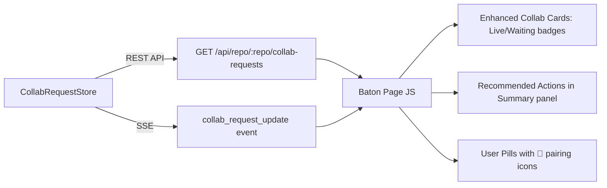

# Design: Live Share Dashboard Visibility & Regression Coverage

## Overview

This design extends the existing Baton repo page (`/repo/:repoName`) to surface active Live Share sessions and recommended collision-resolution actions. No new pages or dashboards are created — all changes are additions to the existing page layout. The work also ensures comprehensive regression test coverage for the entire live-share feature.

Three tracks:

1. **Repo Page Enhancements** — Modify `baton-page-builder.ts` to add visual indicators for active pairing sessions and contextual recommended actions within the existing panels.
2. **Regression Test Plan** — Add Section 13 to `REGRESSION-TEST-PLAN.md` covering all 30 live-share use cases.
3. **Automated Tests** — Add Playwright E2E tests for the collab panel and API tests in `client-verification.mjs`.

See mockup: `konductor/mockups/live-share-repo-page-mockup.html`

## Architecture

All enhancements are purely client-side changes within the existing Baton page builder. No new server endpoints or data models are needed — the collab request data already flows through the existing `GET /api/repo/:repoName/collab-requests` endpoint and `collab_request_update` SSE events.



## Components and Interfaces

### 1. Baton Page Builder — Enhanced Collab Panel (`baton-page-builder.ts`)

The existing `renderCollabRequests()` client-side function and `renderCollabRequestRow()` server-side function are extended:

- **Active Session Badge**: When `status === "link_shared"`, render a `🟢 Live` badge next to the status. When `status === "accepted"`, render a `⏳ Waiting for Link` indicator.
- **User Pill Annotation**: In `renderSummary()`, cross-reference the `collabRequests` array with the user list. If a user is part of a `link_shared` request, append a 🤝 icon to their pill.

### 2. Baton Page Builder — Recommended Actions (`baton-page-builder.ts`)

A new `renderRecommendedActions()` function in the client-side JS:

- Called from `renderSummary()` when `healthStatus` is `warning` or `alerting`.
- Renders a small card below the summary grid with contextual suggestions.
- Suggestions are static text based on the health status — no new API calls needed.

### 3. Regression Test Plan Update (`REGRESSION-TEST-PLAN.md`)

A new Section 13 with test entries T-356 through T-395+ covering:
- Collab request CRUD via REST API
- Baton panel rendering via Playwright
- SSE real-time updates via Playwright
- Agent check-in piggyback via API
- Graceful degradation via API
- Edge cases (dedup, mutual, expiry)

### 4. Playwright E2E Tests (`e2e/collab-requests.spec.ts`)

New test file using the existing `helpers.ts` pattern:
- Seeds collab requests via `CollabRequestStore` on the test context
- Verifies panel rendering, status badges, join buttons, SSE updates
- Tests active session indicators and recommended actions

### 5. Client Verification (`testrepo/client-verification.mjs`)

New test section added to the existing script:
- Tests `GET /api/repo/:repoName/collab-requests`
- Tests `POST /api/collab-requests/:requestId/respond`
- Verifies Baton HTML contains collab panel

## Data Models

No new data models. The existing `CollabRequest` interface from `collab-request-store.ts` provides all needed fields:

```typescript
interface CollabRequest {
  requestId: string;
  initiator: string;
  recipient: string;
  repo: string;
  branch: string;
  files: string[];
  collisionState: CollisionState;
  shareLink?: string;
  status: "pending" | "accepted" | "declined" | "expired" | "link_shared";
  createdAt: string;
  updatedAt: string;
}
```

The `healthStatus` field from the repo summary (`"healthy" | "warning" | "alerting"`) drives the recommended actions visibility.


## Correctness Properties

*A property is a characteristic or behavior that should hold true across all valid executions of a system — essentially, a formal statement about what the system should do. Properties serve as the bridge between human-readable specifications and machine-verifiable correctness guarantees.*

### Property Reflection

After analyzing the acceptance criteria, two properties (1.1 and 1.2) both test that the `renderCollabRequestRow()` function produces status-specific HTML indicators based on the `status` field. These can be combined into a single property that covers all status values.

The remaining testable criteria (1.3, 1.4, 2.1–2.4) are UI rendering behaviors best verified as Playwright examples rather than property-based tests, since they depend on client-side JS execution and cross-component state.

### Properties

Property 1: Status-specific indicator rendering
*For any* valid `CollabRequest` object, the HTML string returned by `renderCollabRequestRow()` SHALL contain a status-specific indicator: "🟢 Live" when status is `link_shared`, "⏳ Waiting" when status is `accepted`, and the standard status badge for all other statuses.
**Validates: Requirements 1.1, 1.2**

## Error Handling

- If the `/api/repo/:repoName/collab-requests` endpoint returns an error or is unreachable, the collab panel falls back to "No active collaboration requests." (existing behavior).
- If the repo summary API returns no `healthStatus`, the recommended actions section is hidden (safe default).
- Playwright tests use `{ timeout: 5000 }` for SSE-dependent assertions to handle slow connections.

## Testing Strategy

### Property-Based Testing

- Library: `fast-check` (already used in the project for other property tests)
- Minimum iterations: 100
- Property 1 tests the `renderCollabRequestRow()` function directly with generated `CollabRequest` objects, verifying the HTML output contains the correct status indicator for each status value.

### Unit Tests

- `baton-page-builder.test.ts` — extend existing tests with cases for active session indicators and recommended actions rendering.

### Playwright E2E Tests

- New file `e2e/collab-requests.spec.ts` covering:
  - Collab panel visibility and empty state
  - Request card rendering with all fields
  - Status badge styling for each status
  - "Join Session" button for `link_shared` requests
  - Active session indicator (🟢 Live badge)
  - SSE real-time updates for `collab_request_update` events
  - Recommended actions visibility based on health status
  - User pill pairing icon annotation

### Client Verification (API Tests)

- Extend `testrepo/client-verification.mjs` with a new section testing:
  - `GET /api/repo/:repoName/collab-requests` — returns array
  - `POST /api/collab-requests/:requestId/respond` — accept/decline
  - Baton HTML contains "Collaboration Requests" section

### Regression Test Plan

- Add Section 13 to `REGRESSION-TEST-PLAN.md` with test entries covering all 30 live-share use cases.
- Each test tagged with unique ID (T-356+), priority (P0/P1/P2), method, and expected result.
