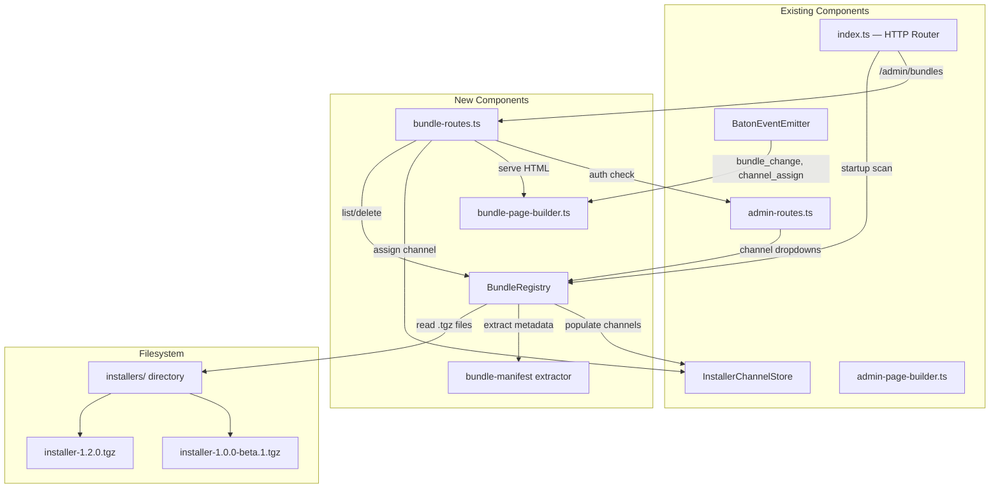

# Design Document: Konductor Local Bundle Store

## Overview

The Local Bundle Store adds a filesystem-backed installer bundle registry to the Konductor server. When `KONDUCTOR_SERVE_CLIENT_BUNDLES_FROM_LOCAL_STORE=true`, the server scans `installers/` for versioned `.tgz` files at startup, indexes them in an in-memory `BundleRegistry`, and exposes them through the admin dashboard for channel assignment. The existing `InstallerChannelStore` is retained for channel-to-tarball mapping but now gets its tarballs from the registry instead of direct uploads.

The feature adds a new Bundle Manager page at `/admin/bundles` (following the mockup at `konductor/konductor/mockups/bundle-manager.html`) and modifies the Global Client Settings panel to use version-selection dropdowns instead of per-channel upload buttons.

## Architecture



### Startup Flow

1. Server starts, checks `KONDUCTOR_SERVE_CLIENT_BUNDLES_FROM_LOCAL_STORE`
2. If `true`, `BundleRegistry.scanLocalStore(installersDir)` reads all `installer-*.tgz` files
3. For each file: extract `bundle-manifest.json` from the tarball (or fall back to filename/mtime), validate semver, index in registry
4. If no bundles found, fall back to packing `konductor-setup/` → seed Prod (current behavior)
5. Channel assignments are NOT automatic — admin must assign versions to channels via the dashboard

### Channel Assignment Flow

1. Admin opens Global Client Settings panel → sees channel cards with version dropdowns
2. Dropdown lists all registry versions sorted by semver (newest first)
3. Admin selects a version for Dev/UAT/Prod → clicks Save
4. Server calls `InstallerChannelStore.setTarball(channel, registry.getTarball(version), version)`
5. SSE event emitted → dashboard updates, install commands update

### Bundle Deletion Flow

1. Admin opens Bundle Manager → clicks Delete on a bundle
2. If bundle is assigned to channels: confirmation dialog lists affected channels + user counts
3. On confirm: registry removes bundle, deletes `.tgz` from disk
4. If assigned channels exist: those channels enter "stale" state (no tarball)
5. Affected clients get `bundleStale: true` in next `register_session` response
6. Admin assigns a new version → stale channels recover → clients get `updateRequired: true`

## Components and Interfaces

### BundleRegistry

New file: `src/bundle-registry.ts`

```typescript
interface BundleMetadata {
  version: string;          // semver
  createdAt: string;        // ISO 8601
  author: string;           // from manifest or "unknown"
  summary: string;          // from manifest or ""
  hash: string;             // SHA-256 hex
  fileSize: number;         // bytes
  filePath: string;         // path on disk (for deletion)
  channels: ChannelName[];  // which channels reference this version (computed)
}

interface BundleRegistry {
  scanLocalStore(dir: string): Promise<void>;
  list(): BundleMetadata[];                          // sorted by semver, newest first
  get(version: string): { metadata: BundleMetadata; tarball: Buffer } | null;
  getLatest(): { metadata: BundleMetadata; tarball: Buffer } | null;  // by createdAt
  delete(version: string): Promise<{ deleted: boolean; staleChannels: ChannelName[] }>;
  has(version: string): boolean;
  updateChannelRefs(channelAssignments: Map<ChannelName, string>): void;
}
```

### bundle-manifest.json Format

Embedded in each `.tgz` at `package/bundle-manifest.json`:

```json
{
  "version": "1.2.0",
  "createdAt": "2026-04-20T09:00:00.000Z",
  "author": "deanwheatley-star",
  "summary": "Channel-aware update URLs, Slack disable checkbox, local bundle store"
}
```

### bundle-page-builder.ts

New file. Generates the Bundle Manager page HTML following the mockup. Reuses `buildAdminStyles()` from `admin-page-builder.ts` for consistent theming.

### bundle-routes.ts

New file. Handles `/admin/bundles` (GET page), `/api/admin/bundles` (GET list, DELETE), `/api/admin/channels/:channel/assign` (PUT). Shares auth middleware with `admin-routes.ts`.

### Admin Page Modifications

`admin-page-builder.ts` changes:
- Global Client Settings panel: replace per-channel "Upload .tgz" buttons with version dropdowns
- Add "Manage Bundles" button linking to `/admin/bundles`
- Channel cards show assigned version from registry

`admin-page-builder.ts` JS changes:
- `renderChannels()`: fetch registry versions, populate dropdowns
- `assignChannelVersion(channel, version)`: POST to `/api/admin/channels/:channel/assign`
- SSE handler: listen for `bundle_change` and `channel_assign` events

## Data Models

### BundleManifest (extracted from tarball)

```typescript
interface BundleManifest {
  version: string;
  createdAt: string;
  author?: string;
  summary?: string;
}
```

### Channel Assignment (stored in AdminSettingsStore)

Channel-to-version mappings stored as settings:
- `channel:dev:version` → `"1.2.0"`
- `channel:uat:version` → `"1.0.0"`
- `channel:prod:version` → `"1.0.0"`

This allows the `InstallerChannelStore` to be populated from the registry at startup and updated via the admin API.

## Correctness Properties

### Property 1: Registry scan completeness
*For any* set of validly-named `.tgz` files in the `installers/` directory, scanning the directory SHALL produce a registry containing exactly one entry per unique semver version, with no entries for files with invalid semver names.
**Validates: Requirements 1.1, 1.2, 1.3, 3.1, 3.2**

### Property 2: Semver ordering
*For any* set of bundle versions in the registry, listing them SHALL produce a sequence ordered by semver precedence (newest first), where pre-release versions have lower precedence than the associated normal version.
**Validates: Requirements 3.3, 4.1**

### Property 3: Channel assignment round-trip
*For any* valid version in the registry and any channel name, assigning the version to the channel and then requesting the channel's tarball SHALL produce a tarball identical to the registry's stored tarball for that version.
**Validates: Requirements 4.3, 10.1, 10.2**

### Property 4: Deletion stale propagation
*For any* bundle version assigned to N channels, deleting the bundle SHALL result in exactly N channels entering the stale state, and zero channels remaining with a valid tarball referencing the deleted version.
**Validates: Requirements 6.4, 7.1**

### Property 5: Latest resolution
*For any* non-empty registry, the "Latest" pseudo-channel SHALL resolve to the bundle with the most recent `createdAt` timestamp, regardless of semver ordering.
**Validates: Requirements 8.2, 8.4**

## Error Handling

- Invalid semver in filename → log warning, skip file, continue scanning
- Corrupt `.tgz` (can't extract manifest) → use filename/mtime fallback metadata
- Duplicate version in directory → log warning, use first file found
- Delete bundle assigned to channels → stale state, warn clients, don't block
- `installers/` directory missing → create it, log instructions
- Empty registry → fall back to `konductor-setup/` pack for Prod

## Testing Strategy

- Unit tests: `bundle-registry.test.ts` — scan, list, get, delete, stale propagation
- Property tests: `bundle-registry.property.test.ts` — Properties 1–5 with fast-check
- Integration tests: `bundle-routes.test.ts` — HTTP endpoints, auth, SSE events
- Admin page tests: verify channel dropdowns, Manage Bundles button, install commands update
