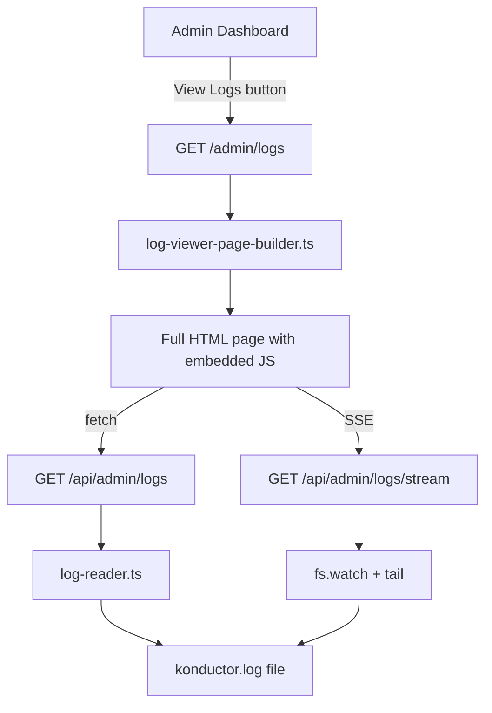

# Design Document: Konductor Log Viewer

## Overview

The Log Viewer adds a dedicated admin page at `/admin/logs` that displays structured Konductor server logs in a sortable, filterable table. It reuses the existing `KonductorLogger` format (`[TIMESTAMP] [CATEGORY] [ACTOR] message`) and the existing admin authentication infrastructure. A "View Logs" button is added to the System Settings panel on the admin dashboard. The page supports real-time log tailing via SSE and client-side filtering/sorting.

## Architecture



The feature consists of three new modules:

1. **log-reader.ts** — Reads and parses the log file into structured `LogEntry[]`. Uses the existing `KonductorLogger.parseEntry()` method for parsing and `KonductorLogger.formatEntry()` for round-trip formatting.
2. **log-viewer-page-builder.ts** — Generates the full HTML page (same pattern as `admin-page-builder.ts`).
3. **Admin route additions** — New routes in `admin-routes.ts` for `/admin/logs`, `/api/admin/logs`, and `/api/admin/logs/stream`.

## Components and Interfaces

### log-reader.ts

```typescript
import type { LogEntry } from "./logger.js";

export interface LogReaderOptions {
  filePath: string;
  maxEntries?: number; // default 500
}

export interface LogReadResult {
  entries: LogEntry[];
  totalLines: number;
  skippedLines: number;
}

/** Read the log file and return parsed entries, newest first. */
export function readLogFile(options: LogReaderOptions): LogReadResult;

/** Parse a single log line. Returns null for malformed lines. */
export function parseLogLine(line: string): LogEntry | null;

/** Format a LogEntry back to the canonical log line string. */
export function formatLogLine(entry: LogEntry): string;
```

### log-viewer-page-builder.ts

```typescript
/** Build the full Log Viewer HTML page. */
export function buildLogViewerPage(username: string): string;
```

### New admin routes

| Method | Path | Description |
|--------|------|-------------|
| GET | `/admin/logs` | Serve the log viewer HTML page (auth required) |
| GET | `/api/admin/logs` | Return parsed log entries as JSON |
| GET | `/api/admin/logs/stream` | SSE stream of new log entries |

### Admin dashboard modification

Add a "View Logs" button to `buildSystemSettingsPanel()` in `admin-page-builder.ts`:

```html
<a class="btn btn-primary btn-sm" href="/admin/logs" target="_blank">View Logs</a>
```

## Data Models

The feature reuses the existing `LogEntry` type from `logger.ts`:

```typescript
export type LogCategory = "CONN" | "SESSION" | "STATUS" | "CONFIG" | "SERVER" | "QUERY" | "GITHUB";

export interface LogEntry {
  timestamp: string;   // "2026-04-10 14:32:01"
  category: LogCategory;
  actor: string;       // "User: <userId>", "SYSTEM", or "Transport: <id>"
  message: string;
}
```

The JSON API response:

```typescript
interface LogApiResponse {
  entries: LogEntry[];
  totalLines: number;
  skippedLines: number;
}
```


## Correctness Properties

*A property is a characteristic or behavior that should hold true across all valid executions of a system — essentially, a formal statement about what the system should do. Properties serve as the bridge between human-readable specifications and machine-verifiable correctness guarantees.*

### Property 1: Log file reader limits to N entries newest-first

*For any* log file containing M well-formed lines and a requested limit of N, the reader SHALL return `min(M, N)` entries, and those entries SHALL be in reverse chronological order (newest timestamp first).

**Validates: Requirements 2.2**

### Property 2: Combined filter applies AND logic

*For any* set of log entries and any combination of category filter (set of categories), actor filter (substring), and message filter (substring), the filtered result SHALL contain exactly those entries where: the entry's category is in the selected set (or all categories if none selected), AND the entry's actor contains the actor filter text (case-insensitive), AND the entry's message contains the message filter text (case-insensitive).

**Validates: Requirements 3.1, 4.1, 5.1, 9.1**

### Property 3: Sorting produces correctly ordered results

*For any* set of log entries and any sortable column (timestamp, category, actor, message) with any direction (ascending or descending), the sorted result SHALL be ordered such that for every consecutive pair of entries (a, b), the value of the sort column for a is ≤ b (ascending) or ≥ b (descending) using lexicographic comparison.

**Validates: Requirements 6.1, 6.2**

### Property 4: Sorting preserves the filtered entry set

*For any* set of log entries with any active filters, applying a sort SHALL produce a result that contains exactly the same set of entries as the filtered (unsorted) result — only the order changes, not the membership.

**Validates: Requirements 6.3**

### Property 5: Parse/format round-trip identity

*For any* well-formed log line in the format `[TIMESTAMP] [CATEGORY] [ACTOR] message`, parsing the line into a LogEntry and then formatting it back SHALL produce a string identical to the original input.

**Validates: Requirements 8.1, 8.2, 8.3**

### Property 6: Malformed lines are rejected

*For any* string that does not match the log line format `[TIMESTAMP] [CATEGORY] [ACTOR] message`, the parser SHALL return null (not throw, not produce a partial result).

**Validates: Requirements 8.4**

## Error Handling

| Scenario | Behavior |
|----------|----------|
| Log file missing | `readLogFile` returns `{ entries: [], totalLines: 0, skippedLines: 0 }` |
| Log file empty | Same as missing |
| Malformed log line | `parseLogLine` returns `null`; line is counted in `skippedLines` |
| SSE connection lost | Client shows disconnected indicator, retries with exponential backoff (1s → 30s max) |
| Unauthenticated access to `/admin/logs` | 302 redirect to `/login` |
| Non-admin access to `/api/admin/logs` | 403 JSON error |

## Testing Strategy

### Property-Based Testing

The project uses **fast-check** with **vitest** for property-based testing. Each correctness property above will be implemented as a dedicated property-based test with a minimum of 100 iterations.

Each property test will be tagged with:
- `**Feature: konductor-log-viewer, Property {N}: {description}**`
- `**Validates: Requirements X.Y**`

Test files:
- `src/log-reader.property.test.ts` — Properties 1, 5, 6
- `src/log-viewer-filter.property.test.ts` — Properties 2, 3, 4

### Unit Testing

Unit tests will cover:
- `log-reader.ts`: specific examples of parsing valid lines, edge cases (empty file, all malformed)
- `admin-routes.ts`: route handler tests for `/admin/logs`, `/api/admin/logs` (auth checks, JSON response shape)
- `log-viewer-page-builder.ts`: HTML output contains expected elements (table headers, filter controls, "View Logs" button)

### Generators

Key fast-check generators needed:

- **validLogLineArb**: Generates well-formed log lines with random timestamps, categories, actors, and messages
- **logEntryArb**: Generates valid `LogEntry` objects with random field values
- **malformedLineArb**: Generates strings that do NOT match the log line regex
- **categoryFilterArb**: Generates subsets of the valid category set
- **filterComboArb**: Generates combinations of category set, actor substring, and message substring
