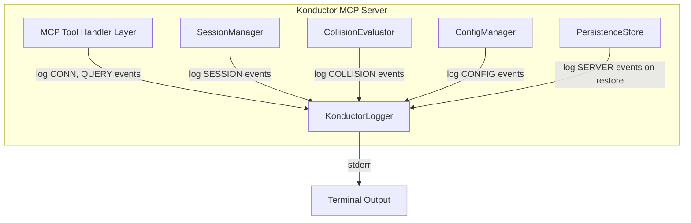

# Design Document: Konductor Verbose Logging

## Overview

This feature adds structured, human-readable activity logging to the Konductor MCP Server. When enabled via environment variables (`VERBOSE_LOGGING=true`, `LOG_TO_TERMINAL=true`), the server outputs a rolling log of all significant events to stderr. When `LOG_TO_FILE=true`, entries are also appended to the file specified by `LOG_FILENAME` (defaults to `konductor.log`). The logging system covers six event categories: connections, sessions, collisions, configuration, server lifecycle, and queries. Terminal output goes to stderr to avoid interfering with stdio MCP transport.

The logger is implemented as a standalone module (`KonductorLogger`) that other components call into. It is disabled by default and has zero overhead when off.

**Runtime:** Node.js 20+
**Language:** TypeScript 5+
**Testing:** Vitest + fast-check

## Architecture



The `KonductorLogger` is injected into each component. Components call logger methods for their respective event types. The logger checks `enabled` before doing any work, so when logging is off there's no string formatting overhead.

## Components and Interfaces

### KonductorLogger

```typescript
interface LogEntry {
  timestamp: string;    // "2026-04-10 14:32:01"
  category: LogCategory;
  actor: string;        // "User: bobby" or "System"
  message: string;
}

type LogCategory = "CONN" | "SESSION" | "COLLISION" | "CONFIG" | "SERVER" | "QUERY";

interface IKonductorLogger {
  readonly enabled: boolean;

  // Connection events
  logConnection(userId: string, ip: string, hostname?: string): void;
  logAuthentication(userId: string): void;
  logDisconnection(userId: string): void;
  logAuthRejection(ip: string, reason: string): void;

  // Session events
  logSessionRegistered(userId: string, sessionId: string, repo: string, branch: string, files: string[]): void;
  logSessionUpdated(userId: string, sessionId: string, files: string[]): void;
  logSessionDeregistered(userId: string, sessionId: string): void;
  logStaleCleanup(count: number, timeoutSeconds: number): void;

  // Collision events
  logCollisionState(userId: string, repo: string, state: string, overlappingUsers: string[], sharedFiles: string[], branches: string[]): void;
  logCollisionAction(actionType: string, affectedUsers: string[], repo: string): void;

  // Config events
  logConfigLoaded(filePath: string, timeoutSeconds: number): void;
  logConfigReloaded(changes: string): void;
  logConfigError(reason: string): void;

  // Server events
  logServerStart(transport: string, port?: number): void;
  logSessionsRestored(count: number): void;
  logHealthCheck(ip: string): void;

  // Query events
  logCheckStatus(userId: string, repo: string, state: string): void;
  logListSessions(repo: string, count: number): void;

  // Core formatting (exposed for testing)
  formatEntry(entry: LogEntry): string;
  parseEntry(line: string): LogEntry;
}
```

### Construction

```typescript
const logger = new KonductorLogger({
  enabled: process.env.VERBOSE_LOGGING === "true",
  toTerminal: process.env.LOG_TO_TERMINAL === "true",
  toFile: process.env.LOG_TO_FILE === "true",
  filePath: process.env.LOG_FILENAME ?? "konductor.log",
});
```

When `enabled` is false, all log methods return immediately. When `toTerminal` is true, formatted entries are written to `process.stderr`. When `toFile` is true, formatted entries are appended to the file at `filePath`.

### Log Format

Each entry is formatted as:

```
[2026-04-10 14:32:01] [CONN] [User: bobby] Connected via SSE from 192.168.68.74 (LT-BOBBY-1.local)
```

The format is: `[TIMESTAMP] [CATEGORY] [ACTOR] MESSAGE`

- Timestamp: ISO 8601 local time, second precision, space-separated date and time
- Category: One of CONN, SESSION, COLLISION, CONFIG, SERVER, QUERY
- Actor: `User: <userId>` or `System`
- Message: Free-form text describing the event

### Integration Points

The logger is created in `index.ts` during bootstrap and passed to each component:

- `SessionManager` receives the logger and calls session event methods
- `CollisionEvaluator` results are logged by the MCP tool handler layer (since the evaluator is a pure function)
- `ConfigManager` receives the logger and calls config event methods
- MCP tool handlers call connection, query, and collision log methods directly
- `PersistenceStore` load results are logged by `SessionManager` or the bootstrap code

## Data Models

### LogEntry

```typescript
interface LogEntry {
  timestamp: string;
  category: LogCategory;
  actor: string;
  message: string;
}
```

### LogCategory

```typescript
type LogCategory = "CONN" | "SESSION" | "COLLISION" | "CONFIG" | "SERVER" | "QUERY";
```

### LoggerOptions

```typescript
interface LoggerOptions {
  enabled: boolean;
  toTerminal: boolean;
  toFile: boolean;
  filePath: string;
}
```

## Correctness Properties

*A property is a characteristic or behavior that should hold true across all valid executions of a system — essentially, a formal statement about what the system should do. Properties serve as the bridge between human-readable specifications and machine-verifiable correctness guarantees.*

### Property 1: Log format consistency

*For any* log entry with a valid category, actor, and message, the formatted output should match the pattern `[TIMESTAMP] [CATEGORY] [ACTOR] message` where the timestamp is in `YYYY-MM-DD HH:MM:SS` format, the category is one of the six valid categories, and the actor is either `User: <id>` or `System`.

**Validates: Requirements 2.1, 2.2, 2.3, 2.4**

### Property 2: Log entry round-trip

*For any* valid LogEntry object, formatting the entry into a string and then parsing that string back should produce a LogEntry with equivalent timestamp, category, actor, and message fields.

**Validates: Requirements 2.5**

### Property 3: Registration log completeness

*For any* user ID, session ID, repository, branch, and file list, the log entries produced by a session registration should contain the user ID, session ID, repository, branch, and all file paths.

**Validates: Requirements 4.1, 4.2**

### Property 4: Collision log completeness by severity

*For any* collision result, the COLLISION log entry should contain the user ID, repository, and state name. When the state is Neighbors or higher, the entry should contain overlapping user IDs. When the state is Collision Course or Merge Hell, the entry should contain shared file paths and branch names.

**Validates: Requirements 5.1, 5.2, 5.3**

## Error Handling

- If `VERBOSE_LOGGING` is not set or is any value other than `"true"`, logging is disabled entirely
- If `LOG_TO_TERMINAL` is not set or is any value other than `"true"`, no output is written even if verbose logging is enabled
- If stderr write fails (unlikely), the error is silently swallowed — logging should never crash the server
- Hostname resolution for connection logging uses a best-effort approach — if reverse DNS fails, only the IP is logged

## Testing Strategy

### Property-Based Testing

The project uses **fast-check** as the property-based testing library, integrated with **Vitest** as the test runner.

Each property-based test:
- Runs a minimum of 100 iterations
- Is tagged with a comment in the format: `**Feature: konductor-logging, Property {number}: {property_text}**`
- Implements exactly one correctness property from this design document
- Uses smart generators that constrain inputs to the valid domain

### Unit Testing

Unit tests complement property tests by covering:
- Logger disabled behavior (no output when `enabled` is false)
- Each log category produces correct output for specific scenarios
- stderr output verification
- Edge cases (empty file lists, missing hostname, long messages)

### Test Organization

```
src/
  logger.ts
  logger.test.ts
```

Tests are co-located with the source file. Property-based tests and unit tests live in the same test file, separated by describe blocks.
