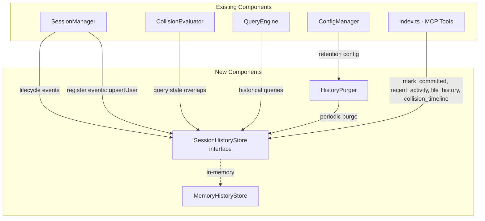

# Design Document: Long-Term Session Memory

## Overview

This feature adds a persistent session history layer to the Konductor MCP Server, enabling collision detection across time gaps, historical queries, and a user registry. The storage backend uses an in-memory store for this phase, with a well-defined `ISessionHistoryStore` interface that a future database implementation can satisfy. All consumers (CollisionEvaluator, QueryEngine, Baton dashboard) interact through this interface and are storage-agnostic.

The design integrates with existing components by hooking into SessionManager lifecycle events (register, deregister, stale cleanup) and extending the CollisionEvaluator to consider historical sessions. Three new MCP tools (`recent_activity`, `file_history`, `collision_timeline`) fulfill Enhanced Chat Phase 2 requirements. A `mark_committed` tool allows the client watcher to clear historical collision warnings when files are committed.

## Architecture



The `ISessionHistoryStore` is instantiated at startup and injected into SessionManager (for lifecycle hooks), CollisionEvaluator (for stale overlap queries), QueryEngine (for historical tools), and the MCP tool handlers in `index.ts`.

## Components and Interfaces

### ISessionHistoryStore

The core interface that the in-memory implementation satisfies and that a future database implementation will also satisfy:

```typescript
interface HistoricalSession {
  sessionId: string;
  userId: string;
  repo: string;
  branch: string;
  files: string[];
  status: "active" | "expired" | "committed";
  createdAt: string;     // ISO 8601
  expiredAt?: string;    // ISO 8601, set on deregister/timeout
  committedAt?: string;  // ISO 8601, set on mark_committed
}

interface ISessionHistoryStore {
  // Lifecycle
  record(session: HistoricalSession): Promise<void>;
  markExpired(sessionId: string, expiredAt: string): Promise<void>;
  markCommitted(params: { sessionId?: string; userId?: string; repo?: string }): Promise<number>;
  updateFiles(sessionId: string, files: string[]): Promise<void>;

  // Queries
  getStaleOverlaps(repo: string, files: string[]): Promise<HistoricalSession[]>;
  getRecentActivity(repo: string, since: string, until: string): Promise<HistoricalSession[]>;
  getFileHistory(repo: string, filePath: string, since: string, until: string): Promise<HistoricalSession[]>;
  getCollisionTimeline(userId: string, repo: string, since: string, until: string): Promise<HistoricalSession[]>;

  // Maintenance
  purgeOlderThan(cutoffDate: string): Promise<number>;
  exportJson(): Promise<string>;
  importJson(json: string): Promise<number>;

  // User records
  upsertUser(userId: string, repo: string): Promise<void>;
  getUser(userId: string): Promise<UserRecord | null>;
  getAllUsers(): Promise<UserRecord[]>;

  // Lifecycle
  close(): Promise<void>;
}
```

### MemoryHistoryStore

In-memory implementation using JavaScript Maps. All data is lost on restart. This is the only implementation for this phase.

- Sessions stored in `Map<string, HistoricalSession>` keyed by sessionId
- User records stored in `Map<string, UserRecord>` keyed by userId
- `record()` filters out passive sessions (source github_pr or github_commit) — only active sessions are stored
- `getStaleOverlaps()` filters by repo, file intersection, and `status === "expired"` (not committed, not active)
- `purgeOlderThan()` iterates and deletes entries with `expiredAt` before the cutoff
- `exportJson()` serializes the Map values to a JSON string
- `importJson()` parses and validates each record before inserting
- `getRecentActivity()` filters by repo and timestamp range on `createdAt` or `expiredAt`
- `getFileHistory()` filters by repo, file membership, and timestamp range
- `getCollisionTimeline()` filters by userId, repo, and timestamp range

### UserRecord

```typescript
interface UserRecord {
  userId: string;
  firstSeen: string;           // ISO 8601
  lastSeen: string;            // ISO 8601
  reposAccessed: RepoAccess[]; // [{repo, lastAccessed}]
  admin: boolean;              // default: false
  installerChannel: string | null; // null = use global default
  settings: Record<string, unknown>; // extensible JSON blob
}

interface RepoAccess {
  repo: string;
  lastAccessed: string; // ISO 8601
}
```

User records are auto-created on first `register_session` call. The `upsertUser()` method creates a new record if none exists, or updates `lastSeen` and `reposAccessed` if one does. The first user created in an empty system gets `admin: true` (bootstrap admin for future admin dashboard).

### HistoryPurger

A periodic timer that calls `ISessionHistoryStore.purgeOlderThan()` at the configured interval. Reads retention config from ConfigManager. Logs purge results via KonductorLogger.

- Started at server boot
- Interval configurable via `purge_interval_hours` (default: 6)
- Also runs once immediately on startup (no-op for fresh in-memory store)
- Respects hot-reloaded config changes (new interval applied on next tick)

### Extended CollisionEvaluator

The existing `CollisionEvaluator.evaluate()` method gains an optional `historyStore` parameter. When provided, it queries for stale overlaps and appends them to the result as a new `staleOverlaps` field.

```typescript
interface StaleOverlap {
  userId: string;
  branch: string;
  files: string[];
  expiredAt: string;
  timeSinceExpiry: string; // human-readable, e.g. "2 days ago"
}

// Added to CollisionResult:
interface CollisionResult {
  // ... existing fields ...
  staleOverlaps: StaleOverlap[];
}
```

### Extended SummaryFormatter

When `staleOverlaps` is non-empty, the formatter appends a section like:
```
⚠️ Historical overlap: bob worked on src/index.ts 2 days ago (uncommitted)
```

### New MCP Tools

| Tool | Parameters | Returns |
|------|-----------|---------|
| `mark_committed` | `sessionId?`, `userId?`, `repo?` | `{ success, count, message }` |
| `recent_activity` | `repo`, `since?`, `until?` | `{ sessions[] }` |
| `file_history` | `repo`, `filePath`, `since?`, `until?` | `{ sessions[] }` |
| `collision_timeline` | `userId`, `repo`, `since?`, `until?` | `{ transitions[] }` |

Default time ranges: `since` defaults to 24 hours ago, `until` defaults to now.

### Configuration Extension

The `konductor.yaml` gains a `history` section:

```yaml
history:
  session_retention_days: 30
  purge_interval_hours: 6
```

The `ConfigManager` is extended to parse this section and expose `getHistoryConfig()`.

## Data Models

### HistoricalSession

```typescript
interface HistoricalSession {
  sessionId: string;
  userId: string;
  repo: string;
  branch: string;
  files: string[];
  status: "active" | "expired" | "committed";
  createdAt: string;
  expiredAt?: string;
  committedAt?: string;
}
```

### UserRecord

```typescript
interface UserRecord {
  userId: string;
  firstSeen: string;
  lastSeen: string;
  reposAccessed: Array<{ repo: string; lastAccessed: string }>;
  admin: boolean;
  installerChannel: string | null;
  settings: Record<string, unknown>;
}
```

### HistoryConfig

```typescript
interface HistoryConfig {
  sessionRetentionDays: number;  // default: 30
  purgeIntervalHours: number;    // default: 6
}
```


## Correctness Properties

*A property is a characteristic or behavior that should hold true across all valid executions of a system — essentially, a formal statement about what the system should do. Properties serve as the bridge between human-readable specifications and machine-verifiable correctness guarantees.*

### Property 1: Storage record/retrieve round-trip

*For any* valid HistoricalSession with status `"active"`, recording it to the MemoryHistoryStore and then querying for it (via `getRecentActivity` with a range covering its `createdAt`) should return a session record equivalent to the original.

This is the fundamental round-trip property for the storage layer. It validates that the in-memory store correctly stores and retrieves all fields.

**Validates: Requirements 1.1, 2.1**

### Property 2: Session lifecycle status transitions

*For any* recorded session, the status transitions follow a valid state machine: calling `markExpired` should set status to `"expired"` and populate `expiredAt`; calling `markCommitted` should set status to `"committed"` and populate `committedAt`. The original fields (sessionId, userId, repo, branch, files, createdAt) should remain unchanged after any transition.

**Validates: Requirements 2.2, 2.3, 5.2**

### Property 3: File list updates are recorded

*For any* recorded session and any new non-empty file list, calling `updateFiles` should result in the session's `files` field matching the new list when subsequently retrieved.

**Validates: Requirements 2.4**

### Property 4: Passive sessions excluded from history

*For any* session with source `"github_pr"` or `"github_commit"`, calling `record()` should result in the session NOT being present in the store. The store should only contain sessions with source `"active"` or no source field.

**Validates: Requirements 2.5**

### Property 5: Purge removes only sessions older than retention

*For any* set of historical sessions with various `expiredAt` timestamps and any retention cutoff date, calling `purgeOlderThan(cutoff)` should remove exactly those sessions whose `expiredAt` is before the cutoff. Sessions with status `"active"` (no `expiredAt`) and sessions expired after the cutoff should remain untouched.

**Validates: Requirements 3.1**

### Property 6: Stale overlap detection correctness

*For any* repo, file list, and set of historical sessions in that repo, `getStaleOverlaps(repo, files)` should return exactly those historical sessions that are (a) status `"expired"` (not `"committed"` or `"active"`), and (b) have at least one file in common with the provided file list.

**Validates: Requirements 4.1, 4.2, 4.3**

### Property 7: Committed sessions excluded from stale overlaps

*For any* set of historical sessions where all sessions are marked as `"committed"`, `getStaleOverlaps` should return an empty array regardless of file overlap with the query files.

**Validates: Requirements 4.4, 5.3**

### Property 8: Recent activity returns sessions in time range

*For any* set of historical sessions and any time range `[since, until]`, `getRecentActivity` should return exactly those sessions in the specified repo whose `createdAt` or `expiredAt` falls within the range.

**Validates: Requirements 6.1**

### Property 9: File history returns correct sessions

*For any* file path, repo, and time range, `getFileHistory` should return exactly those historical sessions that (a) are in the specified repo, (b) contain the specified file in their `files` array, and (c) have a `createdAt` within the time range.

**Validates: Requirements 6.2**

### Property 10: JSON export/import round-trip

*For any* set of valid historical sessions in the store, calling `exportJson()` and then `importJson()` into a fresh store should produce session records equivalent to the originals when queried.

**Validates: Requirements 7.1, 7.2, 7.3**

### Property 11: User record upsert consistency

*For any* sequence of `upsertUser` calls for the same userId with different repos, the resulting user record should have `firstSeen` equal to the timestamp of the first call, `lastSeen` equal to the timestamp of the most recent call, and `reposAccessed` containing all repos with their most recent access timestamps.

**Validates: Requirements 8.1, 8.2**

### Property 12: History config parsing

*For any* valid `history` section in YAML (with `session_retention_days` as a positive integer and `purge_interval_hours` as a positive integer), parsing should produce a config object with the specified values. When the section is absent, defaults (30 days, 6 hours) should be used.

**Validates: Requirements 9.1**

### Property 13: Stale overlap summary formatting

*For any* collision result with non-empty `staleOverlaps`, the formatted summary string should contain each stale overlap's userId and a human-readable time-since-expiry indication.

**Validates: Requirements 4.5**

## Error Handling

| Scenario | Handling |
|----------|----------|
| `record()` called with passive session | Silently skip — do not store |
| `markExpired()` called for nonexistent sessionId | No-op, return without error |
| `markCommitted()` called for nonexistent session | Return `count: 0` — no error |
| `importJson()` receives invalid JSON string | Throw validation error with details |
| `importJson()` receives valid JSON with invalid records | Skip invalid records, import valid ones, return count of imported |
| `updateFiles()` called for nonexistent sessionId | No-op, return without error |
| `getStaleOverlaps()` called on empty store | Return empty array |
| Purge timer fires on empty store | No-op, log count of 0 |
| Config hot-reload with invalid history section | Keep previous config, log warning |

## Testing Strategy

### Property-Based Testing

Property-based tests use `fast-check` (already a devDependency) with a minimum of 100 iterations per property. Each test is annotated with the correctness property it implements using the format: `**Feature: konductor-long-term-memory, Property {number}: {property_text}**`

Generators:
- `historicalSessionArb`: Generates valid `HistoricalSession` objects with random but valid fields (sessionId as UUID, userId as alphanumeric, repo as owner/name, branch as alphanumeric, files as forward-slash paths, status as one of the three valid values, ISO 8601 timestamps)
- `userRecordArb`: Generates valid `UserRecord` objects with random fields
- `timeRangeArb`: Generates valid `[since, until]` ISO 8601 timestamp pairs where `since < until`
- `historyConfigYamlArb`: Generates valid history config YAML sections with positive integer values

### Unit Testing

Unit tests cover:
- Edge cases: empty store, single session, boundary timestamps
- Error conditions: invalid JSON import, nonexistent session operations
- Integration points: SessionManager → HistoryStore lifecycle hooks, CollisionEvaluator → stale overlap queries
- MCP tool handlers: `mark_committed`, `recent_activity`, `file_history`, `collision_timeline` with specific scenarios
- Config parsing: missing section, partial section, invalid values
- Baton REST endpoint: `/api/repo/:repoName/history` response format
