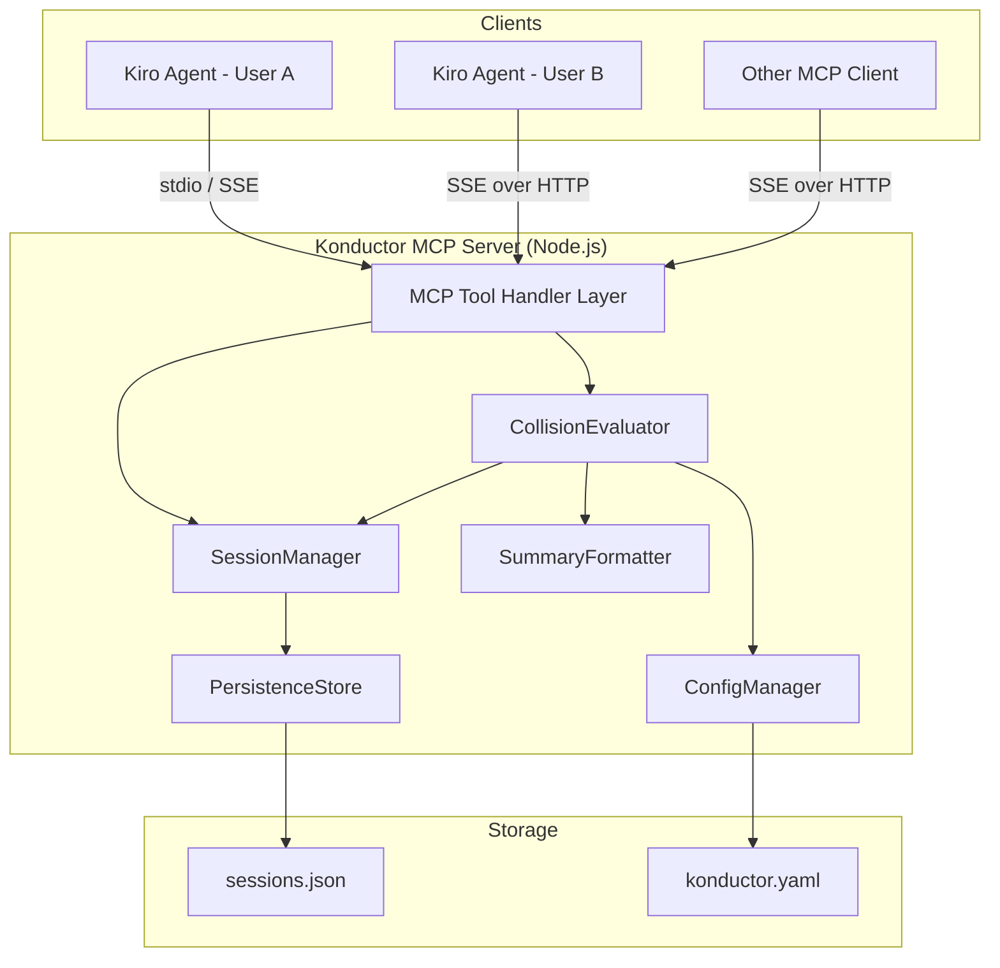

# Design Document: Konductor MCP Server

## Overview

The Konductor is a TypeScript-based MCP server that provides real-time work coordination across GitHub repositories. It tracks active development sessions, evaluates collision risk using a graduated state model, and exposes this awareness through MCP-compliant tools. The server runs as a standalone Node.js process (invocable via `npx`) and integrates with Kiro through steering rules and MCP configuration.

The MVP focuses on explicit session registration by agents/users, collision state evaluation, configurable rules, and JSON file-based persistence. Future phases add GitHub webhook integration and automated actions.

**Runtime:** Node.js 20+
**Language:** TypeScript 5+
**MCP SDK:** `@modelcontextprotocol/sdk`
**Testing:** Vitest + fast-check (property-based testing)
**Package Manager:** npm

## Architecture



The architecture follows a layered approach:
1. **MCP Tool Handler Layer** — receives tool invocations from MCP clients, validates input, dispatches to internal components
2. **SessionManager** — CRUD operations on work sessions, heartbeat tracking, stale session cleanup
3. **CollisionEvaluator** — computes collision state by comparing a user's files against all active sessions in a repository
4. **SummaryFormatter** — generates human-readable summaries from collision state data, with round-trip parseability
5. **ConfigManager** — loads YAML configuration, watches for changes, hot-reloads without restart
6. **PersistenceStore** — JSON serialization/deserialization of sessions to disk with atomic writes

## Components and Interfaces

### MCP Tool Definitions

The Konductor exposes four MCP tools via `@modelcontextprotocol/sdk`:

**`register_session`**
- Input: `{ userId: string, repo: string, branch: string, files: string[] }`
- Output: `{ sessionId: string, collisionState: CollisionState, summary: string }`
- Behavior: Creates or updates a work session for the user in the given repo. If a session already exists for the same user+repo, updates it. Immediately evaluates and returns current collision state.

**`check_status`**
- Input: `{ userId: string, repo: string, files?: string[] }`
- Output: `{ collisionState: CollisionState, overlappingSessions: SessionInfo[], summary: string, actions: Action[] }`
- Behavior: Evaluates collision state without modifying sessions. If `files` is omitted, uses the files from the user's existing session.

**`deregister_session`**
- Input: `{ sessionId: string }`
- Output: `{ success: boolean, message: string }`
- Behavior: Removes the specified work session from tracking.

**`list_sessions`**
- Input: `{ repo: string }`
- Output: `{ sessions: SessionInfo[] }`
- Behavior: Returns all active (non-stale) sessions for a repository.

### SessionManager

```typescript
interface ISessionManager {
  register(userId: string, repo: string, branch: string, files: string[]): Promise<WorkSession>;
  update(sessionId: string, files: string[]): Promise<WorkSession>;
  deregister(sessionId: string): Promise<boolean>;
  heartbeat(sessionId: string): Promise<WorkSession>;
  getActiveSessions(repo: string): Promise<WorkSession[]>;
  cleanupStale(): Promise<number>;
}
```

The SessionManager owns the in-memory session store and delegates persistence to the PersistenceStore. Stale session cleanup runs on a configurable interval.

### CollisionEvaluator

```typescript
interface ICollisionEvaluator {
  evaluate(userSession: WorkSession, allSessions: WorkSession[]): CollisionResult;
}
```

The evaluator computes the highest applicable state by checking overlap levels in order from most severe to least:
1. Same files + different branches → **Merge Hell**
2. Same files, same or unknown branch → **Collision Course**
3. Same directories (derived from file paths) → **Crossroads**
4. Same repo, different files/directories → **Neighbors**
5. No other active sessions → **Solo**

The evaluator is a pure function — it takes a session and a list of other sessions and returns a result. No side effects.

### SummaryFormatter

```typescript
interface ISummaryFormatter {
  format(result: CollisionResult): string;
  parse(summary: string): CollisionResult;
}
```

Produces structured human-readable summaries using a deterministic format. The format is designed to be round-trippable: `parse(format(result))` produces a `CollisionResult` equivalent to the original.

Summary format:
```
[STATE] repo:owner/repo | user:alice | overlaps:bob,carol | files:src/index.ts,src/utils.ts | dirs:src/
```

### ConfigManager

```typescript
interface IConfigManager {
  load(configPath: string): Promise<KonductorConfig>;
  reload(): Promise<KonductorConfig>;
  getTimeout(): number;
  getStateActions(state: CollisionState): Action[];
  onConfigChange(callback: (config: KonductorConfig) => void): void;
}
```

Uses `fs.watch` to detect config file changes and triggers hot-reload. Validates config structure on load.

### PersistenceStore

```typescript
interface IPersistenceStore {
  save(sessions: WorkSession[]): Promise<void>;
  load(): Promise<WorkSession[]>;
}
```

Writes sessions to `sessions.json` using atomic writes (write to temp file, then rename). Reads and validates on startup.

## Data Models

### WorkSession

```typescript
interface WorkSession {
  sessionId: string;        // UUID v4
  userId: string;
  repo: string;             // "owner/repo" format
  branch: string;
  files: string[];           // Relative file paths, normalized with forward slashes
  createdAt: string;         // ISO 8601
  lastHeartbeat: string;     // ISO 8601
}
```

### CollisionState

```typescript
enum CollisionState {
  Solo = "solo",
  Neighbors = "neighbors",
  Crossroads = "crossroads",
  CollisionCourse = "collision_course",
  MergeHell = "merge_hell",
}
```

States are ordered by severity. A numeric severity mapping enables comparison:
```typescript
const SEVERITY: Record<CollisionState, number> = {
  solo: 0, neighbors: 1, crossroads: 2, collision_course: 3, merge_hell: 4
};
```

### CollisionResult

```typescript
interface CollisionResult {
  state: CollisionState;
  queryingUser: string;
  repo: string;
  overlappingSessions: WorkSession[];
  sharedFiles: string[];
  sharedDirectories: string[];
  actions: Action[];
}
```

### KonductorConfig

```typescript
interface KonductorConfig {
  heartbeatTimeoutSeconds: number;  // Default: 300
  states: Record<CollisionState, StateConfig>;
}

interface StateConfig {
  message: string;
  blockSubmissions?: boolean;  // Future phase
}
```

Example `konductor.yaml`:
```yaml
heartbeat_timeout_seconds: 300
states:
  solo:
    message: "You're the only one here. Go wild."
  neighbors:
    message: "Others are in this repo, but touching different files."
  crossroads:
    message: "Heads up — others are working in the same directories."
  collision_course:
    message: "Warning — someone is modifying the same files as you."
  merge_hell:
    message: "Critical — multiple divergent changes on the same files."
    block_submissions: false
```

### Action

```typescript
interface Action {
  type: "warn" | "block" | "suggest_rebase";
  message: string;
}
```


## Correctness Properties

*A property is a characteristic or behavior that should hold true across all valid executions of a system — essentially, a formal statement about what the system should do. Properties serve as the bridge between human-readable specifications and machine-verifiable correctness guarantees.*

### Property 1: Registration preserves session data

*For any* valid user ID, repository name, branch name, and list of file paths, registering a work session and then retrieving it should produce a session whose `userId`, `repo`, `branch`, and `files` fields match the original registration inputs.

**Validates: Requirements 1.1, 1.2**

### Property 2: Session update reflects new files

*For any* registered work session and any new list of file paths, updating the session's files and then retrieving the session should produce a session whose `files` field matches the new file list.

**Validates: Requirements 1.3**

### Property 3: Deregistration removes session

*For any* registered work session, deregistering the session and then listing active sessions for that repository should produce a list that does not contain the deregistered session ID.

**Validates: Requirements 1.4**

### Property 4: Stale sessions are excluded from active queries

*For any* set of work sessions where some have a `lastHeartbeat` older than the configured timeout, querying active sessions should return only the sessions whose `lastHeartbeat` is within the timeout window.

**Validates: Requirements 1.5**

### Property 5: Collision evaluator returns the correct state for the overlap level

*For any* querying session and set of other active sessions in the same repository, the CollisionEvaluator should return:
- "Solo" when no other sessions exist
- "Neighbors" when other sessions exist but share no files or directories
- "Crossroads" when other sessions share directories but not files
- "Collision Course" when other sessions share files on the same branch
- "Merge Hell" when other sessions share files on different branches

The evaluator should always return the highest applicable severity state.

**Validates: Requirements 2.2, 2.3, 2.4, 2.5, 2.6**

### Property 6: Collision response includes required detail for severity level

*For any* CollisionResult with severity at "Neighbors" or higher, the result should include overlapping session usernames, file paths, and branch names. At "Crossroads" or higher, shared directories should be non-empty. At "Collision Course" or higher, shared files should be non-empty.

**Validates: Requirements 3.1, 3.2, 3.3**

### Property 7: Configuration values are applied correctly

*For any* valid KonductorConfig with a custom heartbeat timeout and state-specific actions, the ConfigManager should return the configured timeout value, and the CollisionEvaluator should include the configured actions for the matching collision state in its result.

**Validates: Requirements 4.2, 4.3**

### Property 8: List sessions returns exactly the non-stale sessions for a repo

*For any* set of registered work sessions across multiple repositories (some stale, some active), calling list_sessions for a specific repo should return exactly the non-stale sessions belonging to that repo.

**Validates: Requirements 5.5**

### Property 9: Work session serialization round-trip

*For any* valid WorkSession, serializing the session to JSON and then deserializing it back should produce a WorkSession equivalent to the original.

**Validates: Requirements 6.5**

### Property 10: Summary content completeness

*For any* CollisionResult, the formatted summary should contain the collision state name and the querying user. For results at "Collision Course" or "Merge Hell" severity, the summary should additionally contain the names of overlapping users and the shared file paths.

**Validates: Requirements 7.1, 7.3**

### Property 11: Summary format round-trip

*For any* valid CollisionResult, formatting the result into a summary string and then parsing that string back should produce a CollisionResult with equivalent `state`, `queryingUser`, `repo`, `overlappingSessions` user IDs, and `sharedFiles`.

**Validates: Requirements 7.4**

## Error Handling

### Transport and Authentication
- SSE mode listens on a configurable port (default: 3100, configurable via `KONDUCTOR_PORT` env var or `konductor.yaml`)
- Remote clients authenticate via `Authorization: Bearer <API_KEY>` header
- API key is configured via `KONDUCTOR_API_KEY` environment variable
- Invalid or missing API key returns HTTP 401 before MCP session is established
- stdio mode requires no authentication (local single-user access)

### Input Validation Errors
- Invalid or missing required fields in tool inputs → return MCP error response with descriptive message
- Empty file lists on registration → reject with validation error
- Invalid session ID format on deregister/heartbeat → return "session not found" error
- Malformed repo format (not "owner/repo") → reject with validation error

### Persistence Errors
- Corrupted `sessions.json` on load → log warning, start with empty session store, back up corrupted file
- Write failure to `sessions.json` → retry once, log error, continue with in-memory state
- File permission errors → log error with actionable message about file permissions

### Configuration Errors
- Missing `konductor.yaml` → use built-in defaults, log info message
- Invalid YAML syntax → keep previous config, log parse error
- Missing required config fields → merge with defaults for missing fields
- Hot-reload failure → keep previous config, log error

### Runtime Errors
- Session not found on update/deregister/heartbeat → return descriptive "not found" error
- Concurrent modification of session store → use in-memory locking (single Node.js event loop handles this naturally)

## Testing Strategy

### Property-Based Testing

The project uses **fast-check** as the property-based testing library, integrated with **Vitest** as the test runner.

Each property-based test:
- Runs a minimum of 100 iterations
- Is tagged with a comment in the format: `**Feature: konductor-mcp-server, Property {number}: {property_text}**`
- Implements exactly one correctness property from this design document
- Uses smart generators that constrain inputs to the valid domain (e.g., valid file paths, valid repo formats, valid UUIDs)

### Unit Testing

Unit tests complement property tests by covering:
- Specific edge cases (empty inputs, boundary values)
- Error conditions (invalid inputs, missing sessions)
- Integration points between components (MCP tool handler → SessionManager → PersistenceStore)
- Configuration loading and validation

### Test Organization

```
src/
  session-manager.ts
  session-manager.test.ts
  collision-evaluator.ts
  collision-evaluator.test.ts
  summary-formatter.ts
  summary-formatter.test.ts
  config-manager.ts
  config-manager.test.ts
  persistence-store.ts
  persistence-store.test.ts
  types.ts
  index.ts                    # MCP server entry point
```

Tests are co-located with source files using `.test.ts` suffix. Property-based tests and unit tests live in the same test files, clearly separated by describe blocks.

### Documentation

README.md is maintained incrementally alongside implementation. Each task that adds a tool, config option, or component updates the corresponding README section in the same step. The README covers: overview, quick start, configuration reference, MCP tool reference, and architecture. See the `documentation-standards` steering rule for full guidelines.
