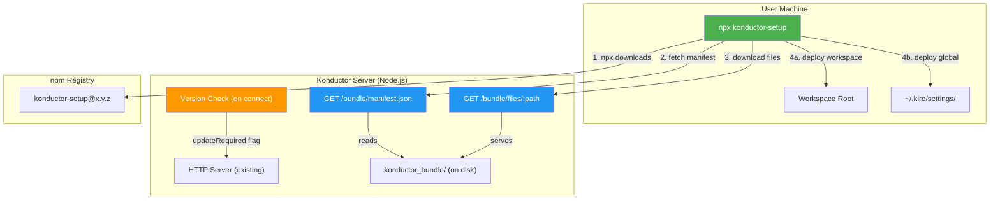

# Design Document: Konductor npx Installer

## Overview

This design replaces the manual "copy `konductor_bundle` into your project" distribution model with a hybrid approach: an npm package (`konductor-setup`) that users invoke via `npx`, which downloads the latest bundle files from the Konductor server at install time and falls back to embedded files when the server is unreachable.

The system has three parts:
1. **npm package** (`konductor-setup`) — cross-platform Node.js installer invoked via `npx konductor-setup`
2. **Server bundle endpoints** — two new HTTP routes on the existing Konductor server that serve the bundle manifest and files
3. **Client version checking** — the server compares client versions on connect and signals when updates are needed

The installer replicates the exact deployment behavior of the current `install.sh` / `install.ps1` scripts but in pure Node.js, eliminating the platform-specific shell dependency for core logic.

**Runtime:** Node.js 20+
**Language:** TypeScript (compiled to JS for the npm package)
**Package:** `konductor-setup` on npm
**Server changes:** Two new HTTP routes + version comparison logic in `index.ts`

## Architecture



### Flow

1. User runs `npx konductor-setup [--server URL] [--api-key KEY] [--workspace|--global]`
2. npx downloads and caches the `konductor-setup` package from npm
3. The installer fetches `GET /bundle/manifest.json` from the Konductor server
4. If the server is reachable, it downloads each file listed in the manifest via `GET /bundle/files/<path>` into a temp directory
5. If the server is unreachable, it falls back to the `bundle/` directory embedded in the npm package
6. The installer deploys files to global (`~/.kiro/`, `~/.gemini/`) and/or workspace (`.kiro/`, `.agent/`, workspace root) locations
7. The installer launches the file watcher as a background process
8. On subsequent MCP connections, the server checks the client's `X-Konductor-Client-Version` header and returns `updateRequired: true` if outdated

## Components

### 1. npm Package: `konductor-setup`

#### Package Structure

```
konductor-setup/
  package.json          # name: "konductor-setup", bin: { "konductor-setup": "./bin/setup.mjs" }
  bin/
    setup.mjs           # Entry point — CLI arg parsing, orchestration
  lib/
    installer.mjs       # Core install logic (global + workspace setup)
    bundle-fetcher.mjs  # Download manifest + files from server, fallback to embedded
    workspace.mjs       # Workspace root detection, .gitignore management
    platform.mjs        # OS-specific watcher launch, path handling
  bundle/               # Embedded fallback copy of all bundle files
    konductor-watcher.mjs
    konductor-watcher-launcher.sh
    konductor-watchdog.sh
    kiro/
      settings/mcp.json
      steering/konductor-collision-awareness.md
      hooks/konductor-file-save.hook.md
      hooks/konductor-session-start.hook.md
    agent/
      rules/konductor-collision-awareness.md
```

#### `package.json`

```json
{
  "name": "konductor-setup",
  "version": "0.1.0",
  "description": "Installer for Konductor collision awareness client",
  "type": "module",
  "bin": {
    "konductor-setup": "./bin/setup.mjs"
  },
  "engines": {
    "node": ">=20.0.0"
  },
  "files": [
    "bin/",
    "lib/",
    "bundle/"
  ]
}
```

Zero runtime dependencies. Uses only Node.js built-ins (`node:fs`, `node:path`, `node:os`, `node:child_process`, `node:https`/`node:http`).

#### CLI Interface

```
npx konductor-setup [options]

Options:
  --global              Run global setup only
  --workspace           Run workspace setup only
  --server <url>        Konductor server URL (default: http://localhost:3010)
  --api-key <key>       API key to write into MCP config
  --check-update        Check if a newer version is available on the server
  --version             Print package version
  --help                Show help
```

No flags = smart default: if global config already exists with a konductor entry, run workspace-only. Otherwise run both.

#### Core Logic: `installer.mjs`

```typescript
interface InstallerOptions {
  mode: "global" | "workspace" | "both" | "auto";
  serverUrl: string;
  apiKey?: string;
  workspaceRoot: string;
}

async function install(options: InstallerOptions): Promise<void>;
```

The `install` function:

1. Calls `BundleFetcher.fetch(serverUrl)` to get bundle files (server or embedded fallback)
2. If `mode === "auto"`, checks if `~/.kiro/settings/mcp.json` has a konductor entry → workspace-only if yes, both if no
3. Runs global setup: MCP config (merge or create), global steering rules, global agent rules
4. Runs workspace setup: clean previous install, deploy steering/hooks/agent rules/watcher/launcher/watchdog, create `.konductor-watcher.env` if missing, update `.gitignore`, launch watcher
5. Writes a `.konductor-version` file in the workspace root containing the deployed bundle version (used for update detection)

The logic mirrors the current `install.sh` exactly — same file destinations, same cleanup steps, same env file preservation. The only difference is it's JavaScript instead of bash.

#### Bundle Fetcher: `bundle-fetcher.mjs`

```typescript
interface BundleManifest {
  version: string;           // semver, e.g. "0.1.0"
  files: string[];           // relative paths, e.g. ["konductor-watcher.mjs", "kiro/steering/konductor-collision-awareness.md"]
}

interface FetchResult {
  source: "server" | "embedded";
  version: string;
  bundleDir: string;         // absolute path to directory containing the files
}

async function fetchBundle(serverUrl: string): Promise<FetchResult>;
```

Fetch strategy:
1. `GET ${serverUrl}/bundle/manifest.json` with a 5-second timeout
2. If successful, download each file from `GET ${serverUrl}/bundle/files/${path}` into `os.tmpdir()/konductor-bundle-<random>/`
3. If any step fails (network error, timeout, non-200 status), fall back to `__dirname/../bundle/` (the embedded copy in the npm package)
4. Return the `FetchResult` with source indicator and resolved directory path

#### Platform: `platform.mjs`

```typescript
function launchWatcher(workspaceRoot: string): void;
function killExistingWatcher(): void;
```

- `launchWatcher`: spawns `node konductor-watcher.mjs` as a detached background process with `stdio: 'ignore'` and calls `.unref()`. On all platforms, uses `child_process.spawn` with `detached: true`.
- `killExistingWatcher`: on macOS/Linux uses `pkill -f "node.*konductor-watcher.mjs"`. On Windows uses `taskkill` to find and kill matching node processes.

### 2. Server Bundle Endpoints

Two new routes added to the existing HTTP server in `index.ts`:

#### `GET /bundle/manifest.json`

No authentication required (Req 7.4).

Response:
```json
{
  "version": "0.1.0",
  "files": [
    "konductor-watcher.mjs",
    "konductor-watcher-launcher.sh",
    "konductor-watchdog.sh",
    "kiro/settings/mcp.json",
    "kiro/steering/konductor-collision-awareness.md",
    "kiro/hooks/konductor-file-save.hook.md",
    "kiro/hooks/konductor-session-start.hook.md",
    "agent/rules/konductor-collision-awareness.md"
  ]
}
```

Implementation: reads the `konductor_bundle/` directory on disk (relative to the server's working directory), walks it recursively to build the file list, and reads the version from the server's own `package.json`. The file list is computed once at startup and cached.

#### `GET /bundle/files/:path`

No authentication required (Req 7.4).

Serves the raw file content from `konductor_bundle/<path>` with appropriate `Content-Type` (text/plain for most, application/json for .json files). Returns 404 if the path doesn't exist or attempts path traversal (contains `..`).

#### Implementation Location

Both routes are added to the `createServer` callback in `startSseServer()`, before the existing route matching. They are simple static file serving — no new components or classes needed.

```typescript
// In startSseServer's request handler, before existing routes:

// Bundle manifest (no auth required)
if (req.method === "GET" && url.pathname === "/bundle/manifest.json") {
  res.writeHead(200, { "Content-Type": "application/json" });
  res.end(JSON.stringify(bundleManifest));
  return;
}

// Bundle file serving (no auth required)
if (req.method === "GET" && url.pathname.startsWith("/bundle/files/")) {
  const filePath = url.pathname.slice("/bundle/files/".length);
  // Validate: no path traversal
  if (filePath.includes("..")) {
    res.writeHead(400, { "Content-Type": "application/json" });
    res.end(JSON.stringify({ error: "Invalid path" }));
    return;
  }
  const fullPath = resolve(bundleDir, filePath);
  try {
    const content = readFileSync(fullPath);
    const ext = extname(filePath);
    const contentType = ext === ".json" ? "application/json" : "text/plain";
    res.writeHead(200, { "Content-Type": contentType });
    res.end(content);
  } catch {
    res.writeHead(404, { "Content-Type": "application/json" });
    res.end(JSON.stringify({ error: "File not found" }));
  }
  return;
}
```

### 3. Client Version Checking

#### Server Side

On SSE connect (`GET /sse`) and on REST API calls (`POST /api/register`, `POST /api/status`), the server reads the `X-Konductor-Client-Version` header from the request. It compares this against the server's bundle version using semver comparison.

If the client version is missing or older, the server adds `"updateRequired": true` and `"serverVersion": "<version>"` to the response JSON. This is a non-breaking addition — existing clients without version awareness simply ignore the extra fields.

For MCP tool calls (`register_session`, `check_status`), the `clientVersion` field is accepted as an optional input parameter. The version check result is appended to the tool's response JSON alongside the existing fields.

```typescript
// Added to register_session and check_status tool responses:
{
  sessionId: "...",
  collisionState: "solo",
  summary: "...",
  updateRequired: true,          // only present when client is outdated
  serverVersion: "0.2.0"         // only present when updateRequired is true
}
```

#### Client Side (Steering Rule)

The steering rule's "Automatic Registration" section is updated. After calling `register_session`, if the response contains `updateRequired: true`:

1. The agent runs `npx konductor-setup@latest --workspace --server <serverUrl>` silently
2. On success: prints `🔄 Konductor: Client updated to v<serverVersion>.` and re-registers the session
3. On failure: prints `⚠️ Konductor: Client is outdated (v<old> → v<new>). Run "npx konductor-setup" to update.`

This happens at most once per session (the agent tracks whether it already attempted an update).

#### Watcher Side

The file watcher (`konductor-watcher.mjs`) is also updated to send `X-Konductor-Client-Version` on its REST API calls. It reads its version from the `.konductor-version` file written by the installer. If the server responds with `updateRequired: true`, the watcher logs a warning but does not self-update (the agent handles that on next session start).

### 4. Version File

The installer writes a `.konductor-version` file to the workspace root:

```
0.1.0
```

Single line, just the semver string. This file is:
- Read by the watcher to report its version to the server
- Read by the installer on subsequent runs to detect if an update is needed
- Added to `.gitignore` by the installer

### 5. Steering Rule Updates

The `konductor-collision-awareness.md` steering rule is updated in two places:

#### Setup Command Section

Replace:
```
bash /path/to/konductor/konductor_bundle/install.sh
```

With:
```
npx konductor-setup --server <serverUrl> --api-key <key>
```

The agent passes `--server` if the Konductor server URL is known from the MCP config or context. It passes `--api-key` if the key is known.

#### Automatic Registration Section

Add after the existing collision check logic:

```
If the register_session response contains updateRequired: true, run:
  npx konductor-setup@latest --workspace --server <serverUrl>
Print: 🔄 Konductor: Client updated to v<version>.
If the update fails, print:
  ⚠️ Konductor: Client is outdated. Run "npx konductor-setup" to update.
Only attempt once per session.
```

## Data Models

### BundleManifest

```typescript
interface BundleManifest {
  version: string;    // semver string matching the server's package.json version
  files: string[];    // relative paths within konductor_bundle/
}
```

### InstallerOptions

```typescript
interface InstallerOptions {
  mode: "global" | "workspace" | "both" | "auto";
  serverUrl: string;
  apiKey?: string;
  workspaceRoot: string;
}
```

### FetchResult

```typescript
interface FetchResult {
  source: "server" | "embedded";
  version: string;
  bundleDir: string;
}
```

## Correctness Properties

### Property 1: Installer deploys identical file set to current scripts

*For any* valid combination of `--global` and `--workspace` flags, the set of files deployed by `npx konductor-setup` to global and workspace locations SHALL be identical to the set deployed by `install.sh` (macOS/Linux) or `install.ps1` (Windows) with the equivalent flags.

**Validates: Requirements 1.1, 1.2, 1.3, 5.5**

### Property 2: Server fallback produces a working installation

*For any* installation where the Konductor server is unreachable, the installer SHALL complete successfully using embedded bundle files, and the resulting installation SHALL be functionally equivalent to a server-sourced installation (differing only in bundle version).

**Validates: Requirements 2.3, 2.4**

### Property 3: API key handling preserves existing non-placeholder keys

*For any* existing `~/.kiro/settings/mcp.json` that contains a konductor entry with an API key that is not `YOUR_API_KEY`, running the installer without `--api-key` SHALL preserve the existing key value unchanged.

**Validates: Requirements 3.3**

### Property 4: Auto-mode correctly detects global config presence

*For any* system where `~/.kiro/settings/mcp.json` exists and contains a `mcpServers.konductor` entry, running `npx konductor-setup` without `--global` or `--workspace` flags SHALL perform workspace-only setup. For any system where the file does not exist or lacks a konductor entry, it SHALL perform both global and workspace setup.

**Validates: Requirements 4.1, 4.2**

### Property 5: Env file preservation

*For any* workspace that already contains a `.konductor-watcher.env` file, running the installer SHALL not modify or overwrite that file.

**Validates: Requirements 5.2**

### Property 6: Watcher is always launched after workspace setup

*For any* successful workspace setup (whether via `--workspace`, `--global --workspace`, or auto-mode that includes workspace), the installer SHALL launch the file watcher as a detached background process before exiting.

**Validates: Requirements 5.1**

### Property 7: Bundle manifest lists all deployable files

*For any* state of the `konductor_bundle/` directory on the server, the `GET /bundle/manifest.json` response SHALL list every file in that directory (recursively), and every file listed SHALL be retrievable via `GET /bundle/files/<path>`.

**Validates: Requirements 7.1, 7.2, 7.3**

### Property 8: Bundle endpoints reject path traversal

*For any* request to `GET /bundle/files/<path>` where `<path>` contains `..`, the server SHALL return HTTP 400 and SHALL NOT read any file outside the `konductor_bundle/` directory.

**Validates: Requirements 7.5 (security)**

### Property 9: Version comparison triggers update correctly

*For any* client reporting version X via `X-Konductor-Client-Version` header, and server bundle version Y, the server SHALL set `updateRequired: true` in the response if and only if X < Y (semver comparison) or X is missing/empty.

**Validates: Requirements 9.1, 9.2, 9.3**

### Property 10: Cross-platform path handling

*For any* file path in the bundle manifest, the installer SHALL correctly resolve and write the file on macOS, Linux, and Windows, handling path separator differences transparently.

**Validates: Requirements 8.1, 8.2**

## Error Handling

### Network Errors (Installer)
- Server unreachable during manifest fetch → fall back to embedded bundle, print warning
- Individual file download fails after manifest succeeds → fall back to embedded bundle for all files (atomic: either all from server or all from embedded)
- Timeout on any request (5 second default) → treat as unreachable

### File System Errors (Installer)
- Cannot write to `~/.kiro/` (permissions) → print error with actionable message, skip global setup, continue with workspace if applicable
- Cannot write to workspace root (permissions) → print error, exit with non-zero code
- Cannot create temp directory → fall back to embedded bundle directly (no temp staging)

### Server Bundle Endpoints
- `konductor_bundle/` directory missing on server → manifest returns empty file list, log warning at startup
- File listed in manifest but deleted from disk → `GET /bundle/files/<path>` returns 404
- Path traversal attempt → HTTP 400, logged as security event

### Version Checking
- Client sends malformed version string → server treats as outdated (same as missing)
- `.konductor-version` file missing in workspace → watcher sends no version header, server treats as outdated
- `npx konductor-setup@latest` fails during auto-update → agent warns user, does not retry in same session

### Watcher Launch
- Node.js not found on PATH → print warning, skip watcher launch (matches current behavior)
- Watcher process exits immediately after spawn → installer does not detect this (matches current behavior; the watchdog handles restarts)

## Testing Strategy

### npm Package Tests

Unit tests for each module using Vitest:

- `installer.test.mjs` — mock file system, verify correct files deployed to correct locations for each mode
- `bundle-fetcher.test.mjs` — mock HTTP responses, verify server fetch and embedded fallback
- `workspace.test.mjs` — workspace root detection, .gitignore management
- `platform.test.mjs` — mock `child_process.spawn`, verify watcher launch args per platform

Property-based tests using fast-check:
- Generate random file lists and verify manifest round-trip
- Generate random existing MCP configs and verify merge preserves existing keys
- Generate random `.gitignore` contents and verify idempotent entry addition

### Server Endpoint Tests

Added to existing `index.test.ts`:
- `GET /bundle/manifest.json` returns valid JSON with version and files array
- `GET /bundle/files/<valid-path>` returns file content
- `GET /bundle/files/<invalid-path>` returns 404
- `GET /bundle/files/../../etc/passwd` returns 400 (path traversal)
- Bundle endpoints work without authentication headers

### Version Check Tests

Added to existing `index.test.ts`:
- `register_session` with `X-Konductor-Client-Version: 0.0.1` returns `updateRequired: true`
- `register_session` with current version returns no `updateRequired` field
- `register_session` with no version header returns `updateRequired: true`
- REST `/api/register` with version header behaves the same

### Integration Test

A shell script that:
1. Starts the Konductor server
2. Runs `node bin/setup.mjs --server http://localhost:3010 --workspace` in a temp directory
3. Verifies all expected files exist in the correct locations
4. Verifies the watcher process is running
5. Cleans up
