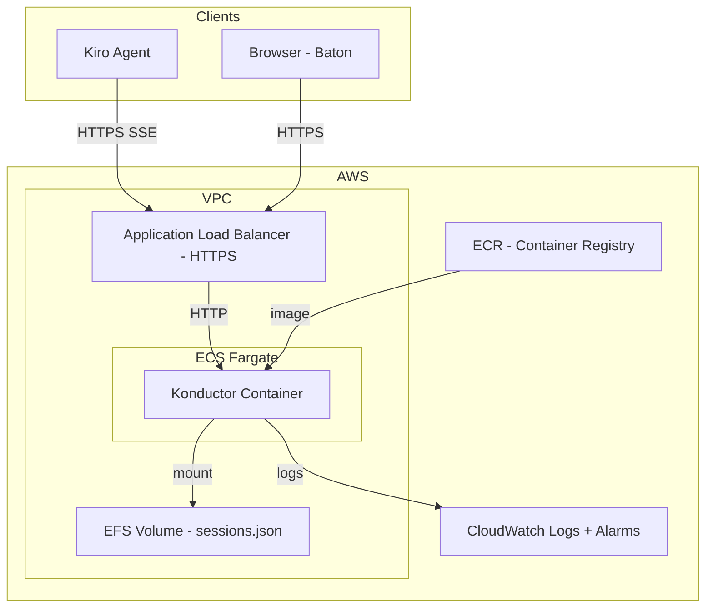

# Design Document: Konductor Production Deployment (Phase 7)

## Overview

Phase 7 containerizes the Konductor and deploys it on AWS ECS Fargate with EFS for persistent storage, ALB for HTTPS termination, and CloudWatch for monitoring. The infrastructure is defined as code using AWS CDK (TypeScript) to match the Konductor's language stack.

## Architecture



## Components

### Dockerfile

Multi-stage build:
1. Build stage: compile TypeScript
2. Production stage: Node.js Alpine, copy compiled JS, install production deps only
3. Health check: `CMD ["node", "-e", "fetch('http://localhost:3100/health')"]`

### CDK Stack

```typescript
// konductor-stack.ts
- VPC with public subnets
- ECS Cluster + Fargate Service (1 task, 0.25 vCPU, 512MB)
- EFS file system mounted at /data
- ALB with HTTPS listener (ACM certificate)
- ALB target group with health check on /health
- ALB idle timeout set to 3600s (for SSE connections)
- CloudWatch log group
- CloudWatch alarms: UnhealthyHostCount, 5xxErrorRate
- ECR repository for container images
```

### Health Endpoint

```typescript
// GET /health
{
  status: "healthy",
  uptime: 3600,
  activeSessions: 12,
  version: "1.0.0"
}
```

### Environment Variables (Production)

```
KONDUCTOR_PORT=3100
KONDUCTOR_API_KEY=<secret from SSM Parameter Store>
KONDUCTOR_DATA_DIR=/data
KONDUCTOR_CONFIG_PATH=/data/konductor.yaml
GITHUB_TOKEN=<secret from SSM Parameter Store>
```

## Correctness Properties

*A property is a characteristic or behavior that should hold true across all valid executions of a system — essentially, a formal statement about what the system should do. Properties serve as the bridge between human-readable specifications and machine-verifiable correctness guarantees.*

No new correctness properties for this phase — the deployment infrastructure wraps existing functionality. Correctness is validated by the existing property-based test suite running in CI before deployment.

## Testing Strategy

- **CDK assertions** for infrastructure-as-code validation (correct resource types, configurations)
- **Container health check** verified during deployment
- **Smoke test** script that registers a session, checks status, and deregisters after deployment
- Existing property-based and unit test suite runs in CI before container build
