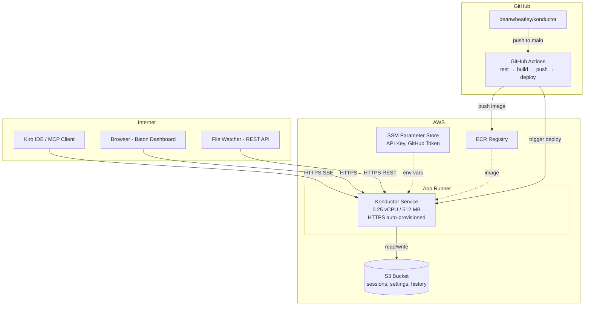

# Design Document: Konductor AWS POC Deployment

## Overview

This design deploys the Konductor MCP Server to AWS using App Runner for compute and S3 for persistent storage. App Runner provides built-in HTTPS with an auto-generated `*.awsapprunner.com` domain, eliminating the need for ALB, VPC, Route 53, ACM, and EFS. GitHub Actions automates the build-test-deploy pipeline on every push to `main`. The infrastructure is defined in AWS CDK (TypeScript).

## Architecture



## Components and Interfaces

### 1. Dockerfile (`konductor/Dockerfile`)

Multi-stage build:

```
Stage 1 (build):
  - FROM node:20-alpine
  - Copy konductor/ source and konductor-setup/ source
  - npm ci (all deps) in konductor/
  - npm ci in konductor-setup/
  - npm run build in konductor/

Stage 2 (production):
  - FROM node:20-alpine
  - Copy compiled dist/ from build stage
  - Copy package.json, package-lock.json
  - Copy konductor-setup/ (for installer bundle packing)
  - Copy konductor.yaml
  - npm ci --omit=dev
  - EXPOSE 3100
  - ENV KONDUCTOR_PORT=3100 KONDUCTOR_PROTOCOL=http
  - HEALTHCHECK: node -e "fetch('http://localhost:3100/health').then(r=>{if(!r.ok)throw 1})"
  - CMD ["node", "dist/index.js"]
```

### 2. S3 Persistence Layer (`konductor/src/s3-persistence.ts`)

New module that replaces `LocalPersistence` for cloud deployments. Reads/writes JSON files to S3.

```typescript
interface S3PersistenceConfig {
  bucketName: string;
  prefix?: string;           // S3 key prefix (default: "konductor/")
  flushIntervalMs?: number;  // Periodic flush interval (default: 30000)
}

class S3Persistence {
  // Load all data files from S3 on startup
  async load(): Promise<void>;

  // Save a specific data file to S3
  async save(key: string, data: unknown): Promise<void>;

  // Flush all dirty data to S3
  async flush(): Promise<void>;

  // Start periodic flush timer
  startPeriodicFlush(): void;

  // Stop periodic flush and do final flush
  async shutdown(): Promise<void>;
}
```

Data files stored in S3:
- `konductor/sessions.json` — Active work sessions
- `konductor/settings.json` — Admin settings
- `konductor/history-users.json` — User history and metadata
- `konductor/query-log.json` — Baton query log

The module uses the AWS SDK v3 (`@aws-sdk/client-s3`) which is lightweight and tree-shakeable. The App Runner instance role provides S3 access — no credentials needed in the container.

Serialization: JSON.stringify with 2-space indentation for debuggability. Deserialization: JSON.parse with graceful handling of missing keys (returns empty defaults).

### 3. CDK Stack (`infra/lib/konductor-stack.ts`)

Single stack provisioning all resources:

| Resource | Configuration |
|----------|--------------|
| ECR | `konductor` repo, scan on push, retain 5 images |
| S3 | `konductor-data-*` bucket, versioning enabled, 30-day old version expiry |
| App Runner Service | 0.25 vCPU, 512 MB, image from ECR, health check `/health` |
| App Runner Auto-Scaling | Min 1, Max 1 (single instance for POC) |
| IAM Instance Role | S3 read/write to data bucket, SSM read for secrets |
| IAM Access Role | ECR pull access for App Runner |

Environment variables passed to container:
- `KONDUCTOR_PORT=3100`
- `KONDUCTOR_PROTOCOL=http`
- `KONDUCTOR_S3_BUCKET=<bucket-name>`
- `KONDUCTOR_EXTERNAL_URL=https://<app-runner-url>`
- `KONDUCTOR_API_KEY` → from SSM `/konductor/api-key`
- `GITHUB_TOKEN` → from SSM `/konductor/github-token`
- `LOG_TO_TERMINAL=true`

Note: App Runner doesn't natively support SSM SecureString injection like ECS does. The CDK stack will use App Runner's `SourceConfiguration.imageRepository.imageConfiguration.runtimeEnvironmentSecrets` which maps SSM parameters to environment variables at runtime.

### 4. GitHub Actions Workflow (`.github/workflows/deploy.yml`)

```yaml
trigger: push to main, workflow_dispatch
jobs:
  test:
    - npm ci in konductor/
    - npm test in konductor/
  deploy:
    needs: test
    steps:
    - Configure AWS credentials
    - Login to ECR
    - Build Docker image (context: repo root, dockerfile: konductor/Dockerfile)
    - Tag with git SHA + latest
    - Push to ECR
    - Trigger App Runner deployment (aws apprunner start-deployment)
```

### 5. Server Code Change: `KONDUCTOR_EXTERNAL_URL` Override

In `main()` in `konductor/src/index.ts`, the `serverUrl` is currently derived from `osHostname()`:

```typescript
const serverUrl = `${protocol}://${osHostname()}:${port}`;
```

This needs to check `KONDUCTOR_EXTERNAL_URL` first:

```typescript
const serverUrl = process.env.KONDUCTOR_EXTERNAL_URL || `${protocol}://${osHostname()}:${port}`;
```

Same change in `startSseServer()` where `serverUrl` is constructed. This ensures all MCP responses, Baton dashboard URLs, installer commands, and update URLs use the App Runner's public HTTPS domain.

### 6. Server Code Change: S3 Persistence Integration

In `createComponents()` in `konductor/src/index.ts`, when `KONDUCTOR_S3_BUCKET` is set, use `S3Persistence` instead of `LocalPersistence`:

```typescript
const s3Bucket = process.env.KONDUCTOR_S3_BUCKET;
if (s3Bucket) {
  const s3Persistence = new S3Persistence({ bucketName: s3Bucket });
  await s3Persistence.load();
  s3Persistence.startPeriodicFlush();
  // Wire up event emitter hooks (same pattern as LocalPersistence)
  // Register SIGTERM handler for graceful shutdown
} else if (isLocal) {
  // Existing LocalPersistence path
}
```

### 7. Client Bundle Distribution

The bundle lifecycle in AWS:

1. Developer pushes code to `main` (includes changes to `konductor/` and/or `konductor-setup/`)
2. GitHub Actions builds Docker image — `konductor-setup/` is copied into the image
3. App Runner deploys new container
4. On startup, the server packs `konductor-setup/` into a tarball and serves it at `/bundle/installer.tgz`
5. Connected file watchers detect version mismatch on their next poll (every 10s)
6. File watchers download the new bundle and self-update

## Data Models

### S3 Bucket Layout

```
konductor/
├── sessions.json          # Active work sessions
├── settings.json          # Admin settings
├── history-users.json     # User history and metadata
└── query-log.json         # Baton query log
```

### SSM Parameters

| Path | Type | Description |
|------|------|-------------|
| `/konductor/api-key` | SecureString | Bearer token for MCP API authentication |
| `/konductor/github-token` | SecureString | GitHub PAT for PR/commit polling |

### GitHub Actions Secrets

| Secret | Description |
|--------|-------------|
| `AWS_ACCESS_KEY_ID` | IAM user access key for ECR push and App Runner deploy |
| `AWS_SECRET_ACCESS_KEY` | IAM user secret key |
| `AWS_REGION` | AWS region (e.g. `us-east-1`) |
| `AWS_ACCOUNT_ID` | AWS account ID for ECR URI construction |


## Correctness Properties

*A property is a characteristic or behavior that should hold true across all valid executions of a system-essentially, a formal statement about what the system should do. Properties serve as the bridge between human-readable specifications and machine-verifiable correctness guarantees.*

This spec introduces two testable components: the `KONDUCTOR_EXTERNAL_URL` override and the S3 persistence layer. Most other criteria are CDK assertions or documentation checks.

### Property 1: External URL override

*For any* valid URL string set as `KONDUCTOR_EXTERNAL_URL`, the server SHALL use that URL as `serverUrl` instead of deriving it from `osHostname()` and the local port. *For any* empty or undefined value, the server SHALL fall back to the hostname-derived URL.

**Validates: Requirements 8.1, 8.3**

### Property 2: S3 persistence round-trip

*For any* valid Konductor data structure (sessions array, settings object, history-users object, query-log array), serializing to JSON and then deserializing SHALL produce an object equivalent to the original. This validates that no data is lost or corrupted during the S3 write/read cycle.

**Validates: Requirements 3.2, 3.3, 11.1, 11.2, 11.4, 11.5**

## Error Handling

| Scenario | Handling |
|----------|----------|
| S3 bucket unreachable on startup | Log warning, start with empty data structures, retry on next flush |
| S3 write failure during periodic flush | Log error, retain data in memory, retry on next flush interval |
| S3 object missing on startup | Start with empty defaults (first deployment scenario) |
| S3 corrupted JSON on load | Log error, start with empty defaults, overwrite on next flush |
| SSM parameter missing | Container fails to start → App Runner retries |
| ECR image pull failure | App Runner retries with backoff |
| App Runner health check failure | App Runner replaces instance |
| GitHub Actions build failure | Deploy job skipped → no deployment, existing container continues |

## Testing Strategy

### CDK Assertions (Unit Tests)

CDK provides `assertions` module for testing synthesized CloudFormation templates:

- App Runner service configuration (CPU, memory, health check)
- ECR repository (scan on push, lifecycle rules)
- S3 bucket (versioning, lifecycle rules)
- IAM roles (S3 access, ECR pull, SSM read)
- Environment variables in App Runner configuration
- CloudFormation outputs

### Property-Based Tests

Property-based testing library: `fast-check` (already used in the Konductor test suite).

Each property-based test runs a minimum of 100 iterations and is tagged with the format: `**Feature: konductor-production, Property {number}: {property_text}**`

- Property 1 (External URL override): Generate random valid URLs, set `KONDUCTOR_EXTERNAL_URL`, verify the server uses the external URL. Generate empty/undefined values, verify fallback to hostname.
- Property 2 (S3 persistence round-trip): Generate random valid data structures (sessions, settings, history, query log), serialize to JSON, deserialize, verify equivalence.

### Smoke Test

A post-deployment smoke test script that:
1. Calls `GET /health` and verifies 200 response
2. Calls `POST /api/register` with test data and verifies session creation
3. Calls `POST /api/status` and verifies collision state response
4. Calls `POST /api/deregister` and verifies cleanup
5. Calls `GET /bundle/installer.tgz` and verifies the tarball is served

This is a manual verification step, not part of the automated test suite.
