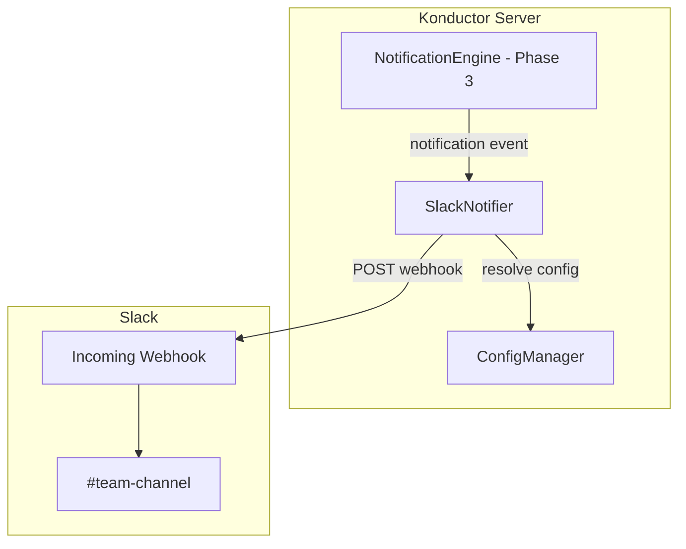

# Design Document: Konductor Slack Integration (Phase 6)

## Overview

Phase 6 adds a SlackNotifier component that posts collision alerts to Slack channels via incoming webhooks. The notifier hooks into the NotificationEngine from Phase 3 and routes notifications to configured channels based on repository mappings. Slack user IDs are resolved from a configurable mapping to enable @-mentions.

## Architecture



## Components and Interfaces

### SlackNotifier

```typescript
interface ISlackNotifier {
  notify(notification: Notification): Promise<void>;
}
```

Receives notifications from the NotificationEngine, formats them as Slack Block Kit messages, resolves user mappings, and posts to the appropriate webhook URL.

### Slack Message Format

```json
{
  "blocks": [
    {
      "type": "header",
      "text": { "type": "plain_text", "text": "🔴 Merge Hell — org/repo-a" }
    },
    {
      "type": "section",
      "text": {
        "type": "mrkdwn",
        "text": "<@U123ABC> and <@U456DEF> have divergent changes on:\n• `src/auth.ts`\n• `src/types.ts`\n\nBranches: `feature/auth` vs `fix/login`"
      }
    },
    {
      "type": "context",
      "elements": [
        { "type": "mrkdwn", "text": "Konductor • Collision Course → Merge Hell" }
      ]
    }
  ]
}
```

### Enhanced Configuration

```yaml
slack:
  default_webhook: "https://hooks.slack.com/services/T.../B.../xxx"
  notification_threshold: collision_course
  channels:
    "org/repo-a": "https://hooks.slack.com/services/T.../B.../yyy"
    "org/repo-b": "https://hooks.slack.com/services/T.../B.../zzz"
  user_mapping:
    alice: "U123ABC"
    bob: "U456DEF"
    carol: "U789GHI"
```

## Data Models

### SlackMessage

```typescript
interface SlackMessage {
  webhookUrl: string;
  blocks: SlackBlock[];
}

// Uses Slack Block Kit types
```

## Correctness Properties

*A property is a characteristic or behavior that should hold true across all valid executions of a system — essentially, a formal statement about what the system should do. Properties serve as the bridge between human-readable specifications and machine-verifiable correctness guarantees.*

### Property 1: Slack message contains all collision participants

*For any* notification with overlapping users, the formatted Slack message should contain a mention (or plain text name) for every user involved in the collision, and should contain every shared file path.

**Validates: Requirements 1.2, 1.3**

### Property 2: Channel routing matches repository configuration

*For any* notification and channel configuration, the SlackNotifier should route the message to the repository-specific webhook if configured, or the default webhook otherwise. If neither exists, no message should be sent.

**Validates: Requirements 2.1, 2.2, 2.3**

### Property 3: User mapping resolution

*For any* Konductor user ID and user mapping configuration, if a mapping exists the Slack message should contain the Slack @-mention format (`<@SLACK_ID>`), and if no mapping exists the message should contain the plain Konductor user ID.

**Validates: Requirements 3.1, 3.2**

## Testing Strategy

- **fast-check** for property-based tests on message formatting and channel routing logic
- **Vitest** for unit tests on SlackNotifier with mocked webhook endpoints
- Integration tests verifying the full notification → format → post pipeline
