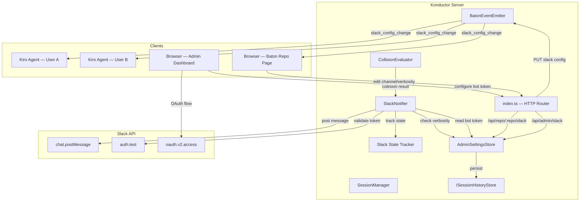

# Design Document: Konductor Slack Integration (Phase 6)

## Overview

Phase 6 adds server-side Slack notification support to the Konductor MCP Server. The server posts collision alerts directly to Slack channels using a bot token configured by the admin. Each repository has its own Slack channel and verbosity setting, editable from the Baton repo page or via client chat commands. The server tracks collision state transitions and posts notifications when severity crosses the verbosity threshold — both escalation and de-escalation messages.

The design assumes 1 Konductor instance per organization. All repos on the server share the same Slack workspace credentials (bot token). Per-repo channel routing is handled via settings stored in the `ISessionHistoryStore`.

When any Slack configuration changes for a repo, all connected clients with active sessions in that repo receive a real-time notification via SSE, which the steering rule formats as a chat message with a link to the Slack channel.

## Dependencies

- `konductor-baton` — repo page UI, SSE event infrastructure, collapsible panel pattern
- `konductor-admin` — admin dashboard UI, settings store, auth middleware
- `konductor-long-term-memory` — `ISessionHistoryStore` for persisting Slack settings
- `konductor-mcp-server` — collision evaluation, session management, SSE transport
- `konductor-enhanced-chat` — "konductor," chat prefix routing for Slack commands

## Architecture



### Flow: Collision → Slack Notification

1. `CollisionEvaluator` produces a `CollisionResult` during `register_session` or `check_status`
2. The MCP tool handler passes the result to `SlackNotifier.onCollisionEvaluated(repo, result)`
3. `SlackNotifier` reads the per-repo Slack settings from `AdminSettingsStore` (channel, verbosity)
4. `SlackNotifier` checks the `SlackStateTracker` for the previous notified state for this repo
5. If the collision state meets the verbosity threshold and differs from the last notified state → post escalation message
6. If the collision state dropped below the threshold and the previous state was above → post de-escalation message
7. `SlackStateTracker` records the new state
8. If the bot token is missing or invalid → log warning, skip silently

### Flow: Slack Config Change → Client Notification

1. User changes Slack channel or verbosity via Baton repo page (`PUT /api/repo/:repo/slack`) or via chat command (agent calls same API)
2. Server validates input, persists to settings store
3. Server emits `slack_config_change` event via `BatonEventEmitter`
4. All SSE subscribers for that repo (Baton pages) receive the event and update the UI
5. All connected MCP clients with active sessions in that repo receive the event
6. The steering rule instructs the agent to display: `📢 Konductor: Slack alerts for <repo> now go to #<channel> (verbosity: <level>). <link>`
7. Server logs: `[CONFIG] [SYSTEM] Slack channel for <repo> changed to #<channel> (verbosity: <level>) by <userId>`
8. Server sends a test notification to the new Slack channel confirming the change

## Components and Interfaces

### SlackNotifier

Server-side module that posts messages to Slack. No external dependencies — uses Node.js built-in `fetch` (Node 20+).

```typescript
interface ISlackNotifier {
  /** Called after collision evaluation. Posts to Slack if threshold met. */
  onCollisionEvaluated(repo: string, result: CollisionResult, triggeringUserId: string): Promise<void>;

  /** Post a test message to verify configuration. */
  sendTestMessage(channel: string): Promise<{ ok: boolean; error?: string }>;

  /** Validate the bot token by calling auth.test. */
  validateToken(): Promise<{ ok: boolean; team?: string; botUser?: string; error?: string }>;

  /** Check if Slack is configured (bot token available). */
  isConfigured(): boolean;
}
```

Construction:
```typescript
const slackNotifier = new SlackNotifier(settingsStore, stateTracker, logger);
```

The `SlackNotifier` reads the bot token from `AdminSettingsStore` on each call (supports hot-reload when admin changes the token). It never caches the token long-term.

### SlackStateTracker

In-memory tracker for the last notified collision state per repo. Used to detect escalation/de-escalation transitions.

```typescript
interface ISlackStateTracker {
  /** Get the last collision state that triggered a Slack notification for a repo. */
  getLastNotifiedState(repo: string): CollisionState | null;

  /** Record that a notification was sent for this repo at this state. */
  setLastNotifiedState(repo: string, state: CollisionState): void;

  /** Clear tracking for a repo (e.g., when Slack is disabled). */
  clear(repo: string): void;
}
```

In-memory `Map<string, CollisionState>`. Lost on restart — acceptable because collision state is re-evaluated on next `register_session`.

### SlackSettingsManager

Thin wrapper around `AdminSettingsStore` for per-repo Slack settings. Handles defaults and validation.

```typescript
interface RepoSlackConfig {
  channel: string;       // Slack channel name (no # prefix)
  verbosity: number;     // 0-5
  enabled: boolean;      // derived: bot token configured AND verbosity > 0
}

interface ISlackSettingsManager {
  getRepoConfig(repo: string): Promise<RepoSlackConfig>;
  setRepoChannel(repo: string, channel: string): Promise<void>;
  setRepoVerbosity(repo: string, verbosity: number): Promise<void>;
  getGlobalStatus(): Promise<{ configured: boolean; team?: string; botUser?: string }>;
  getBotToken(): Promise<string | null>;
  setBotToken(token: string): Promise<void>;
}
```

Settings keys in `ISessionHistoryStore`:
- `slack:bot_token` (category: `slack`, encrypted) — global bot token
- `slack:oauth_client_id` (category: `slack`, encrypted) — OAuth client ID (if SSO flow used)
- `slack:oauth_client_secret` (category: `slack`, encrypted) — OAuth client secret
- `slack:<repo>:channel` (category: `slack`) — per-repo channel name
- `slack:<repo>:verbosity` (category: `slack`) — per-repo verbosity (0-5)

### Verbosity Mapping

```typescript
const VERBOSITY_THRESHOLD: Record<number, CollisionState[]> = {
  0: [],                                                              // disabled
  1: ["merge_hell"],                                                  // critical only
  2: ["collision_course", "merge_hell"],                              // DEFAULT
  3: ["crossroads", "collision_course", "merge_hell"],                // moderate+
  4: ["neighbors", "crossroads", "collision_course", "merge_hell"],   // low+
  5: ["solo", "neighbors", "crossroads", "collision_course", "merge_hell"], // everything
};

function shouldNotify(state: CollisionState, verbosity: number): boolean {
  return VERBOSITY_THRESHOLD[verbosity]?.includes(state) ?? false;
}
```

### Channel Name Sanitization

```typescript
function sanitizeChannelName(repoName: string): string;
```

Rules (per Slack API):
- Lowercase only
- Only letters, numbers, hyphens, underscores
- No leading hyphens
- Max 80 characters
- Replace any non-allowed character with `-`
- Collapse consecutive hyphens
- Trim leading/trailing hyphens

Default channel: `konductor-alerts-<sanitized_repo_name>`

Example: repo `org/My-Project.v2` → channel `konductor-alerts-my-project-v2`

## Slack Message Format

Messages use Slack Block Kit:

### Escalation Message

```json
{
  "channel": "konductor-alerts-my-project",
  "blocks": [
    {
      "type": "header",
      "text": { "type": "plain_text", "text": "🟠 Collision Course — org/my-project" }
    },
    {
      "type": "section",
      "text": {
        "type": "mrkdwn",
        "text": "alice and bob are modifying the same files:\n• `src/auth.ts`\n• `src/types.ts`\n\nBranch: `feature/auth`"
      }
    },
    {
      "type": "context",
      "elements": [
        { "type": "mrkdwn", "text": "*konductor collision alert for org/my-project*" }
      ]
    }
  ]
}
```

### De-escalation Message

```json
{
  "channel": "konductor-alerts-my-project",
  "blocks": [
    {
      "type": "section",
      "text": {
        "type": "mrkdwn",
        "text": "✅ Collision resolved on org/my-project — previously 🟠 Collision Course"
      }
    },
    {
      "type": "context",
      "elements": [
        { "type": "mrkdwn", "text": "*konductor collision alert for org/my-project*" }
      ]
    }
  ]
}
```

### Config Change Test Message

```json
{
  "channel": "new-channel-name",
  "blocks": [
    {
      "type": "section",
      "text": {
        "type": "mrkdwn",
        "text": "🔔 Konductor Slack integration configured for *org/my-project*.\nCollision alerts (verbosity level 2) will be posted to this channel."
      }
    },
    {
      "type": "context",
      "elements": [
        { "type": "mrkdwn", "text": "*konductor collision alert for org/my-project*" }
      ]
    }
  ]
}
```

### Emoji Mapping

| Collision State    | Emoji | Header Text Pattern                |
|--------------------|-------|------------------------------------|
| solo               | 🟢    | `🟢 Solo — {repo}`                |
| neighbors          | 🟢    | `🟢 Neighbors — {repo}`           |
| crossroads         | 🟡    | `🟡 Crossroads — {repo}`          |
| collision_course   | 🟠    | `🟠 Collision Course — {repo}`    |
| merge_hell         | 🔴    | `🔴 Merge Hell — {repo}`          |

## Baton Repo Page — Slack Integration Panel

A new collapsible panel added to the Baton repo page, positioned after the existing panels.

### Layout

```
┌─────────────────────────────────────────────────────────────────┐
│  SLACK INTEGRATION                                 [▼ collapse] │
│                                                                 │
│  Status: 🟢 Connected (workspace: My Team)                     │
│                                                                 │
│  Channel: [konductor-alerts-my-project    ] [🔗 Open in Slack] │
│  Verbosity: [2 - Collision Course + Merge Hell ▼]              │
│                                                                 │
│  [Save Changes]  [Send Test Message]                            │
│                                                                 │
│  Last notification: 🟠 Collision Course — 5 minutes ago         │
└─────────────────────────────────────────────────────────────────┘
```

When Slack is not configured:
```
┌─────────────────────────────────────────────────────────────────┐
│  SLACK INTEGRATION                                 [▼ collapse] │
│                                                                 │
│  ⚠️ Slack integration not configured.                           │
│  Ask your admin to set up Slack credentials in the              │
│  Admin Dashboard.                                               │
└─────────────────────────────────────────────────────────────────┘
```

### Verbosity Dropdown Labels

| Value | Label |
|-------|-------|
| 0 | Disabled |
| 1 | Merge Hell only |
| 2 | Collision Course + Merge Hell (default) |
| 3 | Crossroads and above |
| 4 | Neighbors and above |
| 5 | Everything |

## Admin Dashboard — Slack Integration Panel

A new collapsible panel added to the admin dashboard, positioned after the existing Global Client Settings panel.

### Layout

```
┌─────────────────────────────────────────────────────────────────┐
│  SLACK INTEGRATION                                 [▼ collapse] │
│                                                                 │
│  Authentication Mode:                                           │
│  ○ Bot Token (manual)    ● Slack App (OAuth)                    │
│                                                                 │
│  --- Bot Token Mode ---                                         │
│  Token: [xoxb-•••••••••••••••••••••    ] [Validate]             │
│  Status: 🟢 Valid — Workspace: My Team, Bot: @konductor        │
│                                                                 │
│  --- OR Slack App OAuth Mode ---                                │
│  Client ID:     [your-client-id          ]                      │
│  Client Secret: [•••••••••••••••••       ]                      │
│  [Install Slack App]  → redirects to Slack OAuth consent        │
│  Status: 🟢 Installed — Workspace: My Team                     │
│                                                                 │
│  [Save]  [Test: Send to channel [#general        ] [Send]]     │
│                                                                 │
│  ⓘ Source: database (editable)                                  │
│  — OR —                                                         │
│  ⓘ Source: SLACK_BOT_TOKEN env var (read-only)                  │
└─────────────────────────────────────────────────────────────────┘
```

### OAuth Flow

When the admin clicks "Install Slack App":

1. Server redirects to `https://slack.com/oauth/v2/authorize` with:
   - `client_id` from the admin form
   - `scope=chat:write,chat:write.public` (post to any public channel without joining)
   - `redirect_uri=<serverUrl>/auth/slack/callback`
   - `state` parameter for CSRF protection
2. Admin authorizes the app in Slack
3. Slack redirects to `/auth/slack/callback` with authorization code
4. Server exchanges code for bot token via `oauth.v2.access`
5. Server stores the bot token (encrypted) in settings store
6. Server validates token via `auth.test` and displays workspace info
7. Admin is redirected back to `/admin` with a success message

## API Endpoints

### Auth Routes

| Method | Path | Auth | Description |
|--------|------|------|-------------|
| GET | `/auth/slack/callback` | None | OAuth callback from Slack |

### Per-Repo Slack Settings

| Method | Path | Auth | Description |
|--------|------|------|-------------|
| GET | `/api/repo/:repoName/slack` | Authenticated | Get Slack config for repo |
| PUT | `/api/repo/:repoName/slack` | Authenticated | Update Slack config for repo |

`GET /api/repo/:repoName/slack` response:
```json
{
  "channel": "konductor-alerts-my-project",
  "verbosity": 2,
  "enabled": true,
  "lastNotification": {
    "state": "collision_course",
    "timestamp": "2026-04-19T10:30:00Z"
  }
}
```

`PUT /api/repo/:repoName/slack` request:
```json
{
  "channel": "my-custom-channel",
  "verbosity": 3
}
```

Validation:
- `channel`: must match Slack naming rules (lowercase, alphanumeric/hyphens/underscores, max 80 chars, no leading hyphen)
- `verbosity`: integer 0–5

### Admin Slack Settings

| Method | Path | Auth | Description |
|--------|------|------|-------------|
| GET | `/api/admin/slack` | Admin | Get global Slack auth status |
| PUT | `/api/admin/slack` | Admin | Update bot token or OAuth credentials |
| POST | `/api/admin/slack/test` | Admin | Send test message to a channel |

`GET /api/admin/slack` response:
```json
{
  "configured": true,
  "source": "database",
  "team": "My Team",
  "botUser": "@konductor",
  "authMode": "bot_token"
}
```

`PUT /api/admin/slack` request (bot token mode):
```json
{
  "botToken": "xoxb-..."
}
```

`PUT /api/admin/slack` request (OAuth mode):
```json
{
  "oauthClientId": "...",
  "oauthClientSecret": "..."
}
```

`POST /api/admin/slack/test` request:
```json
{
  "channel": "general"
}
```

## SSE Events

### New Event Type: `slack_config_change`

Added to `BatonEvent`:

```typescript
type BatonEvent =
  | { type: "session_change"; repo: string; data: RepoSummary }
  | { type: "notification_added"; repo: string; data: BatonNotification }
  | { type: "notification_resolved"; repo: string; data: { id: string } }
  | { type: "query_logged"; repo: string; data: QueryLogEntry }
  | { type: "slack_config_change"; repo: string; data: SlackConfigChangeEvent };

interface SlackConfigChangeEvent {
  channel: string;
  verbosity: number;
  changedBy: string;       // userId who made the change
  slackChannelLink: string; // https://slack.com/app_redirect?channel=...
}
```

This event is emitted on:
- Baton repo page SSE stream (`/api/repo/:repoName/events`)
- MCP client SSE connections (for clients with active sessions in the repo)
- Admin dashboard SSE stream (`/api/admin/events`)

### MCP Tool Response Extension

The `register_session` response gains an optional `slackConfig` field:

```typescript
{
  sessionId: "...",
  collisionState: "collision_course",
  summary: "...",
  repoPageUrl: "...",
  slackConfig: {
    channel: "konductor-alerts-my-project",
    verbosity: 2,
    enabled: true
  }
}
```

This lets the steering rule display the Slack channel on first registration.

## Steering Rule Updates

### New Chat Commands

Added to the management command routing table:

| User says | Action |
|---|---|
| "show slack config", "slack status" | Call `get_slack_config` MCP tool with current repo. Display channel, verbosity, enabled status. |
| "change slack channel to X" | Call `set_slack_config` MCP tool with `{ repo, channel: X }`. Confirm change. |
| "change slack verbosity to X" | Call `set_slack_config` MCP tool with `{ repo, verbosity: X }`. Confirm change. |
| "disable slack", "turn off slack" | Call `set_slack_config` with `{ repo, verbosity: 0 }`. Confirm. |
| "enable slack", "turn on slack" | Call `set_slack_config` with `{ repo, verbosity: 2 }`. Confirm. |

### New MCP Tools

| Tool | Input | Description |
|------|-------|-------------|
| `get_slack_config` | `{ repo }` | Get Slack config for a repo |
| `set_slack_config` | `{ repo, channel?, verbosity? }` | Update Slack config for a repo |

These tools wrap the REST API endpoints so the agent can call them via MCP.

### Slack Config Change Notification (Steering Rule)

When the agent receives a `slack_config_change` SSE event:

```
📢 Konductor: Slack alerts for <repo> now go to #<channel> (verbosity: <level>).
🔗 Slack channel: <slackChannelLink>
```

### Help Output Update

Add to the help output:

```
📊 Queries:
  ...existing...
  • "konductor, slack status" — show Slack config for this repo

⚙️ Management:
  ...existing...
  • "konductor, change slack channel to X" — set Slack channel for this repo
  • "konductor, change slack verbosity to X" — set notification verbosity (0-5)
  • "konductor, disable slack" / "enable slack" — toggle Slack notifications
```

## Data Models

### RepoSlackConfig

```typescript
interface RepoSlackConfig {
  channel: string;
  verbosity: number;
  enabled: boolean;
}
```

### SlackConfigChangeEvent

```typescript
interface SlackConfigChangeEvent {
  channel: string;
  verbosity: number;
  changedBy: string;
  slackChannelLink: string;
}
```

### SlackGlobalConfig

```typescript
interface SlackGlobalConfig {
  configured: boolean;
  source: "env" | "database";
  team?: string;
  botUser?: string;
  authMode: "bot_token" | "oauth";
}
```

## Correctness Properties

### Property 1: Verbosity threshold filtering

*For any* collision state and verbosity level N (0–5), the `shouldNotify` function SHALL return `true` if and only if the collision state is included in the set defined by verbosity level N. At level 0, no states match. At level 5, all states match.

**Validates: Requirements 5.1, 5.2, 5.3**

### Property 2: Message footer always present

*For any* Slack message built by the `SlackNotifier`, the message blocks SHALL contain a context block with the text `*konductor collision alert for <repo>*` where `<repo>` matches the repository name. No message shall be built without this footer.

**Validates: Requirements 1.4, 8.4**

### Property 3: Channel name sanitization

*For any* repository name string, the sanitized channel name SHALL: be lowercase, contain only letters/numbers/hyphens/underscores, not start with a hyphen, be at most 80 characters, and be non-empty. The sanitization function is idempotent: `sanitize(sanitize(x)) === sanitize(x)`.

**Validates: Requirement 2.2**

### Property 4: De-escalation detection

*For any* sequence of collision states for a repo, a de-escalation notification SHALL be sent if and only if the previous notified state was above the verbosity threshold AND the new state is below the threshold. No de-escalation is sent if the previous state was already below the threshold.

**Validates: Requirements 9.1, 9.2, 9.3**

### Property 5: Message content completeness

*For any* collision notification, the Slack message SHALL contain: the collision state emoji, the repository name, the branch name(s), the list of affected files, and the names of all involved engineers. No field shall be omitted.

**Validates: Requirements 1.3, 8.2, 8.3**

### Property 6: Config change notification delivery

*For any* Slack config change (channel or verbosity), the emitted `slack_config_change` event SHALL contain the new channel, new verbosity, the userId who made the change, and a valid Slack channel link. The event SHALL be scoped to the correct repo.

**Validates: Requirements 4.1, 4.2, 4.3**

### Property 7: Bot token source precedence

*For any* combination of `SLACK_BOT_TOKEN` environment variable and database-stored bot token, the effective token SHALL be the environment variable when set, and the database value otherwise. When neither is set, `isConfigured()` returns false.

**Validates: Requirements 6.6, 6.7**

### Property 8: Slack channel name validation

*For any* string submitted as a Slack channel name, the validation function SHALL accept strings matching Slack's naming rules (lowercase, alphanumeric/hyphens/underscores, 1-80 chars, no leading hyphen) and reject all others.

**Validates: Requirement 11.3**

### Property 9: Verbosity range validation

*For any* integer submitted as a verbosity level, the validation function SHALL accept values 0–5 and reject all others.

**Validates: Requirement 11.3**

## Error Handling

### Slack API Errors
- Bot token missing → `isConfigured()` returns false, all notification calls are no-ops, log once at startup
- Bot token invalid (auth.test fails) → log error, mark as unconfigured, admin panel shows error
- `chat.postMessage` returns `channel_not_found` → log warning with channel name, skip notification
- `chat.postMessage` returns `not_in_channel` → log warning (bot needs to be invited or use `chat:write.public` scope)
- `chat.postMessage` returns rate limit (429) → log warning, skip this notification, retry on next event
- Network error → log warning, skip notification, no retry queue (next collision event will try again)
- OAuth callback with invalid state → 403 error page, redirect to admin

### Settings Errors
- Invalid channel name on PUT → 400 with descriptive message
- Invalid verbosity on PUT → 400 with descriptive message
- Settings store write failure → 500, log error

### Graceful Degradation
- Slack integration is entirely optional. When not configured, the server operates exactly as before.
- Slack errors never block or delay collision evaluation, session registration, or any other server functionality.
- The `SlackNotifier` catches all exceptions internally and logs them — it never throws to callers.

## Testing Strategy

### Property-Based Testing (fast-check + Vitest)

- **Property 1**: Generate random collision states × verbosity levels, verify `shouldNotify` correctness
- **Property 3**: Generate random repo name strings (including unicode, special chars, long strings), verify sanitized output meets all Slack rules and is idempotent
- **Property 4**: Generate random sequences of collision states with random verbosity, verify de-escalation detection logic
- **Property 8**: Generate random strings, verify channel name validation accepts/rejects correctly
- **Property 9**: Generate random integers (including negatives, floats, boundary values), verify verbosity validation

### Unit Testing (Vitest)

- `slack-notifier.test.ts`:
  - Posts message when threshold met (mocked fetch)
  - Skips when below threshold
  - Skips when bot token missing
  - Handles Slack API errors gracefully
  - De-escalation message sent on state drop
  - No de-escalation when previous state was below threshold
  - Message format includes all required fields and footer

- `slack-settings.test.ts`:
  - Per-repo config read/write round-trip
  - Default channel name generation
  - Bot token source precedence (env vs database)
  - Channel name validation (valid and invalid inputs)
  - Verbosity validation

- `slack-admin.test.ts`:
  - Admin API endpoints (GET/PUT /api/admin/slack)
  - Token validation via auth.test mock
  - OAuth flow (callback handling)
  - Test message sending

- `slack-repo-api.test.ts`:
  - GET /api/repo/:repo/slack returns correct config
  - PUT /api/repo/:repo/slack updates and emits SSE event
  - PUT with invalid channel returns 400
  - PUT with invalid verbosity returns 400
  - Config change triggers test notification to new channel

- `slack-sse.test.ts`:
  - slack_config_change event emitted on channel change
  - Event contains correct data (channel, verbosity, changedBy, link)
  - Event scoped to correct repo

### Integration Testing

- Full flow: configure bot token → set repo channel → trigger collision → verify Slack message posted (mocked Slack API)
- Config change flow: change channel via API → verify SSE event → verify test message sent
- OAuth flow: mock Slack OAuth endpoints → verify token stored and validated

### E2E Testing (Playwright)

- Admin dashboard: configure bot token, validate, test message
- Baton repo page: view Slack panel, change channel, change verbosity, verify real-time update
