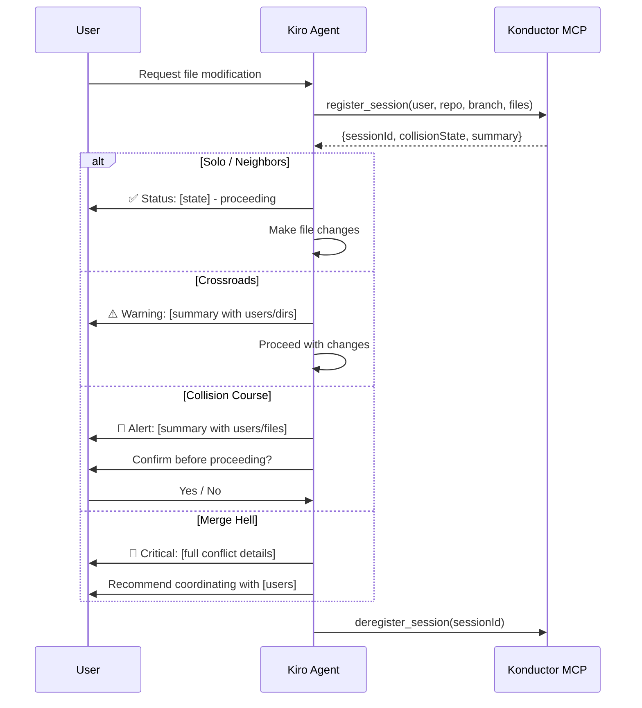

# Design Document: Konductor Steering Rules (Phase 2)

## Overview

This phase creates a Kiro steering rule file that instructs the AI agent to interact with the Konductor MCP Server during development. The steering rule is a markdown file placed in `.kiro/steering/konductor.md` that provides behavioral instructions to the agent. No application code is written in this phase — the deliverable is the steering rule content and its documentation.

## Architecture



## Components and Interfaces

### Steering Rule File

The steering rule is a single markdown file at `.kiro/steering/konductor.md`. It uses Kiro's steering rule format with front-matter for inclusion configuration.

**File structure:**
```markdown
---
inclusion: always
---

# Konductor - Work Coordination

[Instructions for the agent...]
```

### Message Templates

The steering rule defines message templates for each collision state:

| State | Icon | Behavior | Template |
|-------|------|----------|----------|
| Solo | ✅ | Brief status, proceed | "All clear — you're the only one in {repo}." |
| Neighbors | ✅ | Brief status, proceed | "Others are in {repo} but on different files. Proceeding." |
| Crossroads | ⚠️ | Warning, proceed | "Heads up — {users} are working in the same directories ({dirs}). Proceeding with caution." |
| Collision Course | 🔶 | Alert, ask confirmation | "Warning — {users} are modifying the same files ({files}). Recommend coordinating before proceeding. Continue?" |
| Merge Hell | 🔴 | Critical alert, recommend stop | "Critical conflict — {users} have divergent changes on {files} across different branches. Strongly recommend coordinating with them before making changes." |

### Configuration Parameters

The steering rule supports inline configuration via a code block:

```yaml
# Konductor steering config
check_before_modify: true
register_on_start: true
deregister_on_end: true
confirmation_threshold: collision_course  # State at which to ask user confirmation
```

## Data Models

No new data models — this phase uses the Konductor MCP Server's existing tool interfaces and response formats.

## Testing Strategy

This phase is primarily a configuration/documentation deliverable. Testing consists of:
- Manual verification that the steering rule loads correctly in Kiro
- Manual verification that the agent follows the instructions when the Konductor MCP is configured
- Review of message templates for clarity and completeness

No automated tests are required for this phase since the deliverable is a steering rule file, not application code.
